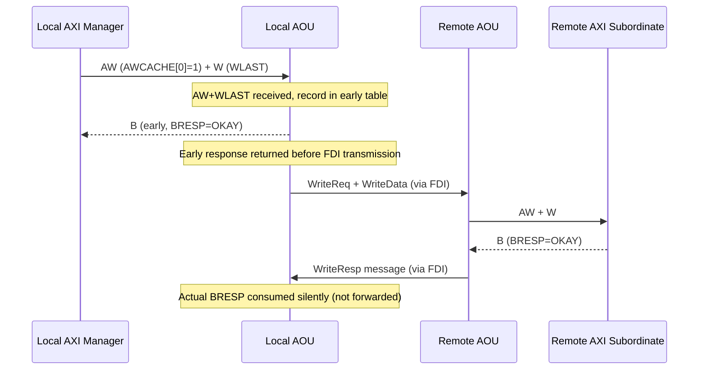
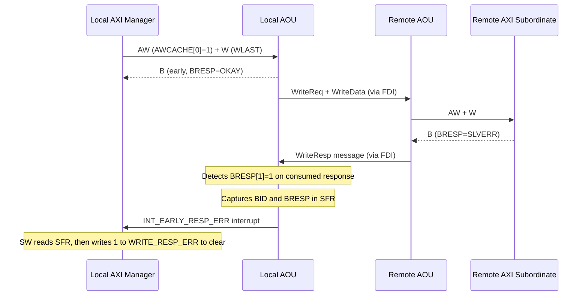
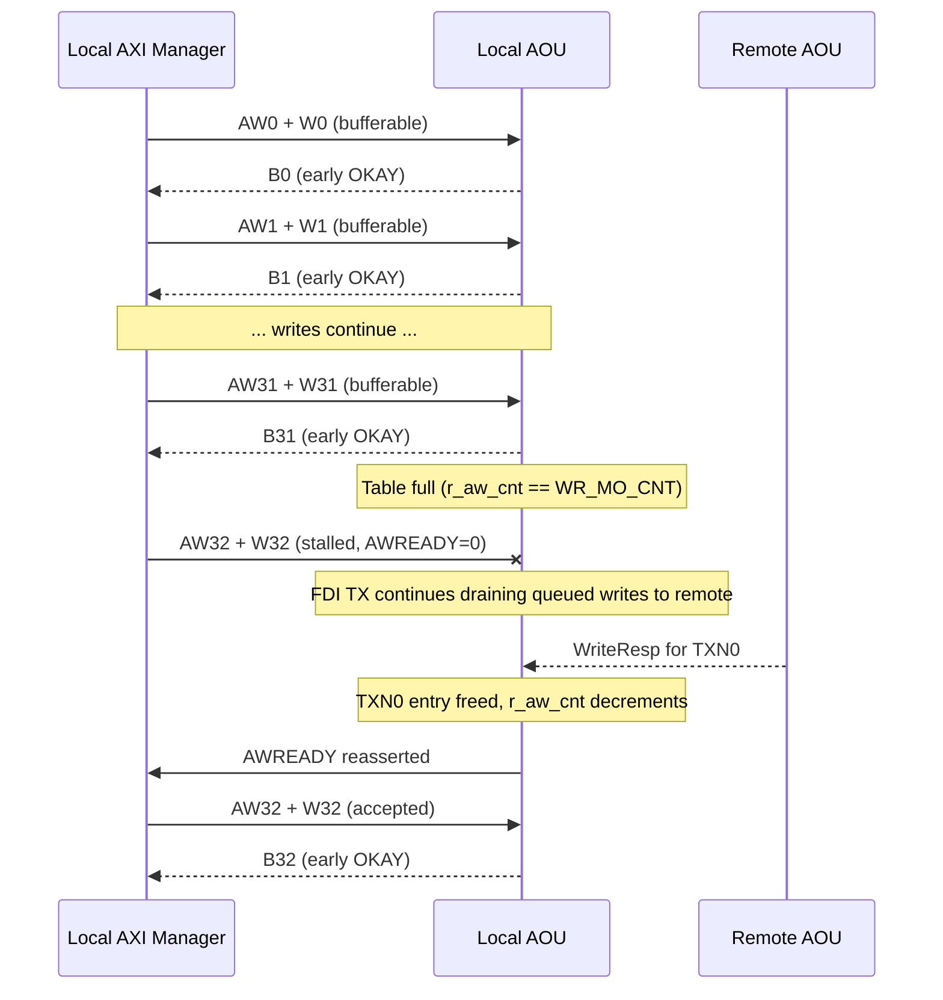
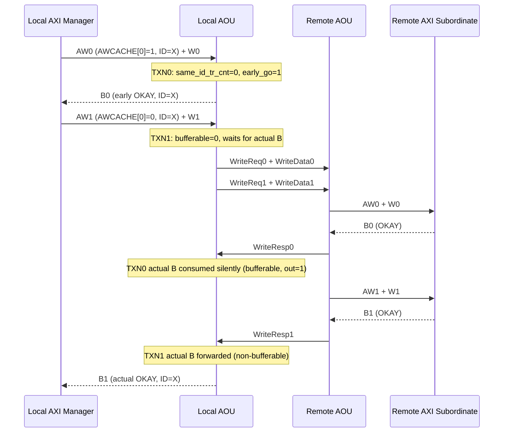
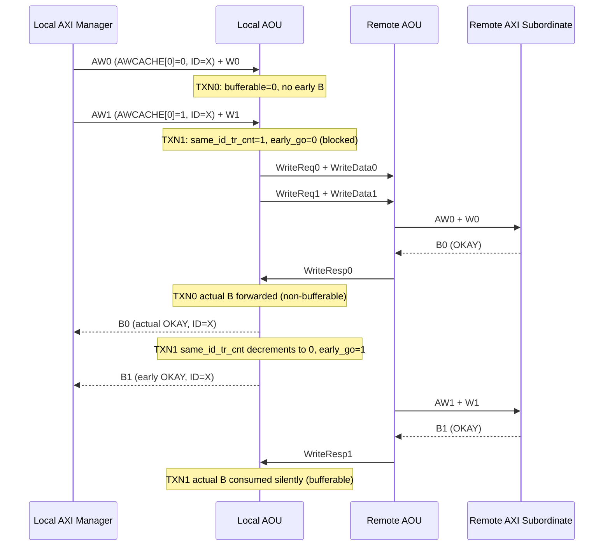
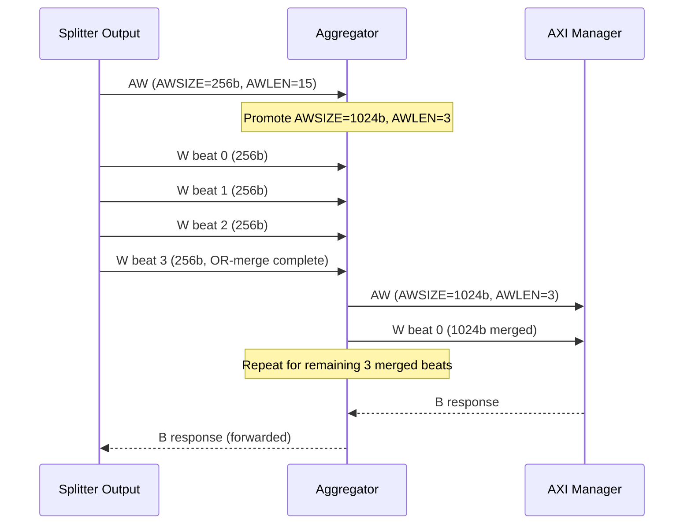
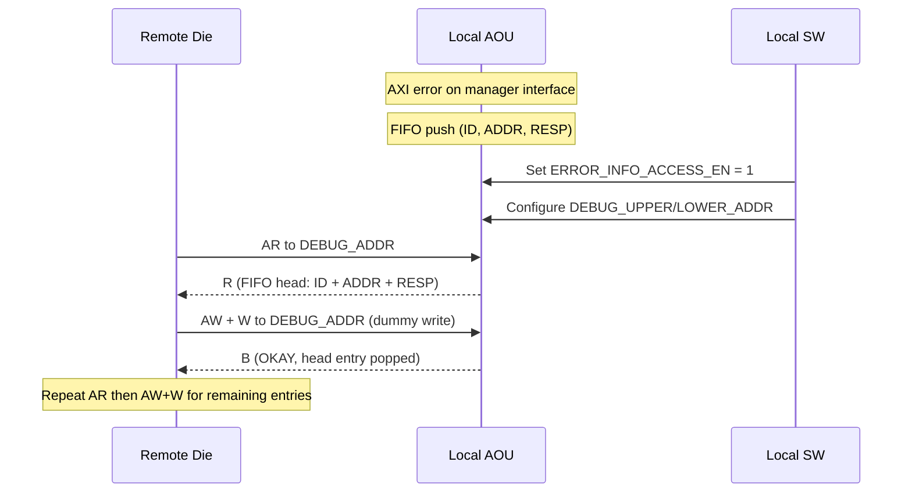

Apache License Release

AOU_CORE
Microarchitecture specification

Version 1.00, Feb.27 2026

# BOS Semiconductors

**Contents**

- [1. Introduction](#1-introduction)
  - [1.1. Overview](#11-overview)
- [2. Features](#2-features)
  - [2.1. Basic features](#21-basic-features)
- [3. Architecture](#3-architecture)
  - [3.1. Block diagram](#31-block-diagram)
  - [3.2. TX_CORE](#32-tx_core)
    - [3.2.1. TX_CORE QoS Scheme](#321-tx_core-qos-scheme)
  - [3.3. RX_CORE](#33-rx_core)
  - [3.4. Message FIFO](#34-message-fifo)
  - [3.5. Data width converter](#35-data-width-converter)
    - [3.5.1. Overview](#351-overview)
    - [3.5.2. Width Adaptation Paths](#352-width-adaptation-paths)
    - [3.5.3. WLAST Regeneration](#353-wlast-regeneration)
  - [3.6. AXI Transaction Splitter](#36-axi-transaction-splitter)
    - [3.6.1. Overview](#361-overview)
    - [3.6.2. Burst Splitting](#362-burst-splitting)
    - [3.6.3. Response Reassembly](#363-response-reassembly)
    - [3.6.4. SFR Configuration](#364-sfr-configuration)
  - [3.7. Write Early Response Controller](#37-write-early-response-controller)
    - [3.7.1. Overview](#371-overview)
    - [3.7.2. Transaction Flow -- Normal Case](#372-transaction-flow----normal-case)
    - [3.7.3. Transaction Flow -- Error Case](#373-transaction-flow----error-case)
    - [3.7.4. ID Ordering](#374-id-ordering)
    - [3.7.5. Write-Outstanding Queue Backpressure](#375-write-outstanding-queue-backpressure)
    - [3.7.6. Mixed Ordering -- Bufferable Before Non-Bufferable (Same ID)](#376-mixed-ordering----bufferable-before-non-bufferable-same-id)
    - [3.7.7. Mixed Ordering -- Non-Bufferable Before Bufferable (Same ID)](#377-mixed-ordering----non-bufferable-before-bufferable-same-id)
    - [3.7.8. Enable/Disable Procedure](#378-enabledisable-procedure)
    - [3.7.9. SFR Fields](#379-sfr-fields)
  - [3.8. AXI Aggregator](#38-axi-aggregator)
    - [3.8.1. Overview](#381-overview)
    - [3.8.2. Write Aggregation](#382-write-aggregation)
    - [3.8.3. Read Aggregation](#383-read-aggregation)
    - [3.8.4. SFR Fields](#384-sfr-fields)
  - [3.9. Credit Controller](#39-credit-controller)
  - [3.10. RP Remapping](#310-rp-remapping)
    - [3.10.1. Configuration Rules](#3101-configuration-rules)
    - [3.10.2. Header Encoding](#3102-header-encoding)
    - [3.10.3. Misconfiguration Behavior](#3103-misconfiguration-behavior)
  - [3.11. UCIe Flit cancel mechanism](#311-ucie-flit-cancel-mechanism)
    - [3.11.1. Cancel Cases](#3111-cancel-cases)
    - [3.11.2. RX_FDI_IF Buffering](#3112-rx_fdi_if-buffering)
    - [3.11.3. Timing](#3113-timing)
- [4. Interrupt](#4-interrupt)
- [5. Error](#5-error)
- [6. Integration guide](#6-integration-guide)
  - [6.1. I/O descriptions](#61-io-descriptions)
  - [6.2. Clocks](#62-clocks)
  - [6.3. Resets](#63-resets)
  - [6.4. Configurable Parameters](#64-configurable-parameters)
- [7. Software operation guide](#7-software-operation-guide)
  - [7.1. SFR setting](#71-sfr-setting)
  - [7.2. Debugging features](#72-debugging-features)
    - [7.2.1. Overview](#721-overview)
    - [7.2.2. AXI ID Mismatch Error](#722-axi-id-mismatch-error)
    - [7.2.3. LinkReset Error Reporting](#723-linkreset-error-reporting)
    - [7.2.4. R/B Response Error Debug FIFO](#724-rb-response-error-debug-fifo)
    - [7.2.5. Write Early Response Error](#725-write-early-response-error)
  - [7.3. Activation & Deactivation Flow](#73-activation--deactivation-flow)
    - [7.3.1. Credit Management Type](#731-credit-management-type)
    - [7.3.2. Activation start](#732-activation-start)
    - [7.3.3. Deactivation start](#733-deactivation-start)
    - [7.3.4. Deactivation Sequence Flow](#734-deactivation-sequence-flow)
    - [7.3.5. Activation/Deactivation Interrupt](#735-activationdeactivation-interrupt)
    - [7.3.6. PM entry / LinkReset / LinkDisabled sequence](#736-pm-entry--linkreset--linkdisabled-sequence)
- [8. PPA](#8-ppa)
  - [8.1. Performance](#81-performance)
  - [8.2. Power](#82-power)
  - [8.3. Area](#83-area)
- [Appendix A. Records of Changes](#appendix-a-records-of-changes)
- [Appendix B. Referenced Documents](#appendix-b-referenced-documents)

# 1. Introduction

This microarchitecture specification includes detailed functional
description of AOU_CORE.

The contents of this document are given as follows. Section 1 is for
overview. Section 2 is for features, implementation specific features,
and assumptions. In Section 3, the architecture and operation of AoU IP
are given. Section 4 covers interrupt sources. Section 5 covers error
handling. Section 6 includes the integration guidelines such as clocks,
resets, and I/O descriptions. Section 7 includes the software operation
guide including the register map and activation flows. Section 8
includes performance, power, and area information.

## 1.1. Overview

The AOU_CORE is a bridge between AXI interface and the UCIe FDI
interface, defined in AoU standard v0.7 spec.
To achieve low latency, AOU_CORE directly handles signals related to the
UCIe FDI interface data flow control and processes data in 64-byte or
32-bytes chunks in a cut-through manner, without converting them to
256-byte flit data. It receives AXI messages from its own AXI subordinate
interface, packs them into 64-byte or 32-byte chunks, and transmits
these chunks to the remote AoU device via UCIe. The remote AoU receives
the 64-byte or 32-byte chunks from the UCIe FDI interface, unpacks them
into AXI messages, and delivers the data through its AXI manager
interface.
The one-way AoU latency, measured from the AXI input of the local device
to the AXI output of the remote device over a back-to-back connection in
a single clock domain, is 7 cycles for read requests, 8 cycles for read
data, 9 cycles for write requests, 9 cycles for write data, and 6 cycles
for write responses. For applications using UCIe, including those with
some CDC domains, the round-trip time (RTT) latency from an AXI read
request to the corresponding AXI read response through this AoU IP over
UCIe is approximately 45 cycles, excluding the memory latency of the
remote device.

To achieve high efficiency, all TX requests and data messages are packed
in a compact format, ensuring that no AoU payload slots are wasted. The
current payload is even updated when the UCIe stalls the current chunk
and space remains available. As a result, the throughput matches the
values defined in the AoU specification. In each cycle, the RX can
process the maximum number of messages defined in the AoU standard: 4
read requests, 4 write requests, 2 read data, 2 write data, and 12 write
responses, respectively.

It supports flow control for all exceptional cases defined in the UCIe
standard. First, it handles the chunk valid/cancel signal, including the
alternative implementation method described in the UCIe specification.
Second, it handles the stall request signal received from the D2D
Adapter while maintaining the Flit-aligned boundary.
Interoperability is also supported when the remote device uses a
different AXI data width.

AOU_CORE supports a configurable number of Resource Plane(RPs), with
both the number of RPs and each RP's AXI data width fully
parameterizable. A dedicated field in the SFR allows software to
configure the target RP, enabling flexible RP mapping. For each RP, the
AW, W and AR channel support three arbitration modes: Round Robin, AXI
QoS scheme, and Port QoS scheme. Additionally, a starvation-prevention
mechanism is implemented to ensure fair arbitration across all RP
channels.

The operating frequency of AOU_CORE targets 1 GHz and meets timing
requirements without relying on multi-cycle paths. The TX buffer is
configured with a minimal number of FIFO entries, while the RX Data
buffer is designed with 88 entries to avoid any performance drop caused
by AoU. The entry size takes into account the round-trip latency for
credit consumption and return.

# 2. Features

<a id="figure-1"></a>


*Figure 1. Block Diagram of AOU_CORE and function description*

## 2.1. Basic features

- Single APB subordinate interface

  - Configuration/control/status register access

- Multiple AXI subordinate & manager interface

  - Configurable RP port & RP remapping supported

  - Supports variable data widths and burst length requests.
    Configurable FIFO Depth

- UCIe 256B latency-optimized flit(Format 6) support only

- Message packing and unpacking are handled in a unit of 64 bytes or 32
  bytes, corresponding to the FDI data width (64B@1 GHz or 32@1 GHz).

- Selectable Early response by setting SFR

- 64B and 32B FDI mode support

- Configurable number of Resource Plane and each RP's AXI data width

- RP Remapping

- QoS scheme between RP with AW, W, AR channel

- Interoperability with different data width remote die

- Handling of flit cancel and stall request as specified in the UCIe
  specification

- Selectable AXI Aggregator added for BUS efficiency

- According to the AoU specification, except for the AXI data width, the
  parameters AXI_ADDR_WD, AXI_ID_WD, and AXI_LEN_WD are fixed. Porting
  to match the width of the connected ports must be handled externally
  to AOU_CORE_TOP.

- Returning read data that exceeds the AXI data width of the remote die
  is treated as a violation.

- For a Read Request received from the remote die,
  if ARSIZE is 5 or less, it returns a Read Data message with DLEN =
  2'b00;
  if ARSIZE is 6, it returns a Read Data message with DLEN = 2'b01;
  if ARSIZE is 7, it returns a Read Data message with DLEN = 2'b10;
  Accordingly, if the local die receives a read data message from the
  remote die whose size is smaller than its own AXI data width, it
  duplicates the data to match its own AXI data width.

# 3. Architecture

This section describes the block diagram of AOU_CORE.

## 3.1. Block diagram

<a id="figure-2"></a>


*Figure 2. Architecture of AOU_CORE*

[Figure 2](#figure-2) shows block diagram of current AOU_CORE. The AXI interface
supports both Manager and Subordinate transactions for message transmission and
reception. AOU_CORE may issue AR and AW requests to the remote die using
the local bus width. Consequently, R-data from the remote die and W-data
from the local die are constrained to the local bus width. However,
since the remote die can transmit data with variable DLEN, AOU_CORE must
support all possible data lengths. This functionality is managed by
AXI4MUX_3X1_TOP, which receives variable DLEN data from RX_CORE, aligns
it to the local bus width, and splits the burst length into segments
matching the local bus burst size.

Inside AXI4MUX_3X1_TOP, AXI aggregator is added for improving bus
utilization. AXI aggregator combines narrow read & write data and send
it to BUS. This functionality may modify AXI Len & Size. For example,
AXI AR with 256-bit size & 16 burst length may transfer into 1024-bit
size & 4 burst length. This operation can be controlled via SFR setting.

AOU_CORE provides 64B FDI interface.

## 3.2. TX_CORE

<a id="figure-3"></a>


*Figure 3. Block Diagram of Single RP AOU_TX_CORE*

[Figure 3](#figure-3) shows the simplified block diagram of single RP AOU_TX_CORE.
The module receives AXI messages for Remote Die. AOU_TX_AXI_BUFFER
captures AXI messages from the system bus. When AOU_TX_CORE obtains
sufficient credit from AOU_CRD_CTRL, it packs the AXI message into an
AOU message and stores it in the ring buffer. Once there is enough space
to hold all messages, messages are stored to the ring buffer in
parallel. The ring buffer subsequently performs handshake operations
with the FDI interface.

### 3.2.1. TX_CORE QoS Scheme

<a id="figure-4"></a>


*Figure 4. TX_CORE QoS Scheme*

When multiple RP requests are issued from the TX core, a QoS scheme is
applied.
The TX core supports three QoS schemes: **Round-Robin**, **Port QoS**,
and **AXI QoS**.
Each transaction supports three QoS level: **High, Normal, Low.**

**Round-Robin (ARB_MODE = 2'b00)** :
Round-robin arbitration between valid RP. When a handshake occurs, the
RP that will receive the next grant is determined.
<a id="figure-5"></a>


*Figure 5. Round-Robin arbitration example*

**Port QoS (ARB_MODE = 2'b01):**
For each RP, the QoS level is configured by an SFR. Arbitration is
performed based on the QoS value is the SFR. The AXI QoS field is not
used for arbitration.

The port QoS is divided into three levels: High, Normal, and Low
priority.
Port QoS can be configured by setting PRIOR_RP_AXI.PRx_PRIOR. A 2-bit
field is used for QoS and supports values from 1 to 3. If the field is
set to 0, it is treated as 1.

By default, arbitration is performed in the order **High → Normal →
Low**. If a timeout occurs while a request is at Normal or Low priority,
the request is promoted and treated as High priority.
Timeout value can be configured by setting PRIOR_TIMER.TIMER_THRESHOLD.
The resolution used for timeout determination can be configured through
PRIOR_TIMER.TIMER_RESOLUTION.

If multiple RPs have the same priority, arbitration among them is
performed in a round-robin manner.
<a id="figure-6"></a>


*Figure 6. Port QoS arbitration example*

**AXI QoS (ARB_MODE = 2'b10):**
For each RP, the QoS level is determined by the value of the AXI QoS
field.
Arbitration is performed based on the AXI QoS value. For the 4-bit AXI
QoS field, boundary of High priority and Normal Priority can be
configured by SFR setting.
The port QoS is divided into three levels: **High**, **Normal**, and
**Low** priority.
By default, arbitration is performed in the order **High → Normal →
Low**. If a timeout occurs while a request is at Normal or Low priority,
the request is promoted and treated as High priority.
If multiple RPs have the same priority, arbitration among them is
performed in a round-robin manner.
<a id="figure-7"></a>


*Figure 7. AXI QoS arbitration example*

## 3.3. RX_CORE

<a id="figure-8"></a>


*Figure 8. Block Diagram of AOU_RX_CORE*

[Figure 8](#figure-8) shows the simplified block diagram of AOU_RX_CORE. AOU_RX_CORE
is a submodule that interfaces directly with the D2D adapter, receiving
I_FDI_PL_VALID, I_FDI_PL_DATA, and I_FDI_PL_FLIT_CANCEL signals to
determine the validity of incoming chunks, and unpacking messages in
accordance with the AOU specification. Within RX_CORE, there is a
submodule called RX_FDI_IF, which is designed to handle flit cancel as
defined in the UCIe specification. This module forwards only valid
chunks to the Chunk Decoder.

To ensure that the local die can support AXI transfers regardless of the
AXI data width of the remote die, AOU_RX_CORE integrates both Downsizer
and Upsizer modules internally.

AOU_RX_CORE includes a splitter that can divide burst lengths so that
AXI messages with any burst length from the remote die can be supported
on the local bus. The AW, W, and AR messages received from the remote
die are sent to the AXI Manager interface, while the B and R messages
received from the remote die are directed to the AXI Subordinate interface.
The R data may be smaller than the local die AXI data width depending on
the ARSIZE of the corresponding AR requests, but R 4M1S FIFO duplicate
values so that it is delivered to the AXI Subordinate interface with the same
width as the local die AXI data width.
Furthermore, the B responses corresponding to the AW and W AXI transfers
issued through the Manager interface are routed into the AXI_3X1_MUX
before being sent to the AOU_TX_CORE.

As illustrated in the figure above, the granularity of data transmitted
from the FIFO, whether directed to the bus or to the AXI_3X1_MUX, is
conveyed to the AOU_CRD_CTRL.

<a id="figure-9"></a>


*Figure 9. Architecture of Chunk Decoder*

[Figure 9](#figure-9) shows the architecture of the Chunk Decoder which is central
submodule of RX_CORE. It consists of shift registers and multiple
decoders that decode each message, based on the received valid chunk
along with its associated msg_idx and msg_valid information. Since AXI
messages differ in the number of granules, the time required for
decoding also varies.

For example, a B message has a size of 1 granule and can therefore be
decoded immediately once a valid chunk is received from RX_FDI_IF. In
contrast, Rdata or Wdata, which have a data width of 1024 bits, require
27-30 granules, and thus cannot be decoded immediately. Instead, they
are decoded after approximately three cycles. Because messages of 27-30
granules may span up to four flits during transmission.

## 3.4. Message FIFO

<a id="figure-10"></a>


*Figure 10. Data FIFO*

<a id="figure-11"></a>


*Figure 11. Req / Resp FIFO*

The Turn-Around-Time(TAT) of AOU_CORE, including the D2D adaptor, is
approximately 40 ns (equivalent to 40 cycles at 1 GHz). Therefore, the
depth of the AW, AR, and B FIFOs is set to 44 regarding the margin.

The width of the Req and Resp FIFOs is equal to the length of the
corresponding message. Since 12 granules are currently being decoded at
once, up to 4 AW/AR requests and up to 12 B responses can be written
into the FIFO in a single cycle. Therefore, the AW/AR FIFO is
implemented as a 4S1M FIFO and B FIFO is implemented as a 12S1M FIFO.

In contrast, for the Wdata and Rdata FIFOs, the FIFO width and depth is
defined differently.

The width of a data message varies depending on the bus data width.
Therefore, the width of the Data FIFO corresponds to the message width
in the case of the minimum bus data width.

For example, the width of the RDATA FIFO is 279 bits, which consists of
256 bits for the minimum bus data width, 10 bits for RID, 2 bits for
RRESP, 1 bit for RLAST, and additional sdlen 2 bits to identify message
width.

In aspect of WDATA FIFO, the width is 290bit. It contains 256 bits for
the minimum bus data widths, 32bits for the minimum strb data widths,
and additional sdlen 2bits to identify message width.

If the data received from the remote die has sdlen of 0(256bit data),
the message will be stored in a single entry of the DATA FIFO. If the
data received from the remote die has sdlen of 1(512bit data), the
message will be stored across two entries of the Data FIFO. Similarly,
if the data received from the remote die has sdlen of 2(1024bit), the
message will be stored across four entries of the Data FIFO.

In addition, the depth of the Data FIFO is not 44. The depth has been
determined under the assumption that the current bus data width is 512
bits. When the bus data width is 512 bits, a W message occupies 15
granules. Since the decoder in RX_CORE can decode 12 granules per cycle,
the maximum W message can reach the FIFO once every 1.25 cycles (15G ÷
12G/cycle = 1.25 cycles). Furthermore, as mentioned above, when the bus
data width is 512 bits, each message is stored across two FIFO entries.
Therefore, if the maximum turnaround time (TAT) to be covered is 50 ns
(50 cycles), the depth can be set to 80 (50 / 1.25 x 2 = 80).
Regarding the margin, Data FIFO's depth is set to 88.

FIFOs are allocated for each RP, and the depth of the FIFOs for each RP
is configurable.

## 3.5. Data width converter

### 3.5.1. Overview

<a id="figure-12"></a>


*Figure 12. AXI4MUX_3X1_TOP*

According to the AoU specification, even if the data width differs
between chips, they must be able to transmit AXI transfers to each
other. Because the remote die may issue read or write transactions with
data widths of 256, 512, or 1024 bits, the local die is responsible for
converting the data to align with its own bus data width. The response
must then be reformatted to match the original request size before being
returned.

Within AOU_CORE_TOP, the `AOU_AXI4MUX_3X1_TOP` module performs this
function. [Figure 12](#figure-12) shows how the structure of the
Bypass, AXI Downsizer, and AXI Upsizer varies depending on the AXI data
width of the local die.

### 3.5.2. Width Adaptation Paths

Three slave channel slots correspond to three possible remote data
widths: 256 bits, 512 bits, and 1024 bits. Which slot uses an upsizer,
bypass, or downsizer depends on the local die's `AXI_DATA_WD` parameter.
A dedicated variant of the width-adapter module is instantiated for each
supported local width:

| Local AXI_DATA_WD | Variant instantiated | CH0 (256b remote) | CH1 (512b remote) | CH2 (1024b remote) |
|----|----|----|----|----|
| 256 | `AOU_AXI4MUX_3X1_256` | Bypass | Downsizer | Downsizer |
| 512 | `AOU_AXI4MUX_3X1_512` | Upsizer | Bypass | Downsizer |
| 1024 | `AOU_AXI4MUX_3X1_1024` | Upsizer | Upsizer | Bypass |

**Write path routing:** The `DLEN` field embedded in the Write Data
message indicates the original data width. `AOU_AXI4MUX_3X1_TOP` uses
this field to steer write data and strobes to the correct channel slot
(and therefore through the correct width adapter).

**Read path routing:** The `ARSIZE` field of the Read Request message
determines which channel slot handles the read response. The 3:1 mux
selects the active slave R channel based on a 2-bit selector derived
from `ARSIZE`.

The upsizer (`AOU_AXI_UP`) packs multiple narrow beats into a single
wider beat, recalculating `AWLEN`/`ARLEN` accordingly. The downsizer
(`AOU_AXI_DOWN`) splits a single wide beat into multiple narrower beats.
Both modules regenerate `WLAST` internally using a beat counter that
compares the current W beat count against the recalculated burst length.

### 3.5.3. WLAST Regeneration

The AoU Write Data message does not carry a `WLAST` signal. The
`AOU_AXI_WLAST_GEN` module regenerates `WLAST` by aligning the phases
of WriteReq and Write Data messages. It operates upstream of the width
adapters in the RX-to-AXI path within `AOU_CORE_RP`.

The module uses `I_S_WDLENGTH` (derived from the `DLEN` field) to
determine the number of W beats expected for each AW transaction:

- When `AWLEN == 0` (single-beat burst), `WLAST` is asserted immediately
  on the first AW/W handshake.
- For multi-beat bursts, `WLAST` is asserted when the internal remaining
  beat counter `r_m_awch_remain_beat` reaches 1.

In addition to `AOU_AXI_WLAST_GEN`, the upsizer and downsizer modules
(`AOU_AXI_UP` and `AOU_AXI_DOWN`) each contain their own WLAST
generation logic to account for the changed burst length after width
conversion.

## 3.6. AXI Transaction Splitter

### 3.6.1. Overview

In the AoU specification, the AXI LEN field is fixed at 8 bits, allowing
the remote die to issue burst transactions up to the maximum supported
by an 8-bit AXI LEN. However, because the local die's bus may not
support the full 8-bit burst length, inbound AXI transactions must be
split into bursts that the local bus can handle and then reassembled to
match the original request.

Even if the burst length increases as a result of data-width conversion,
the AXI transactions are always split to ensure they do not exceed the
maximum burst length supported by the local bus.

The splitter (`AOU_AXI_SPLIT_TR`) sits between the 3:1 arbitration mux
and the [AXI Aggregator](#38-axi-aggregator) inside
`AOU_AXI4MUX_3X1_TOP`. One instance exists per RP, and the maximum
burst length can be configured independently for each RP through the
`AOU_SPLIT_TR_RPn` SFRs.

> **Note:** The `AOU_CON0.AXI_SPLIT_TR_EN` field exists in the SFR but
> is currently tied to `1'b0` in `AOU_CORE_RP`, making the splitter
> always active. The enable bit is reserved for future use.

### 3.6.2. Burst Splitting

The splitter uses internal address-generator submodules
(`aou_axi_split_addrgen_ar` for reads, `aou_axi_split_addrgen_aw` for
writes) to decompose a single long burst into multiple sub-bursts, each
no longer than `MAX_AxBURSTLEN + 1` beats. Addresses for each sub-burst
are computed from the original base address, burst type, and size.

The `MAX_AxBURSTLEN` value must be of the form 2^n - 1. Legal values
are:

| MAX_AxBURSTLEN | Max beats per sub-burst |
|----|----|
| 0 | 1 |
| 1 | 2 |
| 3 | 4 |
| 7 | 8 |
| 15 | 16 |
| 31 | 32 |
| 63 | 64 |
| 127 | 128 |
| 255 | 256 (no split) |

**ID width:** The splitter reserves 2 bits from the AXI ID for internal
sub-burst tracking. Master-side IDs are therefore `ID_WD - 2` bits wide.
The 2 extra bits allow the splitter to correlate responses from up to 4
outstanding sub-bursts per original transaction.

### 3.6.3. Response Reassembly

**Read path:** The `aou_split_tr_arch` reorder buffer tracks the
sub-burst sequence for each outstanding read. Slave-side `RLAST` is
asserted only when the final beat of the last sub-burst is received,
reconstructing the original burst boundary. Intermediate `RLAST` signals
from the master side are consumed internally.

**Write path:** B responses from sub-bursts are merged. The splitter
tracks outstanding write sub-bursts with `r_wr_pending_cnt` and returns
a single B response to the slave side once all sub-bursts have
completed. If any sub-burst returns an error (`|I_M_BRESP_RS`), the
merged `BRESP_ERR` flag is set, propagating the error to the slave-side
response.

**ID mismatch detection:** The splitter exports `DEST_TABLE_RID_ERR` and
`DEST_TABLE_BID_ERR` signals that flag responses with IDs not matching
any outstanding transaction. These feed the
[INT_MI0_ID_MISMATCH](#4-interrupt) interrupt source via
`AOU_AXI4MUX_3X1_TOP`.

### 3.6.4. SFR Configuration

| SFR | Field | Description |
|----|----|----|
| `AOU_CON0` | `AXI_SPLIT_TR_EN` | Global enable (reserved, tied inactive in current RTL) |
| `AOU_SPLIT_TR_RP0` | `MAX_AWBURSTLEN` | Max write burst length for RP0 (must be 2^n - 1) |
| `AOU_SPLIT_TR_RP0` | `MAX_ARBURSTLEN` | Max read burst length for RP0 (must be 2^n - 1) |
| `AOU_SPLIT_TR_RP1` | `MAX_AWBURSTLEN` / `MAX_ARBURSTLEN` | Same for RP1 |
| `AOU_SPLIT_TR_RP2` | `MAX_AWBURSTLEN` / `MAX_ARBURSTLEN` | Same for RP2 |
| `AOU_SPLIT_TR_RP3` | `MAX_AWBURSTLEN` / `MAX_ARBURSTLEN` | Same for RP3 |

These SFRs must be configured before activation and must not be changed
during normal operation.

## 3.7. Write Early Response Controller

### 3.7.1. Overview

The `AOU_EARLY_BRESP_CTRL_AWCACHE` module sits between the local AXI
subordinate interface and the AOU TX datapath. One instance exists per RP and
can be independently enabled or disabled via the per-RP
`WRITE_EARLY_RESPONSE_RPn.EARLY_BRESP_EN` SFR.

When enabled, the module returns an early B response (`BRESP = OKAY`) to
the local AXI manager as soon as both the write address (AW) and the last
write data beat (W with WLAST) have been received at the AXI subordinate
port -- before the write is packed into AoU messages, transmitted over
FDI, and completed on the remote die. This reduces the write latency
seen by the local requester at the cost of deferred error reporting.

Early response applies only to **bufferable** writes (`AWCACHE[0] = 1`).
Non-bufferable writes (`AWCACHE[0] = 0`) pass through the module
unchanged: the AW, W, and B channels are forwarded directly between
the local AXI interface and the AOU TX datapath with no early response
generated, and the actual BRESP from the remote die is returned to the
local AXI manager as normal.

### 3.7.2. Transaction Flow -- Normal Case

The following diagram shows the message flow for a bufferable write
when the remote die returns a successful response.



When the actual B response arrives from the remote die for a transaction
that already received an early response, the controller consumes it
internally: `O_AXI_S_BVALID` is held low (the local AXI manager sees no
second response) while `O_AXI_M_BREADY` is asserted high (the response
is drained from the AOU RX path).

### 3.7.3. Transaction Flow -- Error Case

If the actual B response from the remote die carries an error (`BRESP[1]
= 1`, indicating SLVERR or DECERR), the error cannot be reported via the
AXI B channel because the early OKAY response was already returned to
the local AXI manager. Instead, the error is reported via interrupt and
SFR capture.



The interrupt fires when the consumed response has `BRESP[1] = 1`. SW
must:

1. Read `WRITE_EARLY_RESPONSE_RPn.WRITE_RESP_ERR_ID_INFO` to identify
   the failing transaction's AXI ID.
2. Read `WRITE_EARLY_RESPONSE_RPn.WRITE_RESP_ERR_TYPE_INFO` to identify
   the error type (SLVERR or DECERR).
3. Write 1 to `WRITE_EARLY_RESPONSE_RPn.WRITE_RESP_ERR` (W1C) to clear
   the interrupt.

### 3.7.4. ID Ordering

The `AOU_EARLY_TABLE` inside the controller maintains a tracking table
with `WR_MO_CNT` entries (matching the subordinate write outstanding count).
Each entry records:

| Field | Purpose |
| :---- | :---- |
| `id` | AXI write ID (`AWID`) |
| `bufferable` | `AWCACHE[0]` flag |
| `pending` | Transaction is in flight (AW accepted, B not yet received from remote) |
| `same_id_tr_cnt` | Count of older pending transactions with the same AXI ID that have not yet been early-responded or actually responded |
| `early_go` | Set when `same_id_tr_cnt` reaches 0, indicating this entry is eligible for early response |
| `wid_numbering` | Per-ID sequence number for matching B responses to the correct table entry |

The `early_go` flag ensures that for transactions sharing the same AXI
ID, early responses are issued strictly in order. A later bufferable
transaction with the same ID waits until all prior same-ID transactions
have been responded to (either via early response or actual remote
BRESP). This preserves AXI ID ordering even when bufferable and
non-bufferable writes with the same ID are interleaved.

### 3.7.5. Write-Outstanding Queue Backpressure

The backpressure mechanism described in this section is only active when
the early response feature is enabled (`EARLY_BRESP_EN = 1`). When
disabled, the module is a transparent pass-through: all AW, W, and B
signals are wired directly between the subordinate and manager interfaces with
no outstanding-count gating, and write depth is bounded only by
whatever the downstream AOU TX datapath can accept.

When enabled, the early table has `WR_MO_CNT` entries (default 32, set
by the `S_WR_MO_CNT` parameter). Every write that enters the
controller -- bufferable or non-bufferable -- occupies one table entry
from the time WLAST is accepted until the **actual B response** arrives
from the remote die and is consumed.

Issuing an early B does **not** free the table entry. The entry remains
occupied (`pending = 1, out = 1`) until the real remote B is received.
The table depth therefore limits the total number of writes in flight
across the FDI link, not just the number awaiting early response.

When `r_aw_cnt == WR_MO_CNT`, `AWREADY` and `WREADY` are deasserted
toward the local AXI manager, stalling both the AW and W channels. The
AOU TX datapath and FDI link continue operating normally during this
time -- only new write acceptance is blocked. As actual B responses
arrive from the remote die and table entries are freed, `AWREADY` and
`WREADY` reassert and the manager may resume issuing writes.

The `O_PENDING_CNT_OVER` signal (exposed via the interrupt controller)
fires if a write handshake is attempted while the counter is already at
the limit, serving as a diagnostic for system-hang detection.



### 3.7.6. Mixed Ordering -- Bufferable Before Non-Bufferable (Same ID)

When a bufferable write (TXN0) is followed by a non-bufferable write
(TXN1) on the same AWID, the controller handles them as follows:

1. TXN0 enters the table with `same_id_tr_cnt = 0` and `early_go = 1`.
   Its early B is eligible immediately and is returned to the manager.
2. After TXN0's early B is issued, `out` is set to 1. TXN1 enters the
   table with `bufferable = 0`. The `same_id_tr_cnt` computation
   excludes entries with `out = 1`, so TXN1 sees `same_id_tr_cnt = 0`.
3. TXN1 is non-bufferable, so no early B is generated for it regardless
   of `early_go`. It waits for the actual remote B.
4. The `wid_numbering` field ensures actual B responses are matched in
   issue order: TXN0 has `wid_numbering = 0`, TXN1 has
   `wid_numbering = 1`.
5. When TXN0's actual B arrives, `O_EarlyResponse_Consume = 1`
   (bufferable entry at the read pointer), so the response is consumed
   silently. TXN1's `wid_numbering` decrements to 0.
6. When TXN1's actual B arrives, `O_EarlyResponse_Consume = 0`
   (non-bufferable), so the response is forwarded to the subordinate as a
   normal `BVALID`.

The local AXI manager sees: early B for TXN0 first, then actual B for
TXN1 -- correct AXI ID ordering is preserved.



### 3.7.7. Mixed Ordering -- Non-Bufferable Before Bufferable (Same ID)

When a non-bufferable write (TXN0) is followed by a bufferable write
(TXN1) on the same AWID, the early response for TXN1 is **delayed**
until TXN0's actual B has been received.

1. TXN0 enters the table with `bufferable = 0, out = 0`. No early B is
   generated (not bufferable).
2. TXN1 enters the table with `bufferable = 1`. Because TXN0 is still
   `pending` and `~out`, TXN1 sees `same_id_tr_cnt = 1` and
   `early_go = 0`. The early B for TXN1 is **blocked**.
3. When TXN0's actual B arrives from the remote die, it is forwarded to
   the subordinate (non-bufferable pass-through, `O_EarlyResponse_Consume = 0`).
   The table update loop decrements TXN1's `same_id_tr_cnt` from 1 to 0,
   setting `early_go = 1`.
4. On the following cycle, TXN1's early B becomes eligible and is issued
   to the manager.

This is the key latency impact of mixed-cacheability ordering: the
bufferable write's early response is delayed until the preceding
non-bufferable same-ID write fully completes its round trip through the
remote die. The early-response latency benefit is lost for that
transaction. Software or interconnect designers should be aware that
interleaving non-bufferable writes ahead of bufferable writes on the
same ID negates the early-response advantage for those bufferable
transactions.



### 3.7.8. Enable/Disable Procedure

The `EARLY_BRESP_EN` SFR may be written at any time, but the internal
enable (`r_early_bresp_en`) only transitions when it is safe to do so:

1. Confirm `WRITE_EARLY_RESPONSE_RPn.WRITE_RESP_DONE = 1` (no pending
   write transactions; `r_aw_cnt == 0`).
2. Set or clear `EARLY_BRESP_EN` via APB write.
3. The internal register transitions on the next clock edge where
   `O_BRESP_DONE` is asserted and no AW handshake is in progress. This
   guarantees that the mode change does not occur mid-transaction.

### 3.7.9. SFR Fields

The `WRITE_EARLY_RESPONSE_RPn` register (one per RP: RP0 at `0x0028`,
RP1 at `0x0040`, RP2 at `0x0058`, RP3 at `0x0070`) contains:

| Field | Bits | Access | Description |
| :---- | :---- | :---- | :---- |
| EARLY_BRESP_EN | [0] | RW | Enable early B response for bufferable writes on this RP. |
| WRITE_RESP_ERR_ID_INFO | [10:1] | RO | AXI ID of the transaction whose actual BRESP had an error. |
| WRITE_RESP_ERR_TYPE_INFO | [12:11] | RO | BRESP error type (2'b10 = SLVERR, 2'b11 = DECERR). |
| WRITE_RESP_ERR | [13] | W1C | Write 1 to clear the `INT_EARLY_RESP_ERR` interrupt. |
| WRITE_RESP_DONE | [14] | RO | 1 when no write transactions are pending (`r_aw_cnt == 0`). |

See the full register map in Section 7.1 for the complete SFR listing.

## 3.8. AXI Aggregator

### 3.8.1. Overview

The AXI Aggregator (`AOU_AGGREGATOR`) combines narrow read and write
data into full-width bus beats to improve bus utilization. It sits
downstream of the
[AXI Transaction Splitter](#36-axi-transaction-splitter) and is the
last processing stage before the AXI manager port inside
`AOU_AXI4MUX_3X1_TOP`. One instance exists per RP.

When enabled, the aggregator promotes `AWSIZE`/`ARSIZE` to the full bus
width and recalculates `AWLEN`/`ARLEN` accordingly. For example, an
incoming AR with size 256 bits and burst length 16 is converted to size
1024 bits and burst length 4, then issued on the AXI manager interface.
When R data returns, it is split to restore the original format. The
same principle applies to writes.

When disabled via the per-RP `AOU_CON0.RPn_AXI_AGGREGATOR_EN` SFR, all
master-side signals bypass the aggregator entirely and flow directly to
the AXI manager port without modification.

### 3.8.2. Write Aggregation

Write aggregation is activated when **both** conditions are met:

1. `AWSIZE` is narrower than the full bus width (`AXSIZE < $clog2(DATA_WD/8)`).
2. `AWLEN` is non-zero (multi-beat burst).

When activated, the aggregator:

- Promotes `AWSIZE` to the full bus width.
- Recalculates `AWLEN` based on the ratio between original and promoted
  sizes.
- OR-merges `WDATA` and `WSTRB` across consecutive narrow beats until a
  full-width beat is assembled, then emits the merged beat on the master
  W channel.
- `AWBURST` is passed through unchanged.

A depth-16 synchronous FIFO decouples the AW and W channels. The AW
is issued on the master side only after confirming that sufficient W
FIFO space is available for the recalculated `AWLEN`, preventing
deadlocks when the downstream bus back-pressures the W channel.



*Figure 13. Write Aggregation -- Narrow-to-Wide Beat Merging*

### 3.8.3. Read Aggregation

Read aggregation follows the same size-promotion logic as writes.
`ARSIZE` and `ARLEN` are promoted to the full bus width, and `ARBURST`
is passed through (the aggregator does not restrict burst type to INCR).

The `AOU_AGGREGATOR_INFO` submodule tracks outstanding AR transactions.
For each issued AR, it records the original burst geometry (size, length)
so that when wide R data returns from the manager side, the module can
regenerate the correct slave-side `RLAST` at the original burst
boundaries. Wide R beats are presented to the slave side multiple times
(once per original narrow beat) with the appropriate byte-lane
selection.

### 3.8.4. SFR Fields

| SFR | Field | Bits | Description |
|----|----|----|----|
| `AOU_CON0` | `RP0_AXI_AGGREGATOR_EN` | [20] | Enable aggregator for RP0 |
| `AOU_CON0` | `RP1_AXI_AGGREGATOR_EN` | [21] | Enable aggregator for RP1 |
| `AOU_CON0` | `RP2_AXI_AGGREGATOR_EN` | [22] | Enable aggregator for RP2 |
| `AOU_CON0` | `RP3_AXI_AGGREGATOR_EN` | [23] | Enable aggregator for RP3 |

These fields must be configured before activation and must not be
changed during normal operation.

## 3.9. Credit Controller

<a id="figure-14"></a>


*Figure 14. Block Diagram of AOU_CRD_CTRL*

[Figure 14](#figure-14) shows the simplified block diagram of AOU_CRD_CTRL. The Credit
Controller manages both the credits granted to the remote die and the
credits received from the remote die. It considers the credit consumed
when the TX CORE packs an AXI message into the ring buffer, and
considers the credit returned when an AXI message is popped from the RX
CORE FIFO. The credit controller always grants the maximum credits
available and uses only one of the two methods - either the Misc Credit
Grant messages or the Message Credit field - to grant credits.**

Rx Credit**

The local die is responsible for tracking the credits advertised to the
remote die and issuing new credits once they are returned. Rx Credit
accounts for both advertised and returned credits and is managed by the
AOU_RX_CRD_CTRL module inside AOU_CRD_CTRL.

More specifically, Rx Credit refers to the credit provided by the local
die to the remote die. The remote die uses this credit to transmit
messages, which are then received and unpacked by the local Rx Core.
Because the processing and unpacking occur within the Rx Core, this
credit is defined as Rx Credit. The maximum available Rx Credit is
determined by the depth of the Rx FIFO.

To ensure that no data is lost under flow control, credits shall not be
granted when sufficient buffer space is unavailable. Therefore, the
amount of credit advertised shall be determined conservatively by
considering the worst-case condition. Here, the worst case is defined as
the condition in which the smallest amount of credit can be advertised.
Consequently, the maximum available is specified as the minimum value
among all possible cases when credits are fully advertised:

```
MAX AVAILABLE CREDIT = min(max advertised credit case1, max advertised credit case2, ..., max advertised credit caseN)
```

Assuming all PROFEXTLEN values are set to 0, the maximum advertised
credit is calculated as follows:
**For WREQ, RREQ, WRESPCRED**, each FIFO entry is considered to be
allocated according to the granule size of each message.

```
RX AW MAX CREDIT = RX AW FIFO DEPTH x WriteReq Granules
RX AR MAX CREDIT = RX AR FIFO DEPTH x ReadReq Granules
RX B  MAX CREDIT = RX B  FIFO DEPTH x WriteResp Granules
```
**In the case of WDATA**, data widths of 256, 512 or 1024 may be
received. Separate FIFOs are provided for data and for strobe, each with
the same FIFO depth. Each FIFO entry is 256 bits wide for DATA and 32
bits wide for STRB, ensuring efficient utilization of the FIFO.
Accordingly, 512-bit width data occupies two entries, while 1024-bit
width data occupies four entries. As illustrated in [Figure 14](#figure-14), for
non-Writefull message types, WDATA is stored in the DATA FIFO and WSTRB
is stored in the STRB FIFO.

<a id="figure-15"></a>


*Figure 15. Example of WDATA and WSTRB FIFO Operation*

```
Occupying Data entry per message = WDATA Width / DATA FIFO Width
```

<a id="table-1"></a>
| WDATA width | Granule size per message | Occupying Data entry per message | Granules per Data FIFO entry | Granules per Strb FIFO entry | Granules per FIFO entry |
| --- | --- | --- | --- | --- | --- |
| 256b | 8 | 1 | 8 | - | 8 |
| 512b | 15 | 2 | 7.5 | - | 7.5 |
| 1024b | 30 | 4 | 7.5 | - | 7.5 |

*Table 1. WriteData Credit Calculation*

<a id="table-2"></a>
| WDATA width | Granule size per message | Occupying Data entry per message | Granules per Data FIFO entry | Granules per Strb FIFO entry | Granules per FIFO entry |
| --- | --- | --- | --- | --- | --- |
| 256b | 7 | 1 | 7 | - | 7 |
| 512b | 14 | 2 | 7 | - | 7 |
| 1024b | 27 | 4 | 6.75 | - | 6.75 |

*Table 2. WriteDataFull Credit Calculation*

[Table 1](#table-1) and [Table 2](#table-2) illustrates all possible writedata, writedatafull
message types and the credit calculation when messages consist solely of
one type. The minimum advertised credit occurs when only 1024bit
writedatafull messages are received. According the maximum available
credit for WDATA is defined as follows:
```
RX W MAX CREDIT = (RX W FIFO DEPTH / 4) x WriteData Full1024bit Granules
```

**In the case of RDATA,** Receiving RDATA from the remote die implies
that the local die has already issued a ReadReq message. The ARSIZE used
when sending is determined by the AXI_DATA_WD of the local die. For
example, if AXI_DATA_WD is 512, the AR will request RDATA of 512 bits or
less, and the received RDATA will therefore be 512 or 256 bits wide.

<a id="figure-16"></a>


*Figure 16. Example of RDATA FIFO Operation*

<a id="table-3"></a>
| RDATA Width | Granule size | Occupying entry (RDATA width / FIFO width) | Granules per FIFO entry (Granule size / Occupying entry) |
| --- | --- | --- | --- |
| 256 | 8 | 1 | 8 |
| 512 | 14 | 2 | 7 |
| 1024 | 27 | 4 | 6.75 |

*Table 3. ReadData Credit Calculation*

Similarly, for RDATA, credits must be advertised conservatively by
considering the maximum data width associated with AXI_DATA_WD. As
AXI_DATA_WD increases, the maximum credit that can be advertised
decreases. Therefore, credit shall always be calculated based on
AXI_DATA_WD. For example, if AXI_DATA_WD is 512, the possible RDATA
widths are 256, 512, and credit must be determined under the
conservative assumption that all RDATA widths are 512bits. Likewise, if
AXI_DATA_WD is 1024, the possible RDATA widths are 256, 512, and 1024,
and credits must be determined under the conservative assumption that
all RDATA are 1024bits.

```
RX R MAX CREDIT = {RX R FIFO DEPTH / (AXI_DATA_WD / 256)} x AXI_DATA_WD RDATA Granule Size
```

**Tx Max Credit**

- Tx Credit refers to the credit that the local die receives from the
  remote die. Based on this credit, the Tx Core is permitted to pack
  messages into flits and transmit them. For this reason, the term is
  defined as Tx Credit.

- Tx Credit is managed by the AOU_TX_CRD_CTRL in AOU_CRD_CTRL, which is
  responsible for counting the credits received from the remote die and
  tracking the credits consumed during message packing.

- It is recommended that Tx Max Credit parameter be set to the maximum
  credit value that the remote die is capable of granting.

  - If Tx Max Credit is configured to a value lower than the maximum
    credit issued by the remote die, credit accounting shall be limited
    to the Tx Max Credit value. In this case, flow control operates
    strictly within the range defined by Tx Max Credit, regardless of
    the remote die's capability.

  - If Tx Max Credit is configured to a value greater than or equal to
    the maximum grantable credit of the remote die, the local die can
    fully utilize all credits actually granted by the remote die.

  - This behavior implies that the Tx Max Credit setting is not
    dependent on the remote die's internal configuration. The local die
    shall simply make use of the credits that are actually granted to
    it.

**Credit Advertisement Mechanism**

Upon receipt of an ActivateReq from the remote die, AOU_CORE_TOP
responds with an ActivateAck and, at the same time, advertises credit
through a Misc CreditGrant Message. Only the initial credit
advertisement is performed through this Misc message. Because only a
single Resource Plane is implemented, after the initial advertisement,
subsequent credit advertisements are carried by the Message Credit field
within the protocol header. In multiple-RP configuration, credit
advertisement is likewise delivered exclusively through the Message
Credit field within the protocol header. Credits for multiple RPs are
advertised in a round-robin manner. A grant is issued only when at least
one of the credit fields - wreq, wdata, rreq, rdata, or wresp - contains
a non-zero value to be advertised.

**Definition of Tx Credit Consumption and Rx Credit Advertisement/Return
Timing**

- The Tx Credit is increased immediately upon receipt of a credit
  message from the Rx Core, within the updated value taking effect in
  the following cycle. Credit is decremented when the Tx Core packs a
  message and places it into the ring buffer. The consumption point is
  defined at the time of insertion into the per-RP Tx FIFO.

- The AOU_RX_CRD_CTRL exchanges credit messages (PLP protocol header
  MsgCredit field, dedicated Misc message) with the Tx core through
  valid/ready signaling. Tx core asserts CRDTGRANT_READY when the Tx
  core can pack a Misc Credit Message or asserts MSGCREDIT_CRED_READY
  when a protocol header is required to be transmitted. A credit is
  considered advertised at the point when the credit message handshake
  (valid and ready both asserted) occurs. At that instant, the
  advertised credits are treated as already reserved for the RX FIFO.
  Accordingly, a credit is not considered returned when a message leaves
  the RX Core, but only when data is actually dequeued from the RX FIFO,
  releasing the previously reserved credit.

## 3.10. RP Remapping

### 3.10.1. Configuration Rules

The Resource Plane (RP) operates based on the smaller RP count between
the local and remote dies and follows a strict one-to-one mapping. RP
assignments are configured through the **DEST_RP** SFR. The values of
`RP3_DEST`, `RP2_DEST`, `RP1_DEST`, and `RP0_DEST` must be unique, and
for any RP that is utilized, the configuration on the local and remote
dies must be symmetrical.

This configuration must remain static and must be programmed before
activation. It must not be altered during normal operation.

When the local and remote dies have different `RP_COUNT` values, the
effective RP count is the smaller of the two. Unused RP slots in the
`DEST_RP` register are functionally don't-care but should be set to
non-overlapping values for clean credit routing (see
[Section 3.10.3](#3103-misconfiguration-behavior)).

<a id="figure-17"></a>


*Figure 17. Resource Plane Remapping*

### 3.10.2. Header Encoding

For AXI messages (WriteReq, WriteData, ReadReq), the TX path
(`AOU_TX_AXI_BUFFER`) embeds the `DEST_RP` field from the SFR into the
destination RP field of every outgoing message header. The remote die
uses this field to route the received message to the correct RP for
processing.

For credit grant messages, `AOU_TX_CRD_CTRL` encodes the *local* RP
index (not the `DEST_RP` value) so that the remote die can route
returned credits to the correct local RP's credit counter. This
asymmetry -- destination RP in data messages, source RP in credit
messages -- is fundamental to the RP remapping scheme.

### 3.10.3. Misconfiguration Behavior

No hardware duplicate-detection logic exists for the `DEST_RP` register.
If `DEST_RP` values are configured with overlapping (duplicate) entries,
the credit routing logic in `AOU_TX_CRD_CTRL` -- which uses a
`unique case` statement on `I_RP_DEST_RP[i]` -- will fall through to the
`default` case, mapping to the RP0 credit view. This results in silent
credit accounting errors rather than a flagged interrupt or error
condition.

Software is responsible for ensuring uniqueness and symmetry of the
`DEST_RP` configuration on both link partners before initiating
activation.

## 3.11. UCIe Flit cancel mechanism

AOU_CORE supports all UCIe flit cancel mechanisms. The three cases --
retransmit, flit partially valid, and full flit cancel -- are handled by
the `AOU_RX_FDI_IF` submodule within RX_CORE.

<a id="figure-18"></a>


*Figure 18. UCIe Flit Cancel - Retransmit case*

<a id="figure-19"></a>


*Figure 19. UCIe Flit Cancel - Flit Partially Valid case*

<a id="figure-20"></a>


*Figure 20. UCIe Flit Cancel - Full Flit Cancel case*

### 3.11.1. Cancel Cases

The `AOU_RX_FDI_IF` module uses the FDI `pl_valid` and `pl_flit_cancel`
signals to determine how to handle each incoming chunk. Three cases are
distinguished:

| `pl_valid` | `pl_flit_cancel` | Action |
|----|----|----|
| 1 | 0 | **Normal**: Phase counter increments. Chunk is stored in the staging buffer. |
| 1 | 1 | **Retransmit / Partial Valid**: Phase counter decrements by 1. The staging buffer is re-aligned with `{zero_data, pl_data}` and a valid pattern of `{1'b0, 1'b1}`, replacing the previously stored partial chunk with the corrected data. |
| 0 | 1 | **Full Flit Cancel**: Phase counter decrements by 2. Staging buffer entries are cleared. This is the strongest rollback, discarding the entire in-progress half-flit. |

### 3.11.2. RX_FDI_IF Buffering

The `AOU_RX_FDI_IF` module maintains a staging buffer (`r_data`) that
is `HF_PHASE_CNT` entries deep, where `HF_PHASE_CNT = PHASE_CNT / 2`.
For the default 512-bit FDI data width, `PHASE_CNT = 4` and
`HF_PHASE_CNT = 2`, so the staging buffer holds 2 chunk entries -- one
half-flit of data.

A parallel valid array (`r_data_valid`) tracks which staging buffer
entries contain valid chunk data. The output to RX_CORE is gated:

```
rx_chunk_data_valid = r_data_valid[1] && !pl_flit_cancel
```

This ensures that chunk presentation is suppressed whenever
`pl_flit_cancel` is asserted, even if valid data exists in the staging
buffer. Downstream, `AOU_RX_CORE` advances its phase counter
(`r_aou_rx_phase`) only when `rx_chunk_data_valid` is high, so
cancel-suppressed cycles stall the RX phase progression without data
loss.

### 3.11.3. Timing

Cancel handling is purely combinational on the same clock edge as the
FDI input signals. No additional pipeline stages are introduced beyond
the 2-entry staging buffer and the phase FSM. The latency from FDI
input to valid chunk presentation at RX_CORE is therefore determined
solely by the half-flit fill time under normal operation.

> **Note:** The `flit_packing_state` counter (a TX-side concept in
> `AOU_TX_CORE`) is unrelated to RX cancel handling. RX cancel operates
> entirely within `AOU_RX_FDI_IF` using the phase counter `r_phase`.

The figures below illustrate an example of how only valid chunk data is
delivered to RX_CORE. Within the design, `pl_data`, `pl_valid`, and
`pl_flit_cancel` are defined as part of the FDI interface. In contrast,
`rx_chunk_data` and `rx_chunk_data_valid` represent the signals
responsible for delivering valid chunks to RX_CORE.

<a id="figure-21"></a>


*Figure 21. Example of selecting valid chunks for RX_CORE*

# 4. Interrupt

<a id="table-4"></a>
| Interrupt Name | Access | Description |
|----|----|----|
| INT_ACTIVATE_START | W1C | Asserted when activation of the AoU Protocol layer is required. |
| INT_DEACTIVATE_START | W1C | Asserted when deactivation of the AOU Protocol layer is required. |
| INT_SI0_ID_MISMATCH | W1C | Asserted when AXI subordinate port received with an AXI ID response that does not match any transaction |
| INT_MI0_ID_MISMATCH | W1C | Asserted when AXI manager port received with an AXI ID response that does not match any transaction |
| INT_EARLY_RESP_ERR | W1C | Asserted when B response error occurs on early responsed B response |
| INT_REQ_LINKRESET | W1C | Asserted when AOU_CORE encounters AOU SPEC protocol violation. Request link to go LinkReset. |

*Table 4. Interrupt Sources*

- **INT_ACTIVATE_START**

An interrupt that occurs when activation of the AoU Protocol layer is
required. The interrupt can be cleared by writing '1' to the
AOU_CORE.AOU_INIT.INT_ACTIVATE_START SFR.
For details, please refer to the Interrupt description in
[Section 7.3](#73-activation--deactivation-flow) "Activation &
Deactivation Flow".

- **INT_DEACTIVATE_START**

An interrupt that occurs when deactivation of the AoU Protocol layer is
required. The interrupt can be cleared by writing '1' to the
AOU_CORE.AOU_INIT.INT_DEACTIVATE_START SFR.
For details, please refer to the Interrupt description in
[Section 7.3](#73-activation--deactivation-flow) "Activation &
Deactivation Flow".

- **INT_SI0_ID_MISMATCH**

An interrupt that occurs on the AXI Subordinate Interface when a B or R
channel response is received with an ID that was not previously issued
as a request. For details on ID mismatch detection, see
[Section 3.7.4](#374-id-ordering).

Software can check the mismatched AXI ID by reading
`AOU_CORE.AXI_SLV_ID_MISMATCH_ERR` SFR. The interrupt can be cleared by
writing '1' to
`AOU_CORE.AXI_SLV_ID_MISMATCH_ERR.SLV_BRESP_ERR` / `SLV_RRESP_ERR`.

- **INT_MI0_ID_MISMATCH**

An interrupt that occurs on the AXI Manager Interface when a B or R
channel response is received with an ID that was not previously issued
as a request. This is detected by the
[AXI Transaction Splitter](#36-axi-transaction-splitter) destination
table.

Software can check the mismatched AXI ID by reading
`AOU_CORE.ERROR_INFO` SFR. The interrupt can be cleared by writing '1'
to `AOU_CORE.ERROR_INFO.SPLIT_BID_MISMATCH_ERR` /
`SPLIT_RID_MISMATCH_ERR`.

- **INT_EARLY_RESP_ERR**

An interrupt that occurs when, due to the
[Write Early Response](#37-write-early-response-controller) feature, a B
response has already been sent through the AXI Subordinate Interface,
and a subsequent actual B response arrives with an error. For details,
see [Section 3.7.3](#373-transaction-flow----error-case).

Software can check the ID and error type of the transaction in which the
error occurred by reading `AOU_CORE.WRITE_EARLY_RESPONSE` SFR. The
interrupt can be cleared by writing '1' to
`AOU_CORE.WRITE_EARLY_RESPONSE.WRITE_RESP_ERR`.

- **INT_REQ_LINKRESET**

An interrupt that occurs when AOU_CORE receives an AoU protocol
violation. Refer to [Section 7.2.3](#723-linkreset-error-reporting)
LinkReset Error Reporting. When AOU_CORE receives a protocol violation,
software must perform a software reset of AOU_CORE and re-enter the
activation sequence.

# 5. Error

**TBD**

# 6. Integration guide

The details of integration for AOU_CORE are provided in this section.
Number of AXI channels is configurable. I/O descriptions is for 2 AXI
ports.

## 6.1. I/O descriptions

<a id="table-5"></a>
<table>
<thead>
<tr>
<th colspan="2"><strong>Type</strong></th>
<th><strong>Size</strong></th>
<th><strong>Signal Name</strong></th>
</tr>
</thead>
<tbody>
<tr>
<td>Clock, Reset</td>
<td>　</td>
<td>　</td>
<td>　</td>
</tr>
<tr>
<td>　</td>
<td>input</td>
<td>　</td>
<td>I_PCLK</td>
</tr>
<tr>
<td>　</td>
<td>input</td>
<td>　</td>
<td>I_CLK</td>
</tr>
<tr>
<td>　</td>
<td>input</td>
<td>　</td>
<td>I_PRESETN</td>
</tr>
<tr>
<td>　</td>
<td>input</td>
<td>　</td>
<td>I_RESETN</td>
</tr>
<tr>
<td>　</td>
<td>　</td>
<td>　</td>
<td>　</td>
</tr>
<tr>
<td>APB interface</td>
<td>　</td>
<td>　</td>
<td>　</td>
</tr>
<tr>
<td>　</td>
<td>input</td>
<td>　</td>
<td>I_AOU_APB_SI0_PSEL</td>
</tr>
<tr>
<td>　</td>
<td>input</td>
<td>　</td>
<td>I_AOU_APB_SI0_PENABLE</td>
</tr>
<tr>
<td>　</td>
<td>input</td>
<td>[31:0]</td>
<td>I_AOU_APB_SI0_PADDR</td>
</tr>
<tr>
<td>　</td>
<td>input</td>
<td>　</td>
<td>I_AOU_APB_SI0_PWRITE</td>
</tr>
<tr>
<td>　</td>
<td>input</td>
<td>[31:0]</td>
<td>I_AOU_APB_SI0_PWDATA</td>
</tr>
<tr>
<td>　</td>
<td>　</td>
<td>　</td>
<td>　</td>
</tr>
<tr>
<td>　</td>
<td>output</td>
<td>　</td>
<td>I_AOU_APB_SI0_PREADY</td>
</tr>
<tr>
<td>　</td>
<td>output</td>
<td>[31:0]</td>
<td>I_AOUAPB_SI0_PRDATA</td>
</tr>
<tr>
<td>　</td>
<td>output</td>
<td>　</td>
<td>I_AOU_APB_SI0_PSLVERR</td>
</tr>
<tr>
<td>　</td>
<td>　</td>
<td>　</td>
<td>　</td>
</tr>
<tr>
<td>AXI subordinate interface</td>
<td>　</td>
<td>　</td>
<td>　</td>
</tr>
<tr>
<td>　</td>
<td>input</td>
<td>[1:0][9:0]</td>
<td>I_AOU_TX_AXI_S_ARID</td>
</tr>
<tr>
<td>　</td>
<td>input</td>
<td>[1:0][63:0]</td>
<td>I_AOU_TX_AXI_S_ARADDR</td>
</tr>
<tr>
<td>　</td>
<td>input</td>
<td>[1:0][7:0]</td>
<td>I_AOU_TX_AXI_S_ARLEN</td>
</tr>
<tr>
<td>　</td>
<td>input</td>
<td>[1:0][2:0]</td>
<td>I_AOU_TX_AXI_S_ARSIZE</td>
</tr>
<tr>
<td>　</td>
<td>input</td>
<td>[1:0][1:0]</td>
<td>I_AOU_TX_AXI_S_ARBURST</td>
</tr>
<tr>
<td>　</td>
<td>input</td>
<td>[1:0]</td>
<td>I_AOU_TX_AXI_S_ARLOCK</td>
</tr>
<tr>
<td>　</td>
<td>input</td>
<td>[1:0][3:0]</td>
<td>I_AOU_TX_AXI_S_ARCACHE</td>
</tr>
<tr>
<td>　</td>
<td>input</td>
<td>[1:0][2:0]</td>
<td>I_AOU_TX_AXI_S_ARPROT</td>
</tr>
<tr>
<td>　</td>
<td>input</td>
<td>[1:0][3:0]</td>
<td>I_AOU_TX_AXI_S_ARQOS</td>
</tr>
<tr>
<td>　</td>
<td>input</td>
<td>[1:0]</td>
<td>I_AOU_TX_AXI_S_ARVALID</td>
</tr>
<tr>
<td>　</td>
<td>input</td>
<td>[1:0]</td>
<td>I_AOU_TX_AXI_S_RREADY</td>
</tr>
<tr>
<td>　</td>
<td>input</td>
<td>[1:0] [9:0]</td>
<td>I_AOU_TX_AXI_S_AWID</td>
</tr>
<tr>
<td>　</td>
<td>input</td>
<td>[1:0] [63:0]</td>
<td>I_AOU_TX_AXI_S_AWADDR</td>
</tr>
<tr>
<td>　</td>
<td>input</td>
<td>[1:0] [3:0]</td>
<td>I_AOU_TX_AXI_S_AWLEN</td>
</tr>
<tr>
<td>　</td>
<td>input</td>
<td>[1:0] [2:0]</td>
<td>I_AOU_TX_AXI_S_AWSIZE</td>
</tr>
<tr>
<td>　</td>
<td>input</td>
<td>[1:0] [1:0]</td>
<td>I_AOU_TX_AXI_S_AWBURST</td>
</tr>
<tr>
<td>　</td>
<td>input</td>
<td>[1:0]</td>
<td>I_AOU_TX_AXI_S_AWLOCK</td>
</tr>
<tr>
<td>　</td>
<td>input</td>
<td>[1:0] [3:0]</td>
<td>I_AOU_TX_AXI_S_AWCACHE</td>
</tr>
<tr>
<td>　</td>
<td>input</td>
<td>[1:0] [2:0]</td>
<td>I_AOU_TX_AXI_S_AWPROT</td>
</tr>
<tr>
<td>　</td>
<td>input</td>
<td>[1:0] [3:0]</td>
<td>I_AOU_TX_AXI_S_AWQOS</td>
</tr>
<tr>
<td>　</td>
<td>input</td>
<td>[1:0]</td>
<td>I_AOU_TX_AXI_S_AWVALID</td>
</tr>
<tr>
<td>　</td>
<td>input</td>
<td>[1:0] [9:0]</td>
<td>I_AOU_TX_AXI_S_WID</td>
</tr>
<tr>
<td>　</td>
<td>input</td>
<td>[1:0] [511:0]</td>
<td>I_AOU_TX_AXI_S_WDATA</td>
</tr>
<tr>
<td>　</td>
<td>input</td>
<td>[1:0] [63:0]</td>
<td>I_AOU_TX_AXI_S_WSTRB</td>
</tr>
<tr>
<td>　</td>
<td>input</td>
<td>[1:0]</td>
<td>I_AOU_TX_AXI_S_WLAST</td>
</tr>
<tr>
<td>　</td>
<td>input</td>
<td>[1:0]</td>
<td>I_AOU_TX_AXI_S_WVALID</td>
</tr>
<tr>
<td>　</td>
<td>input</td>
<td>[1:0]</td>
<td>I_AOU_TX_AXI_S_BREADY</td>
</tr>
<tr>
<td>　</td>
<td>　</td>
<td></td>
<td>　</td>
</tr>
<tr>
<td>　</td>
<td>output</td>
<td>[1:0]</td>
<td>O_AOU_RX_AXI_S_ARREADY</td>
</tr>
<tr>
<td>　</td>
<td>output</td>
<td>[1:0] [9:0]</td>
<td>O_AOU_RX_AXI_S_RID</td>
</tr>
<tr>
<td>　</td>
<td>output</td>
<td>[1:0] [511:0]</td>
<td>O_AOU_RX_AXI_S_RDATA</td>
</tr>
<tr>
<td>　</td>
<td>output</td>
<td>[1:0] [1:0]</td>
<td>O_AOU_RX_AXI_S_RRESP</td>
</tr>
<tr>
<td>　</td>
<td>output</td>
<td>[1:0]</td>
<td>O_AOU_RX_AXI_S_RLAST</td>
</tr>
<tr>
<td>　</td>
<td>output</td>
<td>[1:0]</td>
<td>O_AOU_RX_AXI_S_RVALID</td>
</tr>
<tr>
<td>　</td>
<td>output</td>
<td>[1:0]</td>
<td>O_AOU_RX_AXI_S_AWREADY</td>
</tr>
<tr>
<td>　</td>
<td>output</td>
<td>[1:0]</td>
<td>O_AOU_RX_AXI_S_WREADY</td>
</tr>
<tr>
<td>　</td>
<td>output</td>
<td>[1:0] [9:0]</td>
<td>O_AOU_RX_AXI_S_BID</td>
</tr>
<tr>
<td>　</td>
<td>output</td>
<td>[1:0] [1:0]</td>
<td>O_AOU_RX_AXI_S_BRESP</td>
</tr>
<tr>
<td>　</td>
<td>output</td>
<td>[1:0]</td>
<td>O_AOU_RX_AXI_S_BVALID</td>
</tr>
<tr>
<td>　</td>
<td>　</td>
<td>　</td>
<td>　</td>
</tr>
<tr>
<td>AXI manager interface</td>
<td>　</td>
<td>　</td>
<td>　</td>
</tr>
<tr>
<td>　</td>
<td>input</td>
<td>[1:0]</td>
<td>I_AOU_TX_AXI_M_ARREADY</td>
</tr>
<tr>
<td>　</td>
<td>input</td>
<td>[1:0] [11:0]</td>
<td>I_AOU_TX_AXI_M_RID</td>
</tr>
<tr>
<td>　</td>
<td>input</td>
<td>[1:0] [511:0]</td>
<td>I_AOU_TX_AXI_M_RDATA</td>
</tr>
<tr>
<td>　</td>
<td>input</td>
<td>[1:0] [1:0]</td>
<td>I_AOU_TX_AXI_M_RRESP</td>
</tr>
<tr>
<td>　</td>
<td>input</td>
<td>[1:0]</td>
<td>I_AOU_TX_AXI_M_RLAST</td>
</tr>
<tr>
<td>　</td>
<td>input</td>
<td>[1:0]</td>
<td>I_AOU_TX_AXI_M_RVALID</td>
</tr>
<tr>
<td>　</td>
<td>input</td>
<td>[1:0]</td>
<td>I_AOU_TX_AXI_M_AWREADY</td>
</tr>
<tr>
<td>　</td>
<td>input</td>
<td>[1:0]</td>
<td>I_AOU_TX_AXI_M_WREADY</td>
</tr>
<tr>
<td>　</td>
<td>input</td>
<td>[1:0] [11:0]</td>
<td>I_AOU_TX_AXI_M_BID</td>
</tr>
<tr>
<td>　</td>
<td>input</td>
<td>[1:0] [1:0]</td>
<td>I_AOU_TX_AXI_M_BRESP</td>
</tr>
<tr>
<td>　</td>
<td>input</td>
<td>[1:0]</td>
<td>I_AOU_TX_AXI_M_BVALID</td>
</tr>
<tr>
<td></td>
<td></td>
<td></td>
<td></td>
</tr>
<tr>
<td>　</td>
<td>output</td>
<td>[1:0] [11:0]</td>
<td>O_AOU_RX_AXI_M_ARID</td>
</tr>
<tr>
<td>　</td>
<td>output</td>
<td>[1:0] [63:0]</td>
<td>O_AOU_RX_AXI_M_ARADDR</td>
</tr>
<tr>
<td>　</td>
<td>output</td>
<td>[1:0] [3:0]</td>
<td>O_AOU_RX_AXI_M_ARLEN</td>
</tr>
<tr>
<td>　</td>
<td>output</td>
<td>[1:0] [2:0]</td>
<td>O_AOU_RX_AXI_M_ARSIZE</td>
</tr>
<tr>
<td>　</td>
<td>output</td>
<td>[1:0] [1:0]</td>
<td>O_AOU_RX_AXI_M_ARBURST</td>
</tr>
<tr>
<td>　</td>
<td>output</td>
<td>[1:0]</td>
<td>O_AOU_RX_AXI_M_ARLOCK</td>
</tr>
<tr>
<td>　</td>
<td>output</td>
<td>[1:0] [3:0]</td>
<td>O_AOU_RX_AXI_M_ARCACHE</td>
</tr>
<tr>
<td>　</td>
<td>output</td>
<td>[1:0] [2:0]</td>
<td>O_AOU_RX_AXI_M_ARPROT</td>
</tr>
<tr>
<td>　</td>
<td>output</td>
<td>[1:0] [3:0]</td>
<td>O_AOU_RX_AXI_M_ARQOS</td>
</tr>
<tr>
<td>　</td>
<td>output</td>
<td>[1:0]</td>
<td>O_AOU_RX_AXI_M_ARVALID</td>
</tr>
<tr>
<td>　</td>
<td>output</td>
<td>[1:0]</td>
<td>O_AOU_RX_AXI_M_RREADY</td>
</tr>
<tr>
<td>　</td>
<td>output</td>
<td>[1:0] [11:0]</td>
<td>O_AOU_RX_AXI_M_AWID</td>
</tr>
<tr>
<td>　</td>
<td>output</td>
<td>[1:0] [63:0]</td>
<td>O_AOU_RX_AXI_M_AWADDR</td>
</tr>
<tr>
<td>　</td>
<td>output</td>
<td>[1:0] [3:0]</td>
<td>O_AOU_RX_AXI_M_AWLEN</td>
</tr>
<tr>
<td>　</td>
<td>output</td>
<td>[1:0] [2:0]</td>
<td>O_AOU_RX_AXI_M_AWSIZE</td>
</tr>
<tr>
<td>　</td>
<td>output</td>
<td>[1:0] [1:0]</td>
<td>O_AOU_RX_AXI_M_AWBURST</td>
</tr>
<tr>
<td>　</td>
<td>output</td>
<td>[1:0]</td>
<td>O_AOU_RX_AXI_M_AWLOCK</td>
</tr>
<tr>
<td>　</td>
<td>output</td>
<td>[1:0] [3:0]</td>
<td>O_AOU_RX_AXI_M_AWCACHE</td>
</tr>
<tr>
<td>　</td>
<td>output</td>
<td>[1:0] [2:0]</td>
<td>O_AOU_RX_AXI_M_AWPROT</td>
</tr>
<tr>
<td>　</td>
<td>output</td>
<td>[1:0] [3:0]</td>
<td>O_AOU_RX_AXI_M_AWQOS</td>
</tr>
<tr>
<td>　</td>
<td>output</td>
<td>[1:0]</td>
<td>O_AOU_RX_AXI_M_AWVALID</td>
</tr>
<tr>
<td>　</td>
<td>output</td>
<td>[1:0] [11:0]</td>
<td>O_AOU_RX_AXI_M_WID</td>
</tr>
<tr>
<td>　</td>
<td>output</td>
<td>[1:0] [511:0]</td>
<td>O_AOU_RX_AXI_M_WDATA</td>
</tr>
<tr>
<td>　</td>
<td>output</td>
<td>[1:0] [63:0]</td>
<td>O_AOU_RX_AXI_M_WSTRB</td>
</tr>
<tr>
<td>　</td>
<td>output</td>
<td>[1:0]</td>
<td>O_AOU_RX_AXI_M_WLAST</td>
</tr>
<tr>
<td>　</td>
<td>output</td>
<td>[1:0]</td>
<td>O_AOU_RX_AXI_M_WVALID</td>
</tr>
<tr>
<td>　</td>
<td>output</td>
<td>[1:0]</td>
<td>O_AOU_RX_AXI_M_BREADY</td>
</tr>
<tr>
<td></td>
<td></td>
<td></td>
<td></td>
</tr>
<tr>
<td>FDI interface (64B)</td>
<td></td>
<td></td>
<td></td>
</tr>
<tr>
<td></td>
<td>input</td>
<td></td>
<td>I FDI PL 64B VALID</td>
</tr>
<tr>
<td></td>
<td>input</td>
<td>[511:0]</td>
<td>I_FDI PL 64B DATA</td>
</tr>
<tr>
<td></td>
<td>input</td>
<td></td>
<td>I FDI PL 64B FLIT CANCEL</td>
</tr>
<tr>
<td></td>
<td>input</td>
<td></td>
<td>I FDI PL 64B TRDY</td>
</tr>
<tr>
<td></td>
<td>input</td>
<td></td>
<td>I FDI PL 64B STALLREQ</td>
</tr>
<tr>
<td></td>
<td>input</td>
<td>[3:0]</td>
<td>I FDI PL 64B STATE STS　</td>
</tr>
<tr>
<td></td>
<td>output</td>
<td>[511:0]</td>
<td>O FDI LP 64B DATA</td>
</tr>
<tr>
<td></td>
<td>output</td>
<td></td>
<td>O FDI LP 64B VALID</td>
</tr>
<tr>
<td></td>
<td>output</td>
<td></td>
<td>O FDI LP 64B IRDY</td>
</tr>
<tr>
<td></td>
<td>output</td>
<td></td>
<td>O FDI LP 64B STALLACK</td>
</tr>
<tr>
<td>FDI interface (32B)</td>
<td></td>
<td></td>
<td></td>
</tr>
<tr>
<td></td>
<td>input</td>
<td></td>
<td>I FDI PL 32B VALID</td>
</tr>
<tr>
<td></td>
<td>input</td>
<td>[255:0]</td>
<td>I_FDI PL 32B DATA</td>
</tr>
<tr>
<td></td>
<td>input</td>
<td></td>
<td>I FDI PL 32B FLIT CANCEL</td>
</tr>
<tr>
<td></td>
<td>input</td>
<td></td>
<td>I FDI PL 32B TRDY</td>
</tr>
<tr>
<td></td>
<td>input</td>
<td></td>
<td>I FDI PL 32B STALLREQ</td>
</tr>
<tr>
<td></td>
<td>input</td>
<td>[3:0]</td>
<td>I FDI PL 32B STATE STS　</td>
</tr>
<tr>
<td></td>
<td>output</td>
<td>[255:0]</td>
<td>O FDI LP 32B DATA</td>
</tr>
<tr>
<td></td>
<td>output</td>
<td></td>
<td>O FDI LP 32B VALID</td>
</tr>
<tr>
<td></td>
<td>output</td>
<td></td>
<td>O FDI LP 32B IRDY</td>
</tr>
<tr>
<td></td>
<td>output</td>
<td></td>
<td>O FDI LP 32B STALLACK</td>
</tr>
<tr>
<td>Activation related signal</td>
<td>　</td>
<td>　</td>
<td>　</td>
</tr>
<tr>
<td>　</td>
<td>input</td>
<td>　</td>
<td>I_INT_FSM_IN_ACTIVE</td>
</tr>
<tr>
<td></td>
<td>input</td>
<td></td>
<td>I MST BUS CLEANY COMPLETE</td>
</tr>
<tr>
<td></td>
<td>input</td>
<td></td>
<td>I SLV BUS CLEANY COMPLETE</td>
</tr>
<tr>
<td></td>
<td>output</td>
<td></td>
<td>O_AOU_ACTIVATE_ST_DISABLED</td>
</tr>
<tr>
<td></td>
<td>output</td>
<td></td>
<td>O_AOU_ACTIVATE_ST_ENABLED</td>
</tr>
<tr>
<td></td>
<td>output</td>
<td></td>
<td>O_AOU_REQ_LINKRESET</td>
</tr>
<tr>
<td>Interrupt</td>
<td></td>
<td></td>
<td></td>
</tr>
<tr>
<td></td>
<td>output</td>
<td></td>
<td>INT_REQ_LINKRESET</td>
</tr>
<tr>
<td></td>
<td>output</td>
<td></td>
<td>INT_SI0_ID_MISMATCH</td>
</tr>
<tr>
<td></td>
<td>output</td>
<td></td>
<td>INT_MI0_ID_MISMATCH</td>
</tr>
<tr>
<td></td>
<td>output</td>
<td></td>
<td>INT_EARLY_RESP_ERR</td>
</tr>
<tr>
<td></td>
<td>output</td>
<td></td>
<td>INT_ACTIVATE_START</td>
</tr>
<tr>
<td></td>
<td>output</td>
<td></td>
<td>INT_DEACTIVATE_START</td>
</tr>
<tr>
<td>DFT signal</td>
<td></td>
<td></td>
<td></td>
</tr>
<tr>
<td></td>
<td>input</td>
<td></td>
<td>TIEL_DFT_MODESCAN</td>
</tr>
</tbody>
</table>

*Table 5. AOU_CORE_TOP Interface*

**[Activation related signal]**

- **I_INT_FSM_IN_ACTIVE** is an input signal that indicates that the
  link up is complete. When starting the test, I_INT_FSM_IN_ACTIVE
  should be 0, and when you want to activate AOU_CORE,
  I_INT_FSM_IN_ACTIVE should be 1.
  When testing with IP standalone, you must force I_INT_FSM_IN_ACTIVE.

- **I_MST_BUS_CLEANY_COMPLETE** (signal of AOU_CORE_TOP) is asserted
  when all responses to the remote die's requests have been completed.
  The signal originates from the BUS_CLEANY. If the BUS_CLEANY feature
  is not used, the corresponding port must be tied to 1.

- **I_SLV_BUS_CLEANY_COMPLETE** is asserted when all responses from the
  remote die have been received for the requests sent by the local die.
  The signal originates from the BUS_CLEANY. If the BUS_CLEANY feature
  is not used, the corresponding port must be tied to 1.

- After AOU_CORE deactivation, the activation status transitions to
  DISABLED, allowing the UCIe link to go down. Once deactivation
  completes, the **O_AOU_ACTIVATE_ST_DISABLED** (signal of AOU_CORE_TOP)
  is asserted to notify the UCIE_CORE.

- When the AOU_CORE is in the ENABLED state,
  **O_AOU_ACTIVATE_ST_ENABLED** is asserted to notify the UCIE_CORE.

- **O_AOU_REQ_LINKRESET** is a signal that is asserted together with
  INT_REQ_LINKRESET when the AOU_CORE detects an AoU protocol
  violation.
  O_AOU_REQ_LINKRESET is used to notify the UCIE_CORE.

## 6.2. Clocks

There are 2 clock: I_PCLK and I_CLK.

## 6.3. Resets

There are 2 reset: I_PRESETN and I_RESETN.

## 6.4. Configurable Parameters

<a id="table-6"></a>
<table>
<tbody>
<tr>
<td><strong>Name</strong></td>
<td><strong>Values</strong></td>
<td><strong>Note</strong></td>
</tr>
<tr>
<td>RP_COUNT</td>
<td>2</td>
<td>Equal to the count of RP.</td>
</tr>
<tr>
<td>RP*_AXI_DATA_WD</td>
<td>512</td>
<td>Equal to the bus data width.</td>
</tr>
<tr>
<td>AXI_PEER_DIE_MAX_DATA_WD</td>
<td>1024</td>
<td>Maximum data width sent by the remote
die. Fixed to 1024.</td>
</tr>
<tr>
<td>RP*_RX_AW_FIFO_DEPTH</td>
<td>44</td>
<td rowspan="5">FIFO Depth for storing
messages received from the remote die.
The RX FIFO DEPTH should be determined by considering the
Turn-Around-Time(TAT) between the local die and the remote die, so that
no performance drop occurs due to AoU.<br />
TAT refers to the time in an environment integrated with UCIe, measured
from when the local die sends a message until the credit is received
back from the remote die.</td>
</tr>
<tr>
<td>RP*_RX_AR_FIFO_DEPTH</td>
<td>44</td>
</tr>
<tr>
<td>RP*_RX_W_FIFO_DEPTH</td>
<td>88</td>
</tr>
<tr>
<td>RP*_RX_R_FIFO_DEPTH</td>
<td>88</td>
</tr>
<tr>
<td>RP*_RX_B_FIFO_DEPTH</td>
<td>44</td>
</tr>
<tr>
<td>APB_ADDR_WD</td>
<td>32</td>
<td>APB Address width.</td>
</tr>
<tr>
<td>APB_DATA_WD</td>
<td>32</td>
<td>APB data width.</td>
</tr>
<tr>
<td>S_RD_MO_CNT</td>
<td>32</td>
<td>Subordinate Read Multiple Outstanding Count.
It refers to the number of table entries used to record information
about requests received from the local die.</td>
</tr>
<tr>
<td>S_WR_MO_CNT</td>
<td>32</td>
<td>Subordinate Write Multiple Outstanding Count.
It refers to the number of table entries used to record information
about requests received from the local die.</td>
</tr>
<tr>
<td>M_RD_MO_CNT</td>
<td>32</td>
<td>Manager Read Multiple Outstanding Count.
It refers to the number of table entries used to record information
about requests received from the remote die.</td>
</tr>
<tr>
<td>M_WR_MO_CNT</td>
<td>32</td>
<td>Manager Write Multiple Outstanding Count.
It refers to the number of table entries used to record information
about requests received from the remote die.</td>
</tr>
</tbody>
</table>

*Table 6. AOU_CORE_TOP Configurable Parameters*

# 7. Software operation guide

This section gives information about operation guide for the AOU_CORE.

## 7.1. SFR setting

<a id="table-7"></a>
| **Register** | **Offset** | **Bit field name** | **Bit field** | **Type** | **Reset value** |
|:---|:---|:---|:---|:---|:---|
| IP_VERSION | 0x0000 |  |  |  | 0x00010000 |
|  | 　 | MAJOR_VERSION | [31:16] | RO | 0x0001 |
|  | 　 | MINOR_VERSION | [15:0] | RO | 0x0000 |
| AOU_CON0 | 0x0004 |  |  |  | 0x00000000 |
|  |  | Rsvd | [31:28] | RO | 0x0 |
|  |  | RP3_ERROR_INFO_ACCESS_EN | [27] | RW | 0x0 |
|  |  | RP2_ERROR_INFO_ACCESS_EN | [26] | RW | 0x0 |
|  |  | RP1_ERROR_INFO_ACCESS_EN | [25] | RW | 0x0 |
|  |  | RP0_ERROR_INFO_ACCESS_EN | [24] | RW | 0x0 |
|  |  | RP3_AXI_AGGREGATOR_EN | [23] | RW | 0x0 |
|  |  | RP2_AXI_AGGREGATOR_EN | [22] | RW | 0x0 |
|  |  | RP1_AXI_AGGREGATOR_EN | [21] | RW | 0x0 |
|  |  | RP0_AXI_AGGREGATOR_EN | [20] | RW | 0x0 |
|  |  | TX_LP_MODE_THRESHOLD | [19:12] | RW | 0x4 |
|  |  | TX_LP_MODE | [11] | RW | 0x0 |
|  |  | Rsvd | [10:5] | RO | 0x0 |
|  |  | AOU_SW_RESET | [4] | RW | 0x0 |
|  |  | CREDIT_MANAGE | [3] | RW | 0x0 |
|  |  | AXI_SPLIT_TR_EN | [2] | RW | 0x0 |
|  |  | Rsvd | [1:0] | RO | 0x0 |
| AOU_INIT | 0x0008 |  |  |  | 0x00004608 |
|  |  | Rsvd | [31:11] | RO | 0x0 |
|  |  | MST_TR_COMPLETE | [10] | RO | 0x1 |
|  |  | SLV_TR_COMPLETE | [9] | RO | 0x1 |
|  |  | INT_ACTIVATE_START | [8] | W1C | 0x0 |
|  |  | INT_DEACTIVATE_START | [7] | W1C | 0x0 |
|  |  | DEACTIVATE_TIME_OUT_VALUE | [6:4] | RW | 0x0 |
|  |  | ACTIVATE_STATE_DISABLED | [3] | RO | 0x1 |
|  |  | ACTIVATE_STATE_ENABLED | [2] | RO | 0x0 |
|  |  | DEACTIVATE_START | [1] | RW | 0x0 |
|  |  | ACTIVATE_START | [0] | RW | 0x0 |
| AOU_INTERRUPT_MASK | 0x000C |  |  |  |  |
|  |  | Rsvd | [31:9] | RO | 0x0 |
|  |  | INT_REQ_LINKRESET_ACT_ACK_MASK | [8] | RW | 0x0 |
|  |  | INT_REQ_LINKRESET_DEACT_ACK_MASK | [7] | RW | 0x0 |
|  |  | INT_REQ_LINKRESET_INVALID_ACTMSG_MASK | [6] | RW | 0x0 |
|  |  | INT_REQ_LINKRESET_MSGCREDIT_TIMEOUT_MASK | [5] | RW | 0x0 |
|  |  | INT_EARLY_RESP_MASK | [4] | RW | 0x0 |
|  |  | INT_MI0_ID_MISMATCH_MASK | [3] | RW | 0x0 |
|  |  | INT_SI0_ID_MISMATCH_MASK | [2] | RW | 0x0 |
|  |  | Rsvd | [1] | RO | 0x0 |
|  |  | Rsvd | [0] | RO | 0x0 |
| LP_LINKRESET | 0x0010 |  |  |  |  |
|  |  | Rsvd | [31:14] | RO | 0x0 |
|  |  | ACK_TIME_OUT_VALUE | [13:11] | RW | 0x4 |
|  |  | MSGCREDIT_TIME_OUT_VALUE | [10:8] | RW | 0x4 |
|  |  | ACT_ACK_ERR | [7] | W1C | 0x0 |
|  |  | DEACT_ACK_ERR | [6] | W1C | 0x0 |
|  |  | INVALID_ACTMSG_INFO | [5:2] | RO | 0x0 |
|  |  | INVALID_ACTMSG_ERR | [1] | W1C | 0x0 |
|  |  | MSGCREDIT_ERR | [0] | W1C | 0x0 |
| DEST_RP | 0x0014 |  |  |  | 0x00000000 |
|  |  | Rsvd | [31:14] | RO | 0x0 |
|  |  | RP3_DEST | [13:12] | RW | 0x3 |
|  |  | Rsvd | [11:10] | RO | 0x0 |
|  |  | RP2_DEST | [9:8] | RW | 0x2 |
|  |  | Rsvd | [7:6] | RO | 0x0 |
|  |  | RP1_DEST | [5:4] | RW | 0x1 |
|  |  | Rsvd | [3:2] | RO | 0x0 |
|  |  | RP0_DEST | [1:0] | RW | 0x0 |
| PRIOR_RP_AXI | 0x0018 |  |  |  |  |
|  |  | Rsvd | [31:28] | RO | 0x0 |
|  |  | AXI_QOS_TO_NP | [27:24] | RW | 0xA |
|  |  | AXI_QOS_TO_HP | [23:20] | RW | 0x5 |
|  |  | Rsvd | [19:18] | RO | 0x0 |
|  |  | RP3_PRIOR | [17:16] | RW | 0x3 |
|  |  | Rsvd | [15:14] | RO | 0x0 |
|  |  | RP2_PRIOR | [13:12] | RW | 0x2 |
|  |  | Rsvd | [11:10] | RO | 0x0 |
|  |  | RP1_PRIOR | [9:8] | RW | 0x1 |
|  |  | Rsvd | [7:6] | RO | 0x0 |
|  |  | RP0_PRIOR | [5:4] | RW | 0x0 |
|  |  | Rsvd | [3:2] | RO | 0x0 |
|  |  | ARB_MODE | [1:0] | RW | 0x0 |
| PRIOR_TIMER | 0x001C |  |  |  | 0x00000000 |
|  |  | TIMER_RESOLUTION | [31:16] | RW | 0x0 |
|  |  | TIMER_THRESHOLD | [15:0] | RW | 0x0 |
| AXI_SPLIT_TR_RP0 | 0x0020 |  |  |  | 0x00000F0F |
|  |  | Rsvd | [31:16] | RO | 0x0 |
|  |  | MAX_AWBURSTLEN | [15:8] | RW | 0xF |
|  |  | MAX_ARBURSTLEN | [7:0] | RW | 0xF |
| ERROR_INFO_RP0 | 0x0024 |  |  |  | 0x0 |
|  |  | Rsvd | [31:22] | RO | 0x0 |
|  |  | SPLIT_BID_MISMATCH_INFO | [21:12] | RO | 0x0 |
|  |  | SPLIT_RID_MISMATCH_INFO | [11:2] | RO | 0x0 |
|  |  | SPLIT_BID_MISMATCH_ERR | [1] | W1C | 0x0 |
|  |  | SPLIT_RID_MISMATCH_ERR | [0] | W1C | 0x0 |
| WRITE_EARLY_RESPONSE_RP0 | 0x0028 |  |  |  | 0x0 |
|  |  | Rsvd | [31:15] | RO | 0x0 |
|  |  | WRITE_RESP_DONE | [14] | RO | 0x0 |
|  |  | WRITE_RESP_ERR | [13] | W1C | 0x0 |
|  |  | WRITE_RESP_ERR_TYPE_INFO | [12:11] | RO | 0x0 |
|  |  | WRITE_RESP_ERR_ID_INFO | [10:1] | RO | 0x0 |
|  |  | EARLY_BRESP_EN | [0] | RW | 0x0 |
| AXI_ERROR_INFO0_RP0 | 0x002C |  |  |  | 0x0 |
|  |  | DEBUG_UPPER_ADDR | [31:0] | RW | 0x0 |
| AXI_ERROR_INFO1_RP0 | 0x0030 |  |  |  | 0x0 |
|  |  | DEBUG_LOWER_ADDR | [31:0] | RW | 0x0 |
| AXI_SLV_ID_MISMATCH_ERR_RP0 | 0x0034 |  |  |  |  |
|  |  | Rsvd | [31:22] | RO | 0x0 |
|  |  | AXI_SLV_BID_MISMATCH_INFO | [21:12] | RO | 0x0 |
|  |  | AXI_SLV_RID_MISMATCH_INFO | [11:2] | RO | 0x0 |
|  |  | AXI_SLV_BID_MISMATCH_ERR | [1] | W1C | 0x0 |
|  |  | AXI_SLV_RID_MISMATCH_ERR | [0] | W1C | 0x0 |
| AXI_SPLIT_TR_RP1 | 0x0038 |  |  |  | 0x00000F0F |
|  |  | Rsvd | [31:16] | RO | 0x0 |
|  |  | MAX_AWBURSTLEN | [15:8] | RW | 0xF |
|  |  | MAX_ARBURSTLEN | [7:0] | RW | 0xF |
| ERROR_INFO_RP1 | 0x003C |  |  |  | 0x0 |
|  |  | Rsvd | [31:22] | RO | 0x0 |
|  |  | SPLIT_BID_MISMATCH_INFO | [21:12] | RO | 0x0 |
|  |  | SPLIT_RID_MISMATCH_INFO | [11:2] | RO | 0x0 |
|  |  | SPLIT_BID_MISMATCH_ERR | [1] | W1C | 0x0 |
|  |  | SPLIT_RID_MISMATCH_ERR | [0] | W1C | 0x0 |
| WRITE_EARLY_RESPONSE_RP1 | 0x0040 |  |  |  | 0x0 |
|  |  | Rsvd | [31:15] | RO | 0x0 |
|  |  | WRITE_RESP_DONE | [14] | RO | 0x0 |
|  |  | WRITE_RESP_ERR | [13] | W1C | 0x0 |
|  |  | WRITE_RESP_ERR_TYPE_INFO | [12:11] | RO | 0x0 |
|  |  | WRITE_RESP_ERR_ID_INFO | [10:1] | RO | 0x0 |
|  |  | EARLY_BRESP_EN | [0] | RW | 0x0 |
| AXI_ERROR_INFO0_RP1 | 0x0044 |  |  |  | 0x0 |
|  |  | DEBUG_UPPER_ADDR | [31:0] | RW | 0x0 |
| AXI_ERROR_INFO1_RP1 | 0x0048 |  |  |  | 0x0 |
|  |  | DEBUG_LOWER_ADDR | [31:0] | RW | 0x0 |
| AXI_SLV_ID_MISMATCH_ERR_RP1 | 0x004C |  |  |  |  |
|  |  | Rsvd | [31:22] | RO | 0x0 |
|  |  | AXI_SLV_BID_MISMATCH_INFO | [21:12] | RO | 0x0 |
|  |  | AXI_SLV_RID_MISMATCH_INFO | [11:2] | RO | 0x0 |
|  |  | AXI_SLV_BID_MISMATCH_ERR | [1] | W1C | 0x0 |
|  |  | AXI_SLV_RID_MISMATCH_ERR | [0] | W1C | 0x0 |
| AXI_SPLIT_TR_RP2 | 0x0050 |  |  |  | 0x00000F0F |
|  |  | Rsvd | [31:16] | RO | 0x0 |
|  |  | MAX_AWBURSTLEN | [15:8] | RW | 0xF |
|  |  | MAX_ARBURSTLEN | [7:0] | RW | 0xF |
| ERROR_INFO_RP2 | 0x0054 |  |  |  | 0x0 |
|  |  | Rsvd | [31:22] | RO | 0x0 |
|  |  | SPLIT_BID_MISMATCH_INFO | [21:12] | RO | 0x0 |
|  |  | SPLIT_RID_MISMATCH_INFO | [11:2] | RO | 0x0 |
|  |  | SPLIT_BID_MISMATCH_ERR | [1] | W1C | 0x0 |
|  |  | SPLIT_RID_MISMATCH_ERR | [0] | W1C | 0x0 |
| WRITE_EARLY_RESPONSE_RP2 | 0x0058 |  |  |  | 0x0 |
|  |  | Rsvd | [31:15] | RO | 0x0 |
|  |  | WRITE_RESP_DONE | [14] | RO | 0x0 |
|  |  | WRITE_RESP_ERR | [13] | W1C | 0x0 |
|  |  | WRITE_RESP_ERR_TYPE_INFO | [12:11] | RO | 0x0 |
|  |  | WRITE_RESP_ERR_ID_INFO | [10:1] | RO | 0x0 |
|  |  | EARLY_BRESP_EN | [0] | RW | 0x0 |
| AXI_ERROR_INFO0_RP2 | 0x005C |  |  |  | 0x0 |
|  |  | DEBUG_UPPER_ADDR | [31:0] | RW | 0x0 |
| AXI_ERROR_INFO1_RP2 | 0x0060 |  |  |  | 0x0 |
|  |  | DEBUG_LOWER_ADDR | [31:0] | RW | 0x0 |
| AXI_SLV_ID_MISMATCH_ERR_RP2 | 0x0064 |  |  |  |  |
|  |  | Rsvd | [31:22] | RO | 0x0 |
|  |  | AXI_SLV_BID_MISMATCH_INFO | [21:12] | RO | 0x0 |
|  |  | AXI_SLV_RID_MISMATCH_INFO | [11:2] | RO | 0x0 |
|  |  | AXI_SLV_BID_MISMATCH_ERR | [1] | W1C | 0x0 |
|  |  | AXI_SLV_RID_MISMATCH_ERR | [0] | W1C | 0x0 |
| AXI_SPLIT_TR_RP3 | 0x0068 |  |  |  | 0x00000F0F |
|  |  | Rsvd | [31:16] | RO | 0x0 |
|  |  | MAX_AWBURSTLEN | [15:8] | RW | 0xF |
|  |  | MAX_ARBURSTLEN | [7:0] | RW | 0xF |
| ERROR_INFO_RP3 | 0x006C |  |  |  | 0x0 |
|  |  | Rsvd | [31:22] | RO | 0x0 |
|  |  | SPLIT_BID_MISMATCH_INFO | [21:12] | RO | 0x0 |
|  |  | SPLIT_RID_MISMATCH_INFO | [11:2] | RO | 0x0 |
|  |  | SPLIT_BID_MISMATCH_ERR | [1] | W1C | 0x0 |
|  |  | SPLIT_RID_MISMATCH_ERR | [0] | W1C | 0x0 |
| WRITE_EARLY_RESPONSE_RP3 | 0x0070 |  |  |  | 0x0 |
|  |  | Rsvd | [31:15] | RO | 0x0 |
|  |  | WRITE_RESP_DONE | [14] | RO | 0x0 |
|  |  | WRITE_RESP_ERR | [13] | W1C | 0x0 |
|  |  | WRITE_RESP_ERR_TYPE_INFO | [12:11] | RO | 0x0 |
|  |  | WRITE_RESP_ERR_ID_INFO | [10:1] | RO | 0x0 |
|  |  | EARLY_BRESP_EN | [0] | RW | 0x0 |
| AXI_ERROR_INFO0_RP3 | 0x0074 |  |  |  | 0x0 |
|  |  | DEBUG_UPPER_ADDR | [31:0] | RW | 0x0 |
| AXI_ERROR_INFO1_RP3 | 0x0078 |  |  |  | 0x0 |
|  |  | DEBUG_LOWER_ADDR | [31:0] | RW | 0x0 |
| AXI_SLV_ID_MISMATCH_ERR_RP3 | 0x007C |  |  |  |  |
|  |  | Rsvd | [31:22] | RO | 0x0 |
|  |  | AXI_SLV_BID_MISMATCH_INFO | [21:12] | RO | 0x0 |
|  |  | AXI_SLV_RID_MISMATCH_INFO | [11:2] | RO | 0x0 |
|  |  | AXI_SLV_BID_MISMATCH_ERR | [1] | W1C | 0x0 |
|  |  | AXI_SLV_RID_MISMATCH_ERR | [0] | W1C | 0x0 |

*Table 7. Register Map*

**ERR SET is restricted to change the value while the system is
running**

For details on the ACTIVATE and DEACTIVATE SFRs, please refer to
[Section 7.3](#73-activation--deactivation-flow): Activation &
Deactivation Flow.

**AOU_INIT.ACTIVATE_START**

- After link-up is completed, AOU_CORE can send or receive an
  ActivateReq message.

<!-- -->

- AoU Activation Request can only be triggered by
  AOU_INIT.ACTIVATE_START, and it is allowed to be set before and after
  the completion of the UCIe Link-up.

**AOU_INIT.DEACTIVATE_START**

- AOU_CORE must exchange both DeactivateReq and DeactivateAck messages
  before the UCIe Core transitions to the Link Down state.

- The DEACTIVATE_START field in AOU_INIT initiates deactivation and
  ensures that a DeactivateReq is issued only after both conditions
  below are satisfied:

  1.  All outstanding responses to remote die requests have been
      completed.

  2.  No additional messages remain to be transmitted within a window
      defined by **TIME_OUT_VALUE.**

- **AOU_INIT.DEACTIVATE_TIME_OUT_VALUE** configures the timeout value
  used for this condition. This field is 3 bits wide and encodes a
  timeout of **2^(DEACTIVATE_TIME_OUT_VALUE + 3)** cycles.

**MAX BURSTLEN**

- The **MAX_AWBURSTLEN** and **MAX_ARBURSTLEN** register fields define
  the maximum burst length that the splitter may issue to the local bus.

- The splitter inside **AOU_CORE** issues AXI transfers with burst
  lengths less than or equal to the configured values
  (**MAX_AWBURSTLEN**, **MAX_ARBURSTLEN**).

- If **AOU_CORE** receives a larger burst length from the remote die,
  the splitter divides it into smaller bursts based on MAX_AxBURSTLEN.

- Since Splitter only supports maximum burst lengths in the form of 2^n,
  the field must be configured with one of the following: 1, 3, 5, 7,
  15, 31, 63, 127 or 255.

**ACTIVATE_STATE_ENABLED/DISABLED**

- This signal indicates the activation status of the
  AOU_ACTIVATION_CTRL.

- The ENABLE signal is asserted to indicate that activation has been
  completed.

The DISABLED signal is asserted to indicate that deactivation has been
completed.

**MST_TR_COMPLETE/SLV_TR_COMPLETE**

- This signal indicates that there are no pending transactions in both
  local die and remote die.

**ACK_TIME_OUT_VALUE/MSG_CREDIT_TIME_OUT_VALUE**

- After sending an AoU Activation/Deactivation Request message, if an
  Ack message is not received within the specified ACK_TIME_OUT_VALUE, a
  LinkReset interrupt is sent to the SW.

- After receiving the Activation Ack message from the remote die, if a
  creditgrant message is not received within the specified
  MSGCREDIT_TIME_OUT_VALUE, a LinkReset interrupt is sent to the SW.

- These fields are 3 bits wide and encode a timeout of
  2^(TIME_OUT_VALUE + 18) core clock cycles.

**WRITE_EARLY_RESPONSE**

- For the EARLY_RESPONSE_EN SFR setting to enable or disable early
  response, there must be no pending write requests.

- EARLY_RESPONSE_EN: If this field is set(1), It performs the early
  response function.

- WRITE_RESP_DONE: It indicates that there are no pending write requests
  and all write responses have been received from the remote die.

- WRITE_RESP_ERR: It indicated that although the early response feature
  was enabled and an early response has already been delivered to the
  local die, an error occurred later in the write response received from
  the remote die. The BRESP value of the error is stored in
  WRITE_RESP_ERR_TYPE_INFO, and the BID of the transaction that caused
  the error is stored in WRITE_RESP_ERR_ID_INFO SFR.
  When an error occurs, an interrupt is generated. Afterward, writing 1
  to the WRITE_RESP_ERR SFR clears ERR_TYPE_INFO, ERR_ID_INFO, and
  RESP_ERR.

**Low Power mode**

- For lowering power, AOU_CORE uses low power mode.
  By setting AOU_CON0.TX_LP_MODE = 1, AOU_CORE only sends payload to FDI
  when there are remaining AXI messages to send. Since AOU_CORE need to
  send Credit when there are no remaining AXI messages, by setting
  AOU_CON0.TX_LP_MODE_THRESHOLD value, SW can configure the message
  transmission frequency.

<a id="figure-22"></a>


*Figure 22. Bubble inserted when Transmitter de-assert LP_VALID*

- Default value is 0. AOU_CORE always sends messages to FDI for lowering
  latency

## 7.2. Debugging Features

### 7.2.1. Overview

AOU_CORE provides several error-detection and debug features, each with
a dedicated interrupt output and a per-feature mask bit in the
`AOU_INTERRUPT_MASK` register (0x000C). The table below summarises the
mask bits and corresponding interrupt signals.

| Mask Bit | Feature | Interrupt Signal |
| :------- | :------ | :--------------- |
| [8] | Activate-ack timeout | INT_REQ_LINKRESET |
| [7] | Deactivate-ack timeout | INT_REQ_LINKRESET |
| [6] | Invalid ACTMSG | INT_REQ_LINKRESET |
| [5] | MsgCredit timeout | INT_REQ_LINKRESET |
| [4] | Early write-response error | INT_EARLY_RESP_ERR |
| [3] | Manager ID mismatch | INT_MI0_ID_MISMATCH |
| [2] | Subordinate ID mismatch | INT_SI0_ID_MISMATCH |

Setting a mask bit to 1 masks (disables) the corresponding interrupt.

### 7.2.2. AXI ID Mismatch Error

AOU_CORE can detect AXI ID mismatches on both the manager and
subordinate interfaces. A mismatch occurs when a B or R response
arrives with an AXI ID that does not correspond to any outstanding
request.

**Manager side.** The split/aggregator path (`AOU_AXI_SPLIT_TR` /
`AOU_AXI4MUX_3X1_TOP`) maintains pending-ID tables for both read and
write transactions (`AOU_SPLIT_RD_PENDING_INFO` and
`AOU_SPLIT_WR_PENDING_INFO`). When a B response arrives with an ID that
does not match any pending write entry, `SPLIT_BID_MISMATCH_ERR` is
asserted and the offending ID is captured in `SPLIT_BID_MISMATCH_INFO`.
The same logic applies to R responses via `SPLIT_RID_MISMATCH_ERR` and
`SPLIT_RID_MISMATCH_INFO`. These fields are in the per-RP
`ERROR_INFO_RPn` register (RP0 at 0x0024, RP1 at 0x003C, RP2 at
0x0054, RP3 at 0x006C). SW clears each error by writing 1 to the
corresponding W1C bit. The aggregate interrupt is
`INT_MI0_ID_MISMATCH`.

**Table depth and backpressure.** Each pending-ID table is sized by
`M_RD_MO_CNT` / `M_WR_MO_CNT` (default 32), matching the manager
interface outstanding transaction limit. An entry is allocated on the
split-AR or split-AW handshake and freed when the corresponding R (with
RLAST) or B response completes. When all entries are occupied, the
`O_AR_Slot_Available_Flag` / `O_AW_Slot_Available_Flag` signal goes low,
which suppresses new split transactions and effectively deasserts
ARREADY / AWREADY toward the upstream path. This is backpressure, not
an error -- no entries are overwritten or dropped. Because the table
depth equals the AXI outstanding count, the table should never overflow
during correct operation.

**No disable mechanism.** There is no RTL parameter or SFR to disable
the pending-ID tables or the mismatch check. The interrupt can be
masked via `AOU_INTERRUPT_MASK.INT_MI0_ID_MISMATCH_MASK` [3], but this
only suppresses the interrupt signal. The tables continue to operate,
backpressure still applies when full, and the sticky error bits in
`ERROR_INFO_RPn` are still set on a mismatch.

**Subordinate side.** An analogous pending-ID table exists in
`AOU_SLV_AXI_INFO`, with SFR fields in `AXI_SLV_ID_MISMATCH_ERR_RPn`
(RP0 at 0x0034, RP1 at 0x004C, RP2 at 0x0064, RP3 at 0x007C).
However, the subordinate-side mismatch outputs are currently tied to 0
in RTL; the SFR fields are allocated but will always read 0. The
aggregate interrupt `INT_SI0_ID_MISMATCH` will therefore never fire in
the current implementation.

### 7.2.3. LinkReset Error Reporting

When AOU_CORE detects a protocol-level error during activation or
deactivation, it asserts `O_AOU_REQ_LINKRESET` (to FDI) and
`INT_REQ_LINKRESET` (to SW). Both signals share the same net and are
the logical OR of the four sub-conditions below. After handling the
interrupt, SW must perform a LinkReset sequence.

All LinkReset-related SFR fields reside in `LP_LINKRESET` (0x0010).

**Activate/Deactivate Ack Timeout.** After sending an ActivateReq or
DeactivateReq message, a counter begins. If the remote die does not
return an Acknowledge within 2^(`ACK_TIME_OUT_VALUE` + 18) core clock
cycles, the timeout fires. `ACK_TIME_OUT_VALUE` [13:11] is 3 bits wide
with a default of 4, giving a default timeout of 2^22 = ~4M cycles.
The sticky error bits are `ACT_ACK_ERR` [7] and `DEACT_ACK_ERR` [6],
both W1C.

**Invalid ACTMSG.** The activation FSM (`AOU_ACTIVATION_CTRL`) checks
each received activation opcode against the current state. If the
opcode is not permitted in the current state, `INVALID_ACTMSG_ERR` [1]
is set and the offending 4-bit opcode is captured in
`INVALID_ACTMSG_INFO` [5:2]. Clear via W1C.

**MsgCredit Timeout.** After the local die receives ActivateAck, it
expects a CreditGrant message from the remote die indicating the number
of resource planes. If no CreditGrant arrives within
2^(`MSGCREDIT_TIME_OUT_VALUE` + 18) core clock cycles, `MSGCREDIT_ERR`
[0] is set. `MSGCREDIT_TIME_OUT_VALUE` [10:8] defaults to 4. Clear via
W1C.

### 7.2.4. R/B Response Error Debug FIFO

When the manager interface receives an AXI B or R response with a
non-OKAY status (SLVERR or DECERR), AOU_CORE captures the error
details in a dedicated per-RP FIFO so that the remote die can retrieve
them via AXI read.

**FIFO structure.** The `AOU_ERROR_INFO` module (one instance per RP)
implements a 4-entry circular FIFO. Each entry stores:

| Field | Width | Description |
| :---- | :---- | :---------- |
| AXI ID | AXI_ID_WD | ID of the failing transaction |
| AXI ADDR | AXI_ADDR_WD | Address of the failing transaction |
| RESP | 2 bits | BRESP or RRESP value |

Both BRESP and RRESP errors can be pushed simultaneously (two entries
in one cycle). If the FIFO is full, new errors are silently dropped.

**Enabling access.** Before the remote die can read error information,
SW must:

1. Set `AOU_CON0.RPn_ERROR_INFO_ACCESS_EN` [27:24] to 1 for the
   target RP.
2. Configure the dedicated address window by writing the upper 32 bits
   to `AXI_ERROR_INFO0_RPn.DEBUG_UPPER_ADDR` and the lower 32 bits to
   `AXI_ERROR_INFO1_RPn.DEBUG_LOWER_ADDR`.

The `AOU_AXIMUX_1XN_SS` address decoder routes any AXI transaction
whose address matches `{DEBUG_UPPER_ADDR, DEBUG_LOWER_ADDR}` to the
`AOU_ERROR_INFO` module instead of the normal datapath.

**Read protocol.** The remote die issues an AXI read (AR) to the
configured debug address. The module returns the FIFO head entry on
RDATA (containing the concatenated ID, address, and response fields)
with RLAST = 1.

**Pop protocol.** To advance to the next entry, the remote die issues a
dummy AXI write (AW + W) to the same debug address. The simultaneous
AW and W handshake advances the FIFO read pointer, discarding the head
entry. A B response (OKAY) is returned.

The typical access sequence is: read the head entry, then pop it, and
repeat until no more entries remain.



*Figure 23. R/B Response Error Debug FIFO Access Sequence*

### 7.2.5. Write Early Response Error

When the early write-response feature is enabled
(`EARLY_BRESP_EN = 1`) and the actual BRESP from the remote die carries
an error for a transaction that already received an early OKAY, the
error is reported via the `INT_EARLY_RESP_ERR` interrupt. The failing
transaction's AXI ID and BRESP type are captured in
`WRITE_EARLY_RESPONSE_RPn`. SW clears the error by writing 1 to
`WRITE_RESP_ERR` (W1C).

For a detailed description of the early response error flow, see
[section 3.7.3 (Transaction Flow -- Error Case)](#373-transaction-flow----error-case)
and [section 3.7.9 (SFR Fields)](#379-sfr-fields).

## 7.3. Activation & Deactivation Flow

The Activation of AOU_CORE begins after the UCIe Link-up process has
been successfully completed. The completion of UCIe link-up is indicated
by the **I_INT_FSM_IN_ACTIVE** signal of the **AOU_CORE_TOP**.

There is no dependency between the activation of the local die and the
remote die. Each die may initiate the activation sequence independently,
which means the timing of sending **ActivateReq** can differ. Both dies
must exchange **ActivateReq** and **ActivateAck** messages to transition
to the **ENABLED** state, at which point credited messages can be
transmitted.
<a id="figure-24"></a>


*Figure 24. Independent Activation Flow*

Regardless of its own activation state, a die must send an ActivateAck
in response to an ActivateReq from the other die, to acknowledge receipt
of the request.

### 7.3.1. Credit Management Type

There are two types of Credit Management Type. Since current AOU_SPEC
cannot resolve pending AXI response without Activate again. When Credit
Management type is set to 1, During Deactivate state, AOU_CORE can
resolve pending AXI response itself.
It can be configured through AOU_CON0.CREDIT_MANAGE, and the default
value is 0.

- 0 (default) Based on AoU v0.5
  - After deactivation, if a new request is received from the remote die, no response message can be sent.
  - To deliver the corresponding response, the system must go through activation again after deactivation.
  - Credit management and transmission availability for both Request-related messages and Response-related message are controlled together.
  - Credited messages must not be sent, after the DeactivateReq message is sent.
  - Credits must not be sent after the DeactivateAck message is sent.
  - The Activate Interrupt and Deactivate Interrupt that occur in the process of resuming the exchange of response messages impose mandatory requirement to set Activate and Deactivate SFR.

- 1 Proposal by BOS.
  - When the AoU Activity state is DEACTIVATE, manage Request-related messages(WERQ, RREQ, WDATA) and Response-related messages(RDATA, WRESP) separately.
  - RDATA, WRESP Credited messages can be sent, after the DeactivateReq message is sent.
  - Credits for RDATA, WRESP messages must be sent after the DeactivateAck message is sent.
  - The Deactivate interrupt only provides a hint indicating that the remote die has started activate/deactivate.


### 7.3.2. Activation start

Activation can be initiated by setting ACTIVATE_START SFR:
In the current implementation, credits are granted based on the depth of
the RX FIFO, so it is required to ensure that all messages in the RX
FIFO have been popped before sending the ActivateReq message.

Activation START(via SFR AOU_INIT.ACTIVATE_START SFR)

- Activation can be triggered by setting ACTIVATE_START.

- Activation does not proceed until I_INT_FSM_IN_ACTIVE is asserted,
  since no flits can be transmitted beforehand.
  Therefore, it is allowed to set the ACTIVATE_START SFR before
  I_INT_FSM_IN_ACTIVE is asserted. If it is set before the assertion,
  the activation process will automatically proceed after
  I_INT_FSM_IN_ACTIVE becomes asserted.

- AOU_INIT.ACTIVATE_START SFR is automatically cleared to 0 once the
  activation is completed and AOU_ACTIVATE_STATE transitions to ENABLED.

### 7.3.3. Deactivation start

Deactivation is initiated by setting the AOU_INIT.DEACTIVATE_START
register. Setting this register does not immediately trigger sending a
DeactivateReq message. The detailed conditions and sequence for
deactivation can be found in the **Deactivation Sequence Flow** section.
This section will only describe AOU_INIT.DEACTIVATE_TIME_OUT_VALUE SFR.

- When software initiates a DeactivateReq by setting the SFR, there may
  still be outstanding requests that have not yet reached out AOU_CORE.

- To handle this safely, a timeout mechanism is implemented to ensure
  that no valid packets remain in the AOU_TX_CORE.

- If software guarantees that all responses to its issued requests have
  been received before setting the deactivation start SFR, the
  deactivate TIME_OUT_VALUE(AOU_INIT.DEACTIVATE_TIME_OUT_VALUE SFR) can
  be safely configured to a shorter duration.

The ACTIVATION_OP field encodes deactivation messages as follows:

- 2 = DeactivateReq

- 3= DeactivateAck

<a id="figure-25"></a>


*Figure 25. Deactivation sequence with DEACTIVATE_START*

### 7.3.4. Deactivation Sequence Flow

Once the local die issues a DeactivateReq, it can no longer provide
responses to transactions initiated by the remote die. If the remote die
continues to send requests or waits for responses without being
notified, it may enter a hang state.
To manage this safely, the remote die must take explicit action upon
receiving a DeactivateReq:
1. Immediately generate an interrupt to the CPU to inform the system
software that a DeactivateReq has been received and that it must set the
DEACTIVATE_START SFR.

Although deactivation of the local die and the remote die operate
independently, it is essential at the system level to communicate the
deactivation & activation state through interrupts. This ensures that
system software is explicitly informed of deactivation events and
prevents the remote die from continuing to expect response that will
never arrive, thereby avoiding hang conditions.
This approach guarantees that once deactivation is initiated, both dies
can coordinate the transition into safe and consistent DISABLED state.

If the software on both dies can explicitly coordinate to guarantee that
all outstanding transactions have been completed and that no new
transactions will be issued, then such an complicated implementation
would not be necessary.

[Figure 25](#figure-25) illustrates the current activate/deactivate implementation of
AOU_CORE.

<a id="figure-26"></a>


*Figure 26. CREDIT_MANAGE 1 Deactivate sequence flow*

<a id="figure-27"></a>


*Figure 27. CREDIT_MANAGE 0 Deactivate sequence flow*

This system provides a bus cleany mechanism:

- Subordinate bus cleanly indicates whether the local die has received all
  responses to the requests it sent to the remote die.

- Manager bus cleanly indicates whether the remote die has received all
  responses to the requests it sent to the local die.

After the local die sends a DeactivateReq, if the remote die issues a
new request and expects a response, the system must re-enter the
activation sequence before any response can be provided.

Before sending a new ActivateReq, the Rx FIFO must be completely emptied
- that is, all messages must be popped.
After deactivation, the credit count is reset, and during the subsequent
activation process, credits are advertised based on the RX FIFO depth.
Therefore, before sending an ActivateReq, the local die must confirm, as
described in the local die's sequence 10.1, that all messages in the RX
FIFO have been popped.

To meet satisfy the condition in the local die's sequence 10.1, no
backpressure must occur on the local die's MI AW/AR/W channels.

### 7.3.5. Activation/Deactivation Interrupt

**INT_ACTIVATE_START**

- When this interrupt is detected, AOU_INIT.ACTIVATE_START SFR must be set to 1.
- When AOU_INIT.ACTIVATE_STATE_ENABLED becomes 1, write 1 to clear the AOU_INIT.INT_ACTIVATE_START W1C SFR.
- An interrupt occurs when AOU_INIT.ACTIVATE_START SFR is not set and any of the following conditions are met:
  1. There is a message to send
     - When AOU_CON0.CREDIT_MANAGE = 0, if a new request arrives from the remote die after the local die has sent a DeactivateReq, this interrupt is asserted because the local die must return a response.
     - When AOU_CON0.CREDIT_MANAGE = 1, this interrupt can also be asserted if a new request arrives after the remote die has sent a DeactivateReq.
  2. There is a response to be received (I_SLV_BUS_CLEANY_COMPLETE == 0)
     - When AOU_CON0.CREDIT_MANAGE = 0, this interrupt can be asserted if the local die issues new AXI requests after the remote die has sent a DeactivateReq.
  3. An ActivateReq message is received from the remote die.

**INT_DEACTIVATE_START**

- When AOU_CON0.CREDIT_MANAGE = 0: if the interrupt is detected, the manager IP must stop sending new request messages and AOU_INIT.DEACTIVATE_START SFR must be set to 1.
- When AOU_CON0.CREDIT_MANAGE = 1: if the interrupt is detected, this serves only as a hint that the remote die intends to deactivate. The local die can continue sending request messages. Once all messages have been sent, AOU_INIT.DEACTIVATE_START SFR must be set. Otherwise, the remote die may end up in a state where it can never send requests again.
- When AOU_INIT.ACTIVATE_STATE_DISABLED becomes 1, write 1 to clear the AOU_INIT.INT_DEACTIVATE_START W1C SFR.
- An interrupt is asserted when AOU_INIT.DEACTIVATE_START SFR is not set and the local die receives a DeactivateReq message from the remote die.

### 7.3.6. PM entry / LinkReset / LinkDisabled sequence

For PM entry / LinkReset / LinkDisable entry sequence, UCIE_CORE check
AOU_CORE state and try to change state. For this sequence, resolving
pending AXI transactions is necessary.

Since current AOU SPEC has no way to send AXI response after sending
DeactiveReq. CREDIT_MANAGE = 0 (Type 0) is matched with current
AOU_SPEC. For this case, SW need to check whether there is pending AXI
transaction.

- **PM entry SW sequence**

1.  Write AOU_INIT.DEACTIVATE_START to 1.

2.  Polling AOU_INIT.ACTIVATE_STATE_DISABLED and
    AOU_INIT.SLV_TR_COMPLETE & AOU_INIT.MST_TR_COMPLETE.

    1.  Although AOU_CORE state becomes DISABLED, there may have pending
        AXI transaction.

    2.  AOU_CORE issue Interrupt for resolving pending AXI transactions.

    3.  Activate AOU_CORE and resolve pending AXI transactions.

    4.  Deactivate AOU_CORE

3.  Polling AOU_INIT.ACTIVATE_STATE_DISABLED and
    AOU_INIT.SLV_TR_COMPLETE & AOU_INIT.MST_TR_COMPLETE.

4.  Do PM Entry Sequence on UCIE_CORE.

<a id="figure-28"></a>


*Figure 28. PM Entry Sequence*

- **LinkDisable SW sequence**

Same as PM entry, before doing UCIE state transition, AOU_CORE need to
Disabled properly.

1.  Write AOU_INIT.DEACTIVATE_START to 1.

2.  Polling AOU_INIT.ACTIVATE_STATE_DISABLED and
    AOU_INIT.SLV_TR_COMPLETE & AOU_INIT.MST_TR_COMPLETE.

    1.  Although AOU_CORE state becomes DISABLED, there may have pending
        AXI transaction.

    2.  AOU_CORE issue Interrupt for resolving pending AXI transactions.

    3.  Activate AOU_CORE and resolve pending AXI transactions.

    4.  Deactivate AOU_CORE

3.  Polling AOU_INIT.ACTIVATE_STATE_DISABLED and
    AOU_INIT.SLV_TR_COMPLETE & AOU_INIT.MST_TR_COMPLETE.

4.  Do LinkReset/LinkDisabled Sequence on UCIE_CORE.

- **LinkReset sequence**

If AOU_CORE faces uncorrectable error (ex. AOU SPEC violation), AOU_CORE
sends LinkReset to CPU and D2D adapter. LinkReset indicates that an
error has occurred which requires the Link to go down.

While handling LinkReset, SW needs to do AOU_CORE SW reset by setting
AOU_CON0.AOU_SW_RESET.

# 8. PPA

## 8.1. Performance

Performance evaluation is conducted in both 512-bit local die and
512-bit remote die environments. The initial latency is measured from
the AXI input of the local AOU_CORE to the AXI output of the remote
AOU_CORE.

<a id="table-8"></a>
| AXI Channel | AoU Latency on B2B connection |
| --- | --- |
| Read Request (AR) | 9 |
| Read Data (R) | 11 |
| Write Request (AW) | 12 |
| Write Data (W) | 12 |
| Write Response (B) | 10 |
| Misc | 9 |

*Table 8. AOU_CORE Initial Latency (Cycles)*

The reason of two additional latency for AW and W CH is from WLAST
signal generator, and data width converter.

<a id="figure-29"></a>


*Figure 29. Initial Latency of AOU_CORE with UCIe (Cycle)*

<a id="figure-30"></a>


*Figure 30. AoU Bandwidth Efficiency with Respect to UCIe FDI Latency*

The results of efficiency measurements for read and write operations
with varying burst lengths are presented. For write operations, two
cases were evaluated. Normal Write and Write Full, where no write strobe
bits are transmitted. The measured values and the corresponding expected
values are as follows.

<a id="table-9"></a>
<table>
<thead>
<tr>
<th colspan="2">Data transfer
efficiency</th>
<th colspan="2">Uni-direction transfer</th>
<th colspan="2">Bi-direction transfer</th>
</tr>
</thead>
<tbody>
<tr>
<td>AXI burst length</td>
<td>Data type</td>
<td>Measured</td>
<td>AoU limit by spec</td>
<td>Measured</td>
<td>AoU limit by spec</td>
</tr>
<tr>
<td rowspan="3">16 burst</td>
<td>Read data</td>
<td>85.3%*</td>
<td>85.7%</td>
<td>85.3%</td>
<td>84.6%</td>
</tr>
<tr>
<td>Write data</td>
<td>79.0%</td>
<td>79.0%</td>
<td>78.5%</td>
<td>78.7%</td>
</tr>
<tr>
<td>WriteFull data**</td>
<td>84.2%</td>
<td>84.6%</td>
<td>84.2%</td>
<td>84.2%</td>
</tr>
<tr>
<td rowspan="3">1 Burst</td>
<td>Read data</td>
<td>85.3%</td>
<td>85.7%</td>
<td>71.9%</td>
<td>70.6%</td>
</tr>
<tr>
<td>Write data</td>
<td>66.7%</td>
<td>66.7%</td>
<td>63.3%</td>
<td>63.1%</td>
</tr>
<tr>
<td>WriteFull data</td>
<td>70.3%</td>
<td>70.6%</td>
<td>67.0%</td>
<td>66.7%</td>
</tr>
</tbody>
</table>

*Table 9. AOU_CORE Data Transfer Efficiency*

* 0.4% performance drop is not from IP, but just from transfer data
size. If the transfer data size is the multiples of 6 burst such 132
beats, it shows the same performance number with the limit in AoU spec.
Everything is the same case. Note that the efficiency is measured with
128/(cycle_from_1st_valid_to_last_valid + 1), where 1 is the hidden
bubble right before the first valid. It is indispensable since AoU data
message size can not covered in a single 64B chunk, unlike local AXI
bus.

## 8.2. Power

TBD

## 8.3. Area

<a id="figure-31"></a>


*Figure 31. Area of 1 RP AOU*

The area for each 1 RP AOU submodule is shown in the figure above.

Among them, the RX_W_FIFO and RX_R_FIFO, which store write data and read
data respectively, occupy the largest portion of the AOU area. These
FIFOs are currently implemented as register-based FIFOs.

FIFO Depths : TX = 2 entries / RX = 88 entries for R/W data, and 44
entries for AW/AR/B.
The Expected R/W data for 128GBs/s is 176 entries.

**v0.4 AOU_CORE**

With 2 RP, each AXI bandwidth is 512 bit and 256 bit, AOU_CORE area was
197k um^2.

The FIFO depth of the two RPs are identical.

<a id="table-10"></a>
| AoU Area (um^2) | 64GB/s |
| --- | --- |
| 1RP<br />
(AXI : 512bit) | <strong>97K</strong> |
| 2RP<br />
(AXI : 256bit &amp; 512bit) | 197K |

*Table 10. AOU_CORE Area*

# Appendix A. Records of Changes

<a id="table-11"></a>
| Version | Date | Author | Reviewer | Description of Change |
| --- | --- | --- | --- | --- |
| v0.1 | 2025/08/20 | Soyoung Min, Jaeyun Lee, Hojun Lee | Kwanho Kim | Initial version. |
| v0.2 | 2025/09/19 | Soyoung Min, Jaeyun Lee, Hojun Lee | Kwanho Kim | 256, 512, 1024 datawidth verification finished. Early response feature added. |
|      | 2026/04/09 | Brad Erwin | | Expand explanation of early response feature |

*Table 11. Record of Changes*

# Appendix B. Referenced Documents

<a id="table-12"></a>
| Document Name     | Document Location and/or URL      | Issuance Date  |
|-------------------|-----------------------------------|----------------|
| <Document Name> | < Document Location and/or URL> | <MM/DD/YYYY> |

*Table 12. Referenced Documents*
