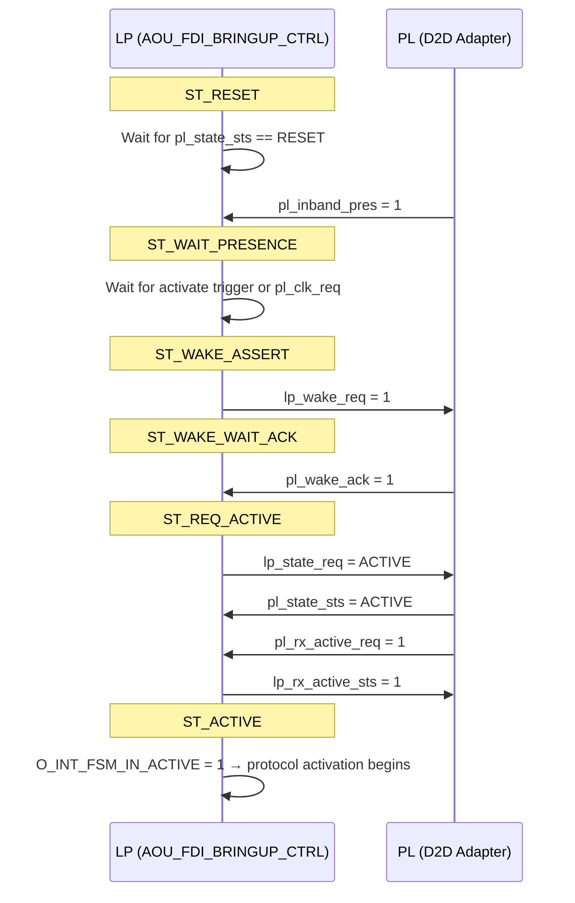

# Table of Contents

- [Integration Options](#integration-options)
- [1. Module Overview](#1-module-overview)
  - [1.1 AOU_TOP](#11-aou_top)
  - [1.2 AOU_CORE_TOP](#12-aou_core_top)
    - [1.2.1 Purpose and Function](#121-purpose-and-function)
    - [1.2.2 Key Features](#122-key-features)
- [2. Parameter List](#2-parameter-list)
- [3. Interface Signals](#3-interface-signals)
  - [3.1 Clock and Reset](#31-clock-and-reset)
  - [3.2 APB Slave Interface](#32-apb-slave-interface)
  - [3.3 AXI Master (RX) – AR Channel](#33-axi-master-rx--ar-channel)
  - [3.4 AXI Master (RX) – R Channel](#34-axi-master-rx--r-channel)
  - [3.5 AXI Master (RX) – AW Channel](#35-axi-master-rx--aw-channel)
  - [3.6 AXI Master (RX) – W and B Channels](#36-axi-master-rx--w-and-b-channels)
  - [3.7 AXI Slave (TX) – AR Channel](#37-axi-slave-tx--ar-channel)
  - [3.8 AXI Slave (TX) – R Channel](#38-axi-slave-tx--r-channel)
  - [3.9 AXI Slave (TX) – AW, W, B Channels](#39-axi-slave-tx--aw-w-b-channels)
  - [3.10 PHY and FDI (Flit Data Interface)](#310-phy-and-fdi-flit-data-interface)
  - [3.11 Interrupt and Error (to Error Handler)](#311-interrupt-and-error-to-error-handler)
  - [3.12 UCIe / External Control and Status](#312-ucie--external-control-and-status)
  - [3.13 DFT](#313-dft)
    - [3.13.1 TIEL_DFT_MODESCAN Usage](#3131-tiel_dft_modescan-usage)
    - [3.13.2 Integrator DFT Responsibilities](#3132-integrator-dft-responsibilities)
  - [3.14 FDI Bringup Control Interface (AOU_TOP only)](#314-fdi-bringup-control-interface-aou_top-only)
  - [3.15 FDI Bringup Software Control (AOU_TOP only)](#315-fdi-bringup-software-control-aou_top-only)
  - [3.16 FDI Bringup Status (AOU_TOP only)](#316-fdi-bringup-status-aou_top-only)
  - [3.17 AOU_CORE_TOP-only Ports (not on AOU_TOP)](#317-aou_core_top-only-ports-not-on-aou_top)
- [4. Software Operation Guide](#4-software-operation-guide)
  - [4.1 Register Map](#41-register-map)
- [5. Interrupts](#5-interrupts)
- [6. Activation Flow](#6-activation-flow)
  - [6.1 Credit Management Type](#61-credit-management-type)
  - [6.2 Activation Start](#62-activation-start)
  - [6.3 Deactivation Start](#63-deactivation-start)
    - [6.3.1 Deactivation Sequence Flow](#631-deactivation-sequence-flow)
  - [6.4 Activation/Deactivation Interrupt](#64-activationdeactivation-interrupt)
  - [6.5 PM Entry / LinkReset / LinkDisabled Sequence](#65-pm-entry--linkreset--linkdisabled-sequence)
    - [6.5.1 PM Entry SW Sequence](#651-pm-entry-sw-sequence)
    - [6.5.2 Link Disable SW Sequence](#652-link-disable-sw-sequence)
    - [6.5.3 Link Reset SW Sequence](#653-link-reset-sw-sequence)
  - [6.6 FDI Bringup Flow (AOU_TOP only)](#66-fdi-bringup-flow-aou_top-only)
    - [6.6.1 Overview](#661-overview)
    - [6.6.2 Bringup Sequence](#662-bringup-sequence)
    - [6.6.3 Supported State Transitions](#663-supported-state-transitions)
    - [6.6.4 PHY Type Mux](#664-phy-type-mux)
    - [6.6.5 Software Bringup Control](#665-software-bringup-control)
    - [6.6.6 Known Limitations](#666-known-limitations)
- [7. Verification Testbench](#7-verification-testbench)
  - [7.1 Architecture](#71-architecture)
  - [7.2 Components](#72-components)
  - [7.3 Running the Testbench](#73-running-the-testbench)
- [8. IP Integration Collateral](#8-ip-integration-collateral)
  - [8.1 Generated Outputs (Phase 1)](#81-generated-outputs-phase-1)
  - [8.2 Single Source of Truth](#82-single-source-of-truth)
  - [8.3 Regeneration](#83-regeneration)
  - [8.4 Planned: Full IP-XACT Component (Phase 2)](#84-planned-full-ip-xact-component-phase-2)
  - [8.5 Timing Constraints (SDC)](#85-timing-constraints-sdc)
    - [8.5.1 Clock Definitions](#851-clock-definitions)
    - [8.5.2 I/O Delay Budgeting Strategy](#852-io-delay-budgeting-strategy)
    - [8.5.3 Clock Domain Crossings](#853-clock-domain-crossings)
  - [8.6 UPF Power Intent](#86-upf-power-intent)
  - [8.7 Library Cell Replacement](#87-library-cell-replacement)
    - [8.7.1 Scan-Friendly Cell Requirements](#871-scan-friendly-cell-requirements)
- [References](#references)

## References

1. AXI over UCIe (AoU) Protocol Specification, v0.7 (https://cdn.sanity.io/files/jpb4ed5r/production/728b2f8cfc09023466cf350db53764890b4f2343.pdf)
2. AXI over UCIe (AoU) Protocol Specification, v0.5
3. Universal Chiplet Interconnect Express (UCIe) Specification, Revision 3.0 (https://www.uciexpress.org/)
4. Arm AMBA AXI and ACE Protocol Specification (AXI4) (https://developer.arm.com)
5. Arm AMBA APB Protocol Specification (https://developer.arm.com)

Arm, AMBA, AXI, APB, and ACE are registered trademarks or trademarks of Arm Limited (or its subsidiaries) in the US and/or elsewhere. Universal Chiplet Interconnect Express (UCIe) is a trademark of the UCIe Consortium. All other trademarks are the property of their respective owners.

---

# AOU Integration Guide

## Integration Options

The AOU IP can be integrated at two levels. Choose the option that
matches your system's FDI bringup strategy:

| Option | Module | When to use | FDI bringup | Additional ports |
| :---- | :---- | :---- | :---- | :---- |
| A (recommended) | `AOU_TOP` | Turn-key FDI bringup control is desired | Handled internally by `AOU_FDI_BRINGUP_CTRL` | FDI bringup control, SW bringup control, bringup status |
| B | `AOU_CORE_TOP` | You have an external UCIe controller or custom FDI state machine | Must be handled externally | `I_INT_FSM_IN_ACTIVE`, `O_AOU_ACTIVATE_ST_*`, `O_AOU_REQ_LINKRESET` |

> **Note:** All AXI, APB, FDI datapath, interrupt, and DFT interfaces
> are identical between `AOU_TOP` and `AOU_CORE_TOP`. The sections
> below that document these interfaces (Sections 2-8) apply to both
> modules unless otherwise noted.

For detailed micro-architecture information -- including datapath
internals, error handling, debugging features, and credit management --
refer to the *AOU_CORE Micro-Architecture Specification*
(`DOC/MAS/aou_core_mas.md`).

---

## 1. Module Overview

### 1.1 AOU_TOP

`AOU_TOP` is the recommended top-level integration module. It
instantiates two submodules:

- **`AOU_FDI_BRINGUP_CTRL`** -- A UCIe 3.0 FDI state machine that
  manages the four FDI handshake pairs (wake, clock, state negotiation,
  RX activation) required to bring the FDI link from RESET to ACTIVE and
  handle teardown, LinkError recovery, Retrain, and L1 entry/exit.

- **`AOU_CORE_TOP`** -- The AXI-over-UCIe protocol engine described in
  [Section 1.2](#12-aou_core_top).

The bringup controller drives `I_INT_FSM_IN_ACTIVE` into the protocol
engine internally, so this signal is not exposed as a top-level port on
`AOU_TOP`. Instead, `AOU_TOP` exposes:

- FDI bringup control ports for the physical layer handshakes
  ([Section 3.14](#314-fdi-bringup-control-interface-aou_top-only))
- Software bringup control pins
  ([Section 3.15](#315-fdi-bringup-software-control-aou_top-only))
- Bringup status outputs
  ([Section 3.16](#316-fdi-bringup-status-aou_top-only))

The FDI bringup flow is described in
[Section 6.6](#66-fdi-bringup-flow-aou_top-only).

### 1.2 AOU_CORE_TOP

Figure 1 shows high level block diagram of AOU CORE TOP.


#### 1.2.1 Purpose and Function

The AOU_CORE_TOP is a bridge between AXI interface and the UCIe FDI interface, defined in AoU
standard, AXI over UCIe Protocol Specification v0.7.

To achieve low latency, AOU_CORE directly handles signals related to the UCIe FDI interface
data flow control and processes data in 64-byte chunks in a cut-through manner, without
converting them to 256-byte flit data. It receives AXI messages from its own AXI slave
interface, packs them into 64-byte chunks, and transmits these chunks to the remote AoU device via UCIe. The remote AoU receives the 64-byte chunks from the UCIe FDI interface, unpacks them into AXI messages, and delivers the data through its AXI master interface.
It supports flow control for all exceptional cases defined in the UCIe standard. First, it handles
the chunk valid/cancel signal, including the alternative implementation method described in the
UCIe specification. Second, it handles the stall request signal received from the D2D Adapter
while maintaining the Flit-aligned boundary.

Interoperability is also supported when the remote device uses a different AXI data width.
AOU_CORE supports a configurable number of Resource Plane(RPs), with both the number of
RPs and each RP’s AXI data width fully parameterizable. A dedicated field in the SFR allows
software to configure the target RP, enabling flexible RP mapping. For each RP, the AW, W and
AR channel support three arbitration modes: Round Robin, AXI QoS scheme, and Port QoS
scheme. Additionally, a starvation-prevention mechanism is implemented to ensure fair
arbitration across all RP channels.

AOU_CORE_TOP implements the subset of FDI signals required specifically for transporting AXI across UCIe.  FDI bringup/teardown and FDI sideband flows are expected to be handled by other components.

The block consists of the following sub blocks

- AOU_CORE
  - AOU_CORE_RP
    Manages a AXI interface for write request, read request, write data, read data and write response busses
  - AOU_CORE_SFR
    This implements control and status register of the AOU core. It has a 32bit APB interface for programming. It configures all the blocks in the core.
  - AOU_TX_CORE
    This block packs the arbitrated AXI channels, credits, and activation messages and packs them into 64 byte FDI chunks. It follows AOU specifications to pack the messages into 256 byte flit data. It then passes it onto UCIe controller over the FDI interface for transmission.
  - AOU_CRD_CTRL
    This block manages credits available for TX. It gets remote credits available from AOU_RX_CORE, and used credits from AOU_TX_CORE and creates final credits that can be used for TX.
  - AOU_RX_CORE
    This block processed 64 byte FDI chunks received by UCIe controller and passed to the core over the FDI interface. It decodes different message types which encapsulate different AXI channel transactions. These messages are buffered and then passed onto AOU_CORE_RP for presenting the transaction to its corresponding AXI interface.
  - AOU_TX_FDI_IF
    This block receives 64 byte data chunks from AOU_TX_CORE and buffers them. It does handshake with UCIe controller FDI RX interface and passes the data chunks downstream to be sent to remote chiplet.
  - AOU_ACT_CTRL
    This block manages activation and deactivation control of the AOU bridge. It initiates activate and deactivate messages to remote AOU bridge when configured via APB.
- AOU_FIFO_RP
  This block buffers decoded messages from AOU_RX_CORE. It separates the messages based on resource plane (RP) indicator and writes them into dedicated FIFOs. These FIFOs feed the corresponding AOU_CORE_RP which manage a single AXI interface.
- ASYNC_APB_BRIDGE
  This block synchronizes APB transactions to the local core clock.

When using `AOU_CORE_TOP` directly, the integrator must provide an
external FDI state machine that drives `I_INT_FSM_IN_ACTIVE` and the
associated control/status signals listed in
[Section 3.12](#312-ucie--external-control-and-status).

#### 1.2.2 Key Features

- Single APB interface
  Configuration/control/status register access

- Multiple AXI master & slave interface
  - Configurable RP port & RP remapping supported
  - Supports variable data widths and burst length requests. Configurable FIFO Depth
- UCIe 256B latency-optimized flit(Format 6) support only
- Message packing and unpacking are handled in a unit of 64 bytes, corresponding to the
  FDI data width (64B@1 GHz).
- Selectable Early response by setting SFR8
- Selectable 32B and 64B FDI mode
- Parameterized  number of Resource Plane and each RP’s AXI data width
- RP Remapping
- QoS scheme between RP with AW, W, AR channel
- Interoperability with different data width remote die
- Handling of flit cancel and stall request as specified in the UCIe specification
- Selectable AXI Aggregator added for BUS efficiency

---

## 2. Parameter List

| Parameter | Type | Default / Note | Description |
| :---- | :---- | :---- | :---- |
| RP_COUNT | parameter | 2 | Number of receive ports (AXI M/S pairs). |
| RP0_RX_AW_FIFO_DEPTH | parameter | 44 | RX AW FIFO depth for RP0. |
| RP0_RX_AR_FIFO_DEPTH | parameter | 44 | RX AR FIFO depth for RP0. |
| RP0_RX_W_FIFO_DEPTH | parameter | 88 | RX W FIFO depth for RP0. |
| RP0_RX_R_FIFO_DEPTH | parameter | 88 | RX R FIFO depth for RP0. |
| RP0_RX_B_FIFO_DEPTH | parameter | 44 | RX B FIFO depth for RP0. |
| RP1_RX_AW_FIFO_DEPTH | parameter | 44 | RX AW FIFO depth for RP1. |
| RP1_RX_AR_FIFO_DEPTH | parameter | 44 | RX AR FIFO depth for RP1. |
| RP1_RX_W_FIFO_DEPTH | parameter | 88 | RX W FIFO depth for RP1. |
| RP1_RX_R_FIFO_DEPTH | parameter | 88 | RX R FIFO depth for RP1. |
| RP1_RX_B_FIFO_DEPTH | parameter | 44 | RX B FIFO depth for RP1. |
| RP2_RX_AW_FIFO_DEPTH | parameter | 44 | RX AW FIFO depth for RP2. |
| RP2_RX_AR_FIFO_DEPTH | parameter | 44 | RX AR FIFO depth for RP2. |
| RP2_RX_W_FIFO_DEPTH | parameter | 88 | RX W FIFO depth for RP2. |
| RP2_RX_R_FIFO_DEPTH | parameter | 88 | RX R FIFO depth for RP2. |
| RP2_RX_B_FIFO_DEPTH | parameter | 44 | RX B FIFO depth for RP2. |
| RP3_RX_AW_FIFO_DEPTH | parameter | 44 | RX AW FIFO depth for RP3. |
| RP3_RX_AR_FIFO_DEPTH | parameter | 44 | RX AR FIFO depth for RP3. |
| RP3_RX_W_FIFO_DEPTH | parameter | 88 | RX W FIFO depth for RP3. |
| RP3_RX_R_FIFO_DEPTH | parameter | 88 | RX R FIFO depth for RP3. |
| RP3_RX_B_FIFO_DEPTH | parameter | 44 | RX B FIFO depth for RP3. |
| RP0_AXI_DATA_WD | parameter | 512 | AXI data width for RP0 (bits). |
| RP1_AXI_DATA_WD | parameter | 512 | AXI data width for RP1 (bits). |
| RP2_AXI_DATA_WD | parameter | 512 | AXI data width for RP2 (bits). |
| RP3_AXI_DATA_WD | parameter | 512 | AXI data width for RP3 (bits). |
| AXI_PEER_DIE_MAX_DATA_WD | parameter | 1024 | Maximum peer data width (bits). |
| APB_ADDR_WD | parameter | 32 | APB address width. |
| APB_DATA_WD | parameter | 32 | APB data width. |
| S_RD_MO_CNT | parameter | 32 | Slave read outstanding count. |
| S_WR_MO_CNT | parameter | 32 | Slave write outstanding count. |
| M_RD_MO_CNT | parameter | 32 | Master read outstanding count. |
| M_WR_MO_CNT | parameter | 32 | Master write outstanding count. |


---

## 3. Interface Signals

### 3.1 Clock and Reset

| Signal | Direction | Width | Description |
| :---- | :---- | :---- | :---- |
| I_CLK | input | 1 | Core system clock (AOU_CORE and AOU_FIFO_RP). |
| I_RESETN | input | 1 | Active-low asynchronous reset. |
| I_PCLK | input | 1 | APB clock (slave side of async bridge). |
| I_PRESETN | input | 1 | APB domain reset. |

### 3.2 APB Slave Interface

| Signal | Direction | Width | Description |
| :---- | :---- | :---- | :---- |
| I_AOU_APB_SI0_PSEL | input | 1 | APB select. |
| I_AOU_APB_SI0_PENABLE | input | 1 | APB enable. |
| I_AOU_APB_SI0_PADDR | input | APB_ADDR_WD | APB address. |
| I_AOU_APB_SI0_PWRITE | input | 1 | APB write. |
| I_AOU_APB_SI0_PWDATA | input | APB_DATA_WD | APB write data. |
| O_AOU_APB_SI0_PRDATA | output | APB_DATA_WD | APB read data. |
| O_AOU_APB_SI0_PREADY | output | 1 | APB ready. |
| O_AOU_APB_SI0_PSLVERR | output | 1 | APB slave error. |

### 3.3 AXI Master (RX) – AR Channel

| Signal | Direction | Width | Description |
| :---- | :---- | :---- | :---- |
| O_AOU_RX_AXI_M_ARID | output | [RP_COUNT-1:0][AXI_ID_WD-1:0] | Read address ID. |
| O_AOU_RX_AXI_M_ARADDR | output | [RP_COUNT-1:0][AXI_ADDR_WD-1:0] | Read address. |
| O_AOU_RX_AXI_M_ARLEN | output | [RP_COUNT-1:0][AXI_LEN_WD-1:0] | Burst length. |
| O_AOU_RX_AXI_M_ARSIZE | output | [RP_COUNT-1:0][2:0] | Transfer size. |
| O_AOU_RX_AXI_M_ARBURST | output | [RP_COUNT-1:0][1:0] | Burst type. |
| O_AOU_RX_AXI_M_ARLOCK | output | [RP_COUNT-1:0] | Lock. |
| O_AOU_RX_AXI_M_ARCACHE | output | [RP_COUNT-1:0][3:0] | Cache attributes. |
| O_AOU_RX_AXI_M_ARPROT | output | [RP_COUNT-1:0][2:0] | Protection. |
| O_AOU_RX_AXI_M_ARQOS | output | [RP_COUNT-1:0][3:0] | QoS. |
| O_AOU_RX_AXI_M_ARVALID | output | [RP_COUNT-1:0] | AR valid. |
| I_AOU_RX_AXI_M_ARREADY | input | [RP_COUNT-1:0] | AR ready. |

### 3.4 AXI Master (RX) – R Channel

| Signal | Direction | Width | Description |
| :---- | :---- | :---- | :---- |
| I_AOU_TX_AXI_M_RID | input | [RP_COUNT-1:0][AXI_ID_WD-1:0] | Read data ID. |
| I_AOU_TX_AXI_M_RDATA | input | [RP_COUNT-1:0][RP_AXI_DATA_WD_MAX-1:0] | Read data. |
| I_AOU_TX_AXI_M_RRESP | input | [RP_COUNT-1:0][1:0] | Read response. |
| I_AOU_TX_AXI_M_RLAST | input | [RP_COUNT-1:0] | Read last. |
| I_AOU_TX_AXI_M_RVALID | input | [RP_COUNT-1:0] | R valid. |
| O_AOU_TX_AXI_M_RREADY | output | [RP_COUNT-1:0] | R ready. |

### 3.5 AXI Master (RX) – AW Channel

| Signal | Direction | Width | Description |
| :---- | :---- | :---- | :---- |
| O_AOU_RX_AXI_M_AWID | output | [RP_COUNT-1:0][AXI_ID_WD-1:0] | Write address ID. |
| O_AOU_RX_AXI_M_AWADDR | output | [RP_COUNT-1:0][AXI_ADDR_WD-1:0] | Write address. |
| O_AOU_RX_AXI_M_AWLEN | output | [RP_COUNT-1:0][AXI_LEN_WD-1:0] | Burst length. |
| O_AOU_RX_AXI_M_AWSIZE | output | [RP_COUNT-1:0][2:0] | Transfer size. |
| O_AOU_RX_AXI_M_AWBURST | output | [RP_COUNT-1:0][1:0] | Burst type. |
| O_AOU_RX_AXI_M_AWLOCK | output | [RP_COUNT-1:0] | Lock. |
| O_AOU_RX_AXI_M_AWCACHE | output | [RP_COUNT-1:0][3:0] | Cache attributes. |
| O_AOU_RX_AXI_M_AWPROT | output | [RP_COUNT-1:0][2:0] | Protection. |
| O_AOU_RX_AXI_M_AWQOS | output | [RP_COUNT-1:0][3:0] | QoS. |
| O_AOU_RX_AXI_M_AWVALID | output | [RP_COUNT-1:0] | AW valid. |
| I_AOU_RX_AXI_M_AWREADY | input | [RP_COUNT-1:0] | AW ready. |

### 3.6 AXI Master (RX) – W and B Channels

| Signal | Direction | Width | Description |
| :---- | :---- | :---- | :---- |
| O_AOU_RX_AXI_M_WDATA | output | [RP_COUNT-1:0][RP_AXI_DATA_WD_MAX-1:0] | Write data. |
| O_AOU_RX_AXI_M_WSTRB | output | [RP_COUNT-1:0][RP_AXI_STRB_WD_MAX-1:0] | Write strobe. |
| O_AOU_RX_AXI_M_WLAST | output | [RP_COUNT-1:0] | Write last. |
| O_AOU_RX_AXI_M_WVALID | output | [RP_COUNT-1:0] | W valid. |
| I_AOU_RX_AXI_M_WREADY | input | [RP_COUNT-1:0] | W ready. |
| I_AOU_TX_AXI_M_BID | input | [RP_COUNT-1:0][AXI_ID_WD-1:0] | Write response ID. |
| I_AOU_TX_AXI_M_BRESP | input | [RP_COUNT-1:0][1:0] | Write response. |
| I_AOU_TX_AXI_M_BVALID | input | [RP_COUNT-1:0] | B valid. |
| O_AOU_TX_AXI_M_BREADY | output | [RP_COUNT-1:0] | B ready. |

### 3.7 AXI Slave (TX) – AR Channel

| Signal | Direction | Width | Description |
| :---- | :---- | :---- | :---- |
| I_AOU_TX_AXI_S_ARID | input | [RP_COUNT-1:0][AXI_ID_WD-1:0] | Read address ID. |
| I_AOU_TX_AXI_S_ARADDR | input | [RP_COUNT-1:0][AXI_ADDR_WD-1:0] | Read address. |
| I_AOU_TX_AXI_S_ARLEN | input | [RP_COUNT-1:0][AXI_LEN_WD-1:0] | Burst length. |
| I_AOU_TX_AXI_S_ARSIZE | input | [RP_COUNT-1:0][2:0] | Transfer size. |
| I_AOU_TX_AXI_S_ARBURST | input | [RP_COUNT-1:0][1:0] | Burst type. |
| I_AOU_TX_AXI_S_ARLOCK | input | [RP_COUNT-1:0] | Lock. |
| I_AOU_TX_AXI_S_ARCACHE | input | [RP_COUNT-1:0][3:0] | Cache attributes. |
| I_AOU_TX_AXI_S_ARPROT | input | [RP_COUNT-1:0][2:0] | Protection. |
| I_AOU_TX_AXI_S_ARQOS | input | [RP_COUNT-1:0][3:0] | QoS. |
| I_AOU_TX_AXI_S_ARVALID | input | [RP_COUNT-1:0] | AR valid. |
| O_AOU_TX_AXI_S_ARREADY | output | [RP_COUNT-1:0] | AR ready. |

### 3.8 AXI Slave (TX) – R Channel

| Signal | Direction | Width | Description |
| :---- | :---- | :---- | :---- |
| O_AOU_RX_AXI_S_RID | output | [RP_COUNT-1:0][AXI_ID_WD-1:0] | Read data ID. |
| O_AOU_RX_AXI_S_RDATA | output | [RP_COUNT-1:0][RP_AXI_DATA_WD_MAX-1:0] | Read data. |
| O_AOU_RX_AXI_S_RRESP | output | [RP_COUNT-1:0][1:0] | Read response. |
| O_AOU_RX_AXI_S_RLAST | output | [RP_COUNT-1:0] | Read last. |
| O_AOU_RX_AXI_S_RVALID | output | [RP_COUNT-1:0] | R valid. |
| I_AOU_RX_AXI_S_RREADY | input | [RP_COUNT-1:0] | R ready. |

### 3.9 AXI Slave (TX) – AW, W, B Channels

| Signal | Direction | Width | Description |
| :---- | :---- | :---- | :---- |
| I_AOU_TX_AXI_S_AWID | input | [RP_COUNT-1:0][AXI_ID_WD-1:0] | Write address ID. |
| I_AOU_TX_AXI_S_AWADDR | input | [RP_COUNT-1:0][AXI_ADDR_WD-1:0] | Write address. |
| I_AOU_TX_AXI_S_AWLEN | input | [RP_COUNT-1:0][AXI_LEN_WD-1:0] | Burst length. |
| I_AOU_TX_AXI_S_AWSIZE | input | [RP_COUNT-1:0][2:0] | Transfer size. |
| I_AOU_TX_AXI_S_AWBURST | input | [RP_COUNT-1:0][1:0] | Burst type. |
| I_AOU_TX_AXI_S_AWLOCK | input | [RP_COUNT-1:0] | Lock. |
| I_AOU_TX_AXI_S_AWCACHE | input | [RP_COUNT-1:0][3:0] | Cache attributes. |
| I_AOU_TX_AXI_S_AWPROT | input | [RP_COUNT-1:0][2:0] | Protection. |
| I_AOU_TX_AXI_S_AWQOS | input | [RP_COUNT-1:0][3:0] | QoS. |
| I_AOU_TX_AXI_S_AWVALID | input | [RP_COUNT-1:0] | AW valid. |
| O_AOU_TX_AXI_S_AWREADY | output | [RP_COUNT-1:0] | AW ready. |
| I_AOU_TX_AXI_S_WDATA | input | [RP_COUNT-1:0][RP_AXI_DATA_WD_MAX-1:0] | Write data. |
| I_AOU_TX_AXI_S_WSTRB | input | [RP_COUNT-1:0][RP_AXI_STRB_WD_MAX-1:0] | Write strobe. |
| I_AOU_TX_AXI_S_WLAST | input | [RP_COUNT-1:0] | Write last. |
| I_AOU_TX_AXI_S_WVALID | input | [RP_COUNT-1:0] | W valid. |
| O_AOU_TX_AXI_S_WREADY | output | [RP_COUNT-1:0] | W ready. |
| O_AOU_RX_AXI_S_BID | output | [RP_COUNT-1:0][AXI_ID_WD-1:0] | Write response ID. |
| O_AOU_RX_AXI_S_BRESP | output | [RP_COUNT-1:0][1:0] | Write response. |
| O_AOU_RX_AXI_S_BVALID | output | [RP_COUNT-1:0] | B valid. |
| I_AOU_RX_AXI_S_BREADY | input | [RP_COUNT-1:0] | B ready. |

### 3.10 PHY and FDI (Flit Data Interface)

| Signal | Direction | Width | Description |
| :---- | :---- | :---- | :---- |
| I_PHY_TYPE | input | 1 | PHY width mode (e.g., 32B vs 64B). |
| I_FDI_PL_32B_VALID | input | 1 | 32B flit valid from PHY. |
| I_FDI_PL_32B_DATA | input | 256 | 32B flit data. |
| I_FDI_PL_32B_FLIT_CANCEL | input | 1 | 32B flit cancel. |
| I_FDI_PL_64B_VALID | input | 1 | 64B flit valid from PHY. |
| I_FDI_PL_64B_DATA | input | 512 | 64B flit data. |
| I_FDI_PL_64B_FLIT_CANCEL | input | 1 | 64B flit cancel. |
| I_FDI_PL_32B_TRDY | input | 1 | 32B PHY ready. |
| I_FDI_PL_32B_STALLREQ | input | 1 | 32B stall request. |
| I_FDI_PL_32B_STATE_STS | input | [3:0] | 32B state status. |
| O_FDI_LP_32B_DATA | output | 256 | 32B flit data to PHY. |
| O_FDI_LP_32B_VALID | output | 1 | 32B flit valid. |
| O_FDI_LP_32B_IRDY | output | 1 | 32B link ready. |
| O_FDI_LP_32B_STALLACK | output | 1 | 32B stall acknowledge. |
| I_FDI_PL_64B_TRDY | input | 1 | 64B PHY ready. |
| I_FDI_PL_64B_STALLREQ | input | 1 | 64B stall request. |
| I_FDI_PL_64B_STATE_STS | input | [3:0] | 64B state status. |
| O_FDI_LP_64B_DATA | output | 512 | 64B flit data to PHY. |
| O_FDI_LP_64B_VALID | output | 1 | 64B flit valid. |
| O_FDI_LP_64B_IRDY | output | 1 | 64B link ready. |
| O_FDI_LP_64B_STALLACK | output | 1 | 64B stall acknowledge. |

### 3.11 Interrupt and Error (to Error Handler)

| Signal | Direction | Width | Description |
| :---- | :---- | :---- | :---- |
| INT_REQ_LINKRESET | output | 1 | Link reset request. |
| INT_SI0_ID_MISMATCH | output | 1 | Slave interface ID mismatch. |
| INT_MI0_ID_MISMATCH | output | 1 | Master interface ID mismatch. |
| INT_EARLY_RESP_ERR | output | 1 | Early response error. |
| INT_ACTIVATE_START | output | 1 | Activate start. |
| INT_DEACTIVATE_START | output | 1 | Deactivate start. |

### 3.12 UCIe / External Control and Status

> **AOU_TOP users:** The signals in this table are present on
> `AOU_CORE_TOP` only. When integrating via `AOU_TOP`, these signals are
> consumed/generated internally by `AOU_FDI_BRINGUP_CTRL` and are not
> exposed as top-level ports. See
> [Section 3.17](#317-aou_core_top-only-ports-not-on-aou_top).

| Signal | Direction | Width | Description |
| :---- | :---- | :---- | :---- |
| I_INT_FSM_IN_ACTIVE | input | 1 | Initialization done / FSM in active state indicator. |
| I_MST_BUS_CLEANY_COMPLETE | input | 1 | Master bus cleany complete. |
| I_SLV_BUS_CLEANY_COMPLETE | input | 1 | Slave bus cleany complete. |
| O_AOU_ACTIVATE_ST_DISABLED | output | 1 | Activation state disabled. |
| O_AOU_ACTIVATE_ST_ENABLED | output | 1 | Activation state enabled. |
| O_AOU_REQ_LINKRESET | output | 1 | AOU link reset request. |

### 3.13 DFT

| Signal | Direction | Width | Description |
| :---- | :---- | :---- | :---- |
| TIEL_DFT_MODESCAN | input | 1 | Scan-mode indicator. Tie low in functional operation; assert high from the SoC scan controller during scan shift and capture. |

#### 3.13.1 TIEL_DFT_MODESCAN Usage

`TIEL_DFT_MODESCAN` controls a glitch-free mux (`u_sw_reset_mux`, instance of `AOU_SOC_GFMUX_LVT`) that selects the reset source for `AOU_CORE`:

```
                          TIEL_DFT_MODESCAN
                                |
                              I_SEL
                         +-------------+
  ~r_sw_reset & I_RESETN |  I_A        |
  (functional SW reset)  |   GFMUX     |---> w_DFTED_sw_resetn ---> AOU_CORE.I_RESETN
                         |  I_B        |
  AOU_SOC_BUF(1'b0)     |             |
  (scan bypass: low)     +-------------+
```

- **Functional mode** (`TIEL_DFT_MODESCAN` = 0): The mux selects `I_A`, the functional software-controlled reset path (`~r_sw_reset & I_RESETN`). This allows the CSR-writable SW reset to combine with the hardware reset.
- **Scan mode** (`TIEL_DFT_MODESCAN` = 1): The mux selects `I_B`, a constant `1'b0` driven through `AOU_SOC_BUF` (`dft_persistent_buf_scan_resetn_sw`). This value de-asserts the active-low SW reset, neutralizing it so that scan chains can shift freely without the software reset logic interfering with controllability or observability.

The `AOU_SOC_BUF` instance exists solely to prevent the synthesis tool from optimizing away the tied-low constant; it must be preserved as a persistent buffer (see [Section 8.7](#87-library-cell-replacement)).

The SDC file (`INTEG/constraints/aou_core_top.sdc`) constrains this pin with `set_case_analysis 0` in functional timing mode.

#### 3.13.2 Integrator DFT Responsibilities

The design provides internal DFT muxing only for the software-controlled reset path (`w_DFTED_sw_resetn`). The two primary hardware resets and all scan infrastructure are the integrator's responsibility:

| Responsibility | Detail |
| :---- | :---- |
| **HW reset DFT muxes** | `I_RESETN` and `I_PRESETN` have no internal scan-mode bypass. The integrator must add external DFT muxes (or equivalent) on both resets so they can be held inactive (high) during scan shift and capture. Without this, all flip-flops using these resets will be uncontrollable during ATPG. |
| **Scan chain insertion** | The design has no `SCAN_EN`, `SCAN_IN`, or `SCAN_OUT` ports. The integrator must insert scan chains via the synthesis tool's DFT insertion flow or by adding scan ports manually. |
| **Multi-clock scan definition** | `I_CLK` (1 GHz core) and `I_PCLK` (100 MHz APB) must be defined as separate scan clocks. The ATPG tool must not shift both domains simultaneously, or lockup latches must be inserted at domain boundaries. |
| **I/O constraints during scan** | AXI and FDI interface ports should be constrained to safe values during scan (via wrapper cells or top-level scan constraints) to prevent unintended activity on external buses. |
| **CDC synchronizer handling** | The `AOU_SOC_SYNCHSR` instances in the `ASYNC_APB_BRIDGE` require scan-safe treatment. See [Section 8.7](#87-library-cell-replacement) for replacement cell requirements. |

### 3.14 FDI Bringup Control Interface (AOU_TOP only)

These signals connect `AOU_TOP` to the D2D adapter's physical layer for
FDI bringup control. They are not present on `AOU_CORE_TOP`.

| Signal | Direction | Width | Description |
| :---- | :---- | :---- | :---- |
| I_PL_INBAND_PRES | input | 1 | Inband presence detect from PL. The bringup FSM waits for this before initiating the wake handshake. |
| I_PL_CLK_REQ | input | 1 | PL clock request. LP responds with `O_LP_CLK_ACK`. |
| I_PL_WAKE_ACK | input | 1 | PL acknowledgement of LP wake request. |
| I_PL_RX_ACTIVE_REQ | input | 1 | PL requests RX activation. LP responds with `O_LP_RX_ACTIVE_STS`. |
| O_LP_STATE_REQ | output | [3:0] | LP state request (RESET=0, ACTIVE=1, LinkError=2, Retrain=3, L1=4). |
| O_LP_WAKE_REQ | output | 1 | LP-initiated wake request. |
| O_LP_CLK_ACK | output | 1 | LP acknowledgement of PL clock request. |
| O_LP_RX_ACTIVE_STS | output | 1 | LP RX active status in response to `I_PL_RX_ACTIVE_REQ`. |

The four handshake pairs correspond to UCIe 3.0 FDI bringup control signals:

| Handshake | LP signal | PL signal | Purpose |
| :---- | :---- | :---- | :---- |
| Wake | `O_LP_WAKE_REQ` | `I_PL_WAKE_ACK` | LP-initiated link wake from low-power |
| Clock | `O_LP_CLK_ACK` | `I_PL_CLK_REQ` | PL-initiated clock request |
| State | `O_LP_STATE_REQ` | (via `I_FDI_PL_*_STATE_STS`) | State negotiation |
| RX Active | `O_LP_RX_ACTIVE_STS` | `I_PL_RX_ACTIVE_REQ` | RX path activation |

### 3.15 FDI Bringup Software Control (AOU_TOP only)

These top-level ports provide direct software control over the FDI
bringup FSM. They are **not SFR-mapped**; the integrator must drive them
from external logic or tie them as needed.

| Signal | Direction | Width | Description |
| :---- | :---- | :---- | :---- |
| I_SW_ACTIVATE_START | input | 1 | Trigger FDI bringup (RESET to ACTIVE). ORed internally with the core's `INT_ACTIVATE_START`. |
| I_SW_DEACTIVATE_START | input | 1 | Trigger FDI teardown. ORed internally with the core's `INT_DEACTIVATE_START`. |
| I_SW_RETRAIN_REQ | input | 1 | Request link retrain (LP-initiated). |
| I_SW_LINKERROR_INJECT | input | 1 | Force the bringup FSM into LinkError state for debug/test. |

### 3.16 FDI Bringup Status (AOU_TOP only)

| Signal | Direction | Width | Description |
| :---- | :---- | :---- | :---- |
| O_FDI_FSM_STATE | output | [3:0] | Current FDI state. Encoding matches UCIe 3.0: RESET=0, ACTIVE=1, LinkError=2, Retrain=3, L1=4, L2=5, Disabled=6. |
| O_FDI_LINK_UP | output | 1 | Asserted when the FDI bringup FSM is in the ACTIVE state. |

### 3.17 AOU_CORE_TOP-only Ports (not on AOU_TOP)

The following signals are present on `AOU_CORE_TOP` but are **not**
exposed on `AOU_TOP`. In `AOU_TOP`, they are consumed or generated
internally by `AOU_FDI_BRINGUP_CTRL`.

| Signal | Direction (on AOU_CORE_TOP) | Description |
| :---- | :---- | :---- |
| I_INT_FSM_IN_ACTIVE | input | FDI link active indicator. Driven by the bringup FSM's `O_INT_FSM_IN_ACTIVE` inside `AOU_TOP`. |
| O_AOU_ACTIVATE_ST_DISABLED | output | Protocol activation state: disabled. Fed back to bringup FSM. |
| O_AOU_ACTIVATE_ST_ENABLED | output | Protocol activation state: enabled. Fed back to bringup FSM. |
| O_AOU_REQ_LINKRESET | output | Protocol-level LinkReset request. Fed back to bringup FSM. |

---

## 4. Software operation Guide

This section gives information about operation guide for the AOU_CORE.

### 4.1 Register Map

The complete register map — address offsets, field definitions, access types, and reset
values — is generated from the SystemRDL source and maintained separately:

- **[AOU Core CSR Reference](../csr/aou-core-csrs.md)** (generated from `csr/aou-core.rdl`)

To regenerate after editing the RDL source, see [DOC/csr/README.md](../csr/README.md).

## 5. Interrupts

- **INT_ACTIVATE_START**
  An interrupt that occurs when activation of the AoU Protocol layer is required. The interrupt can be cleared by writing '1' to the AOU_CORE.AOU_INIT.INT_ACTIVATE_START SFR.

- **INT_DEACTIVATE_START**
  An interrupt that occurs when deactivation of the AoU Protocol layer is required. The interrupt can be cleared by writing '1' to the AOU_CORE.AOU_INIT.INT_DEACTIVATE_START SFR.

- **INT_SI0_ID_MISMATCH**
  An interrupt that occurs on the AXI Slave Interface when a B or R channel response is received with an ID that was not previously issued as a request. SW can check the mismatched AXI ID by reading AOU_CORE.AXI_SLV_ID_MISMATCH_ERR SFR. The interrupt can be cleared by writing '1' to the AOU_CORE.AXI_SLV_ID_MISMATCH_ERR.SLV_B/RRESP_ERR SFR.

- **INT_MI0_ID_MISMATCH**
  An interrupt that occurs on the AXI Master Interface when a B or R channel response is received with an ID that was not previously issued as a request. SW can check the mismatched AXI ID by reading AOU_CORE.ERROR_INFO SFR. The interrupt can be cleared by writing '1' to the AOU_CORE.ERROR_INFO.SPLIT_B/RID_MISMATCH_ERR SFR.

- **INT_EARLY_RESP_ERR**
  An interrupt that occurs when, due to the Write Early Response feature, a B response has already
  been sent through the AXI Slave Interface, and a subsequent actual B response arrives with an Error. SW can check the ID and error type of the transaction in which the error occurred by reading AOU_CORE.WRITE_EARLY_RESPONSE SFR. The interrupt can be cleared by writing '1' to the AOU_CORE.WRITE_EARLY_RESPONSE.WRITE_RESP_ERR SFR.

- **INT_REQ_LINKRESET**
  An interrupt that occurs when AOU_CORE receives a protocol violation. Refer to the *AOU_CORE Micro-Architecture Specification* (`DOC/MAS/aou_core_mas.md`) for debugging details. When AOU_CORE receives a protocol violation, SW needs to do SW reset AOU_CORE and re-enter the activation sequence.

## 6. Activation Flow

> **AOU_TOP users:** When using `AOU_TOP`, FDI bringup (RESET to
> ACTIVE) is handled by `AOU_FDI_BRINGUP_CTRL` before protocol-level
> activation begins. The protocol activation described in this section
> occurs after `O_FDI_LINK_UP` is asserted. See
> [Section 6.6](#66-fdi-bringup-flow-aou_top-only) for the FDI bringup
> sequence.

The Activation of AOU_CORE begins after the UCIe Link-up process has been successfully
completed. The completion of UCIe link-up is indicated by the **I_INT_FSM_IN_ACTIVE**
signal of the **AOU_CORE_TOP**.
There is no dependency between the activation of the local die and the remote die. Each die may
initiate the activation sequence independently, which means the timing of sending **ActivateReq**
can differ. Both dies must exchange **ActivateReq** and **ActivateAck** messages to transition to the **ENABLED** state, at which point credited messages can be transmitted.

Regardless of its own activation state, a die must send an ActivateAck in response to an
ActivateReq from the other die, to acknowledge receipt of the request.

### 6.1 Credit Management Type

There are two types of Credit Management Type. Since current AOU_SPEC cannot resolve
pending AXI response without Activate again. When Credit Management type is set to 1, during
Deactivated state, AOU_CORE can resolve pending AXI response itself.

It can be configured through AOU_CON0.CREDIT_MANAGE, and the default value is 0.

| Credit Management Type  | Specification  | Description |
| ----- | :---: | ----- |
| 0 (default) | Based on AoU v0.5 | After deactivation, if a new request is received from the remote die, no response message can be sent. To deliver the corresponding response, the system must go through activation again after deactivation. Credit management and transmission availability for both Request-related messages and Response-related messages are controlled together. Credited messages must not be sent, after the DeactivateReq message is sent. Credits must not be sent after the DeactivateAck message is sent. The Activate Interrupt and Deactivate Interrupt that occur in the process of resuming the exchange of response messages impose mandatory requirements to set Activate and Deactivate SFR. |
| 1 | Proposal by BOS | When the AoU Activity state is DEACTIVATE, manage Request-related messages (WREQ, RREQ,WDATA) and Response-related messages (RDATA, WRESP) separately. RDATA, WRESP Credited messages can be sent, after the DeactivateReq message is sent. Credits for RDATA, WRESP messages must be sent after the DeactivateAck message is sent. The Deactivate interrupt only provides a hint indicating that the remote die has started to activate / deactivate. |

### 6.2 Activation Start

Activation can be initiated by setting ACTIVATE_START SFR:
In the current implementation, credits are granted based on the depth of the RX FIFO, so it is
required to ensure that all messages in the RX FIFO are popped before sending the ActivateReq message.

Activation START (via SFR AOU_INIT.ACTIVATE_START SFR)

- Activation can be triggered by setting ACTIVATE_START.
- Activation does not proceed until I_INT_FSM_IN_ACTIVE is asserted, since no flits can be transmitted beforehand.
  Therefore, it is allowed to set the ACTIVATE_START SFR before I_INT_FSM_IN_ACTIVE is asserted. If it is set before the assertion, the activation process will automatically proceed after I_INT_FSM_IN_ACTIVE becomes asserted.
- AOU_INIT.ACTIVATE_START SFR is automatically cleared to 0 once the activation is completed and AOU_ACTIVATE_STATE transitions to ENABLED.

### 6.3 Deactivation Start

Deactivation is initiated by setting the AOU_INIT.DEACTIVATE_START register. Setting this
register does not immediately trigger sending a DeactivateReq message. The detailed conditions
and sequence for deactivation can be found in the **Deactivation Sequence Flow** section. This
section will only describe AOU_INIT.DEACTIVATE_TIME_OUT_VALUE SFR.

- When software initiates a DeactivateReq by setting the SFR, there may still be outstanding requests that have not yet left AOU_CORE FDI outputs.
- To handle this safely, a timeout mechanism is implemented to ensure that no valid packets remain in the AOU_TX_CORE.
- If software guarantees that all responses to its issued requests have been received before setting the deactivation start SFR, the deactivate TIME_OUT_VALUE (AOU_INIT.DEACTIVATE_TIME_OUT_VALUE SFR) can be safely configured to a shorter duration.

The ACTIVATION_OP field encodes deactivation messages as follows:

- 2 = DeactivateReq
- 3= DeactivateAck

#### 6.3.1 Deactivation Sequence Flow

Once the local die issues a DeactivateReq, it can no longer provide responses to transactions
initiated by the remote die. If the remote die continues to send requests or waits for responses
without being notified, it may enter a hang state.

To manage this safely, the remote die must take explicit action upon receiving a DeactivateReq:

1. Immediately generate an interrupt to the CPU to inform the system software that a DeactivateReq has been received and that it must set the DEACTIVATE_START SFR. Although deactivation of the local die and the remote die operate independently, it is essential at the system level to communicate the deactivation & activation state through interrupts. This ensures that system software is explicitly informed of deactivation events and prevents the remote die from continuing to expect a response that will never arrive, thereby avoiding hang conditions.
2. This approach guarantees that once deactivation is initiated, both dies can coordinate the transition into safe and consistent DISABLED state.
3. If the software on both dies can explicitly coordinate to guarantee that all outstanding transactions have been completed and that no new transactions will be issued, then such a complicated implementation would not be necessary.


This system provides a bus cleanly-completion mechanism:

- Slave bus cleanly indicates whether the local die has received all responses to the requests it sent to the remote die.
- Master bus cleanly indicates whether the remote die has received all responses to the requests it sent to the local die.

After the local die sends a DeactivateReq, if the remote die issues a new request and expects a
response, the system must re-enter the activation sequence before any response can be provided.
Before sending a new ActivateReq, the Rx FIFO must be completely emptied – that is, all
messages must be popped.

After deactivation, the credit count is reset, and during the subsequent activation process, credits
are advertised based on the RX FIFO depth.

Therefore, before sending an ActivateReq, the local die must confirm, as described in the local
die’s sequence 10.1, that all messages in the RX FIFO have been popped.

To meet satisfy the condition in the local die’s sequence 10.1, no backpressure must occur on the
local die’s MI AW/AR/W channels.

### 6.4 Activation/Deactivation Interrupt

| Interrupt  | Description |
| ----- | ----- |
| INT_ACTIVATE_START | When this interrupt is detected, either the AOU_INIT.ACTIVATE_START SFR must be set to 1. When AOU_INIT.ACTIVATE_STATE_ENABLED becomes 1, you must write 1 to the AOU_INIT.INT_ACTIVATE_START W1C SFR must be set to 1. An interrupt occurs when the following conditions are met while both AOU_INIT.ACTIVATE_START SFR is not set. There is a message to send When AOU_CON0.CREDIT_MANAGE is set to 0, if a new request arrives from the remote die after the local die has sent a DeactivateReq, this interrupt is asserted because the local die is required to return a response to the remote die. When AOU_CON0.CREDIT_MANAGE is set to 1, this interrupt can also be asserted if a new request after the remote die has sent a DeactivateReq. There is a response to be received (I_SLV_BUS_CLEANY_COMPLETE == 0) When AOU_CON0.CREDIT_MANAGE is set to 0, this interrupt can be asserted if the local die issues new AXI requests after the remote die has sent a DeactivateReq. An ActivateReq message is received from the remote die.  |
| INT_DEACTIVATE_START | When AOU_CON0.CREDIT_MANAGE is set to 0, if the interrupt is detected, the master IP must stop sending new request messages and the AOU_INIT.DEACTIVATE_START SFR must be set to 1. When AOU_CON0.CREDIT_MANAGE is set to 1, if the interrupt is detected, this interrupt serves only as a hint that the remote die intends to deactivate. The local die can continue sending request messages. Once all messages have been sent, the AOU_INIT.DEACTIVATE_START SFR must be set. Otherwise, the remote die may end up in a state where it can never send requests again. When AOU_INIT.ACTIVATE_STATE_DISABLED becomes 1,  SW must write 1 to the AOU_INIT.INT_DEACTIVATE_START W1C SFR must be set to 1. An interrupt can be asserted when AOU_INIT.DEACTIVATE_START SFR is not set and the local die receives a DeactivateReq message from the remote die. |

###

### 6.5 PM Entry / LinkReset / LinkDisabled Sequence

For PM entry / LinkReset / LinkDisable entry sequence, UCIE_CORE should check AOU_CORE state and try to change state. For this sequence, resolving pending AXI transactions is necessary.

Since current AOU SPEC has no way to send AXI responses after sending DeactiveReq. CREDIT_MANAGE = 0 (Type 0) is matched with current AOU_SPEC. For this case, SW needs to check whether there is pending AXI transaction.

#### 6.5.1 PM Entry SW Sequence

1. Write AOU_INIT.DEACTIVATE_START to 1.

2. Polling AOU_INIT.ACTIVATE_STATE_DISABLED and AOU_INIT.SLV_TR_COMPLETE & AOU_INIT.MST_TR_COMPLETE.
   2.1 Although AOU_CORE state becomes DISABLED, there may be pending AXI transactions.
   2.2 AOU_CORE issues Interrupt for resolving pending AXI transactions.
   2.3 Activate AOU_CORE and resolve pending AXI transactions.
   2.4 Deactivate AOU_CORE

3. Polling AOU_INIT.ACTIVATE_STATE_DISABLED and AOU_INIT.SLV_TR_COMPLETE & AOU_INIT.MST_TR_COMPLETE.

4. Do PM Entry Sequence on UCIE_CORE.


#### 6.5.2 Link Disable SW Sequence

Same as PM entry, before doing UCIe state transition, AOU_CORE needs to be Disabled properly.

1. Write AOU_INIT.DEACTIVATE_START to 1.

2. Polling AOU_INIT.ACTIVATE_STATE_DISABLED and AOU_INIT.SLV_TR_COMPLETE & AOU_INIT.MST_TR_COMPLETE.
   2.1 Although AOU_CORE state becomes DISABLED, there may be pending AXI transactions.
   2.2 AOU_CORE issues Interrupt for resolving pending AXI transactions.
   2.3 Activate AOU_CORE and resolve pending AXI transactions.
   2.4 Deactivate AOU_CORE

3. Polling AOU_INIT.ACTIVATE_STATE_DISABLED and AOU_INIT.SLV_TR_COMPLETE & AOU_INIT.MST_TR_COMPLETE.

4. Do LinkReset / LinkDisable Sequence on UCIE_CORE.

#### 6.5.3 Link Reset SW Sequence

If AOU_CORE faces an uncorrectable error (ex. AOU SPEC violation), AOU_CORE sends LinkReset to CPU and D2D adapter. LinkReset indicates that an error has occurred which requires the Link to go down.

While handling LinkReset, SW needs  to do AOU_CORE SW reset by setting AOU_CON0.AOU_SW_RESET.

### 6.6 FDI Bringup Flow (AOU_TOP only)

> This section applies **only** when integrating via `AOU_TOP`. If you
> are using `AOU_CORE_TOP` directly, you must implement an equivalent
> FDI state machine externally.

#### 6.6.1 Overview

`AOU_FDI_BRINGUP_CTRL` manages the UCIe 3.0 FDI state machine,
handling the four handshake pairs required to bring the FDI link from
RESET to ACTIVE and to manage teardown, LinkError recovery, Retrain,
and L1 entry/exit.

The bringup FSM operates in the `I_CLK` domain and uses 12 internal
states. The status output `O_FDI_FSM_STATE` maps these to the standard
UCIe 3.0 FDI state encoding.

Once the bringup FSM reaches ACTIVE, it asserts `O_INT_FSM_IN_ACTIVE`
into `AOU_CORE_TOP`, which enables protocol-level activation as
described in [Section 6](#6-activation-flow).

#### 6.6.2 Bringup Sequence

The normal (happy-path) bringup from cold reset proceeds as follows:



The steps in detail:

1. **RESET**: After hardware reset, the FSM waits for PL to report
   `pl_state_sts = RESET` and assert `pl_inband_pres` (remote die
   detected).

2. **WAIT_PRESENCE**: Remote die is present. The FSM asserts
   `lp_rx_active_sts` (if PL requests it) and waits for an activation
   trigger. The trigger can be:
   - `I_SW_ACTIVATE_START` (top-level port)
   - `I_INT_ACTIVATE_START` (from the core's activation controller)
   - `I_PL_CLK_REQ` (PL-initiated clock request)

3. **WAKE_ASSERT / WAKE_WAIT_ACK**: The LP-initiated wake handshake.
   `lp_wake_req` is asserted and the FSM waits for `pl_wake_ack`.

4. **REQ_ACTIVE**: Wake handshake complete. The FSM drives
   `lp_state_req = ACTIVE` and waits for both `pl_state_sts = ACTIVE`
   and `pl_rx_active_req = 1`.

5. **ACTIVE**: The FDI link is up. `O_FDI_LINK_UP` and
   `O_INT_FSM_IN_ACTIVE` are asserted. Protocol-level activation
   ([Section 6](#6-activation-flow)) can now proceed.

#### 6.6.3 Supported State Transitions

| From | To | Trigger |
| :---- | :---- | :---- |
| ACTIVE | LINKERROR | `pl_state_sts = LinkError`, `I_AOU_REQ_LINKRESET`, or `I_SW_LINKERROR_INJECT` |
| ACTIVE | RETRAIN | `pl_state_sts = Retrain` or `I_SW_RETRAIN_REQ` |
| ACTIVE | DEACTIVATE | Deactivate request AND `AOU_ACTIVATE_ST_DISABLED` |
| ACTIVE | L1 | `pl_state_sts = L1` (PL-initiated only) |
| LINKERROR | RESET | `pl_state_sts = RESET` |
| RETRAIN | ACTIVE | `pl_state_sts = ACTIVE` |
| RETRAIN | LINKERROR | `pl_state_sts = LinkError` |
| DEACTIVATE | UNWAKE_WAIT | Unconditional (1 cycle) |
| UNWAKE_WAIT | RESET | `pl_wake_ack = 0` AND `pl_state_sts = RESET` |
| L1 | L1_CLK_WAKE | `pl_clk_req = 1` |
| L1 | WAKE_ASSERT | Activate request |
| L1_CLK_WAKE | WAKE_ASSERT | Unconditional (1 cycle, asserts `lp_clk_ack`) |

#### 6.6.4 PHY Type Mux

`AOU_TOP` includes a PHY-type multiplexer controlled by `I_PHY_TYPE`:

| I_PHY_TYPE | PHY width | `pl_state_sts` source | `pl_stallreq` source |
| :---- | :---- | :---- | :---- |
| 0 | 32B (256-bit) | `I_FDI_PL_32B_STATE_STS` | `I_FDI_PL_32B_STALLREQ` |
| 1 | 64B (512-bit) | `I_FDI_PL_64B_STATE_STS` | `I_FDI_PL_64B_STALLREQ` |

The muxed `pl_state_sts` and `pl_stallreq` are routed to the bringup
controller. FDI datapath signals (data, valid, trdy, etc.) pass through
to `AOU_CORE_TOP` unchanged -- the core's `AOU_TX_FDI_IF` and
`AOU_RX_FDI_IF` handle PHY-width-specific data path switching
internally.

#### 6.6.5 Software Bringup Control

The `I_SW_ACTIVATE_START` and `I_SW_DEACTIVATE_START` ports on
`AOU_TOP` are **not SFR-mapped**. They are top-level pins that must be
driven by external logic (e.g. a system controller or GPIO). The bringup
FSM ORs `I_SW_ACTIVATE_START` with the core's internal
`INT_ACTIVATE_START` to form the combined activation trigger.

> **Note (GAP-15):** The SFR register at address 0x8 bit[0]
> (`activate_start`) feeds the protocol-level activation controller, not
> the FDI bringup FSM. Writing this bit has no effect until the FDI link
> is already in the ACTIVE state. To trigger cold-start FDI bringup via
> software, assert `I_SW_ACTIVATE_START` on the `AOU_TOP` port or
> arrange for PL to drive `pl_clk_req`.

#### 6.6.6 Known Limitations

The current implementation covers the core FDI bringup happy path. The
following limitations apply (see `RTL/fdi-bringup-todo.md` for the full
gap analysis):

| ID | Description |
| :---- | :---- |
| GAP-1 | No wake handshake timeout. If `pl_wake_ack` never arrives, the FSM hangs in ST_WAKE_WAIT_ACK indefinitely. |
| GAP-3 | L2 (deep low-power) state is not implemented. |
| GAP-4 | Disabled state is not implemented. |
| GAP-9 | LP-initiated L1 entry is not supported (L1 entry is PL-initiated only). |
| GAP-15 | SFR `activate_start` (0x8 bit[0]) is disconnected from the FDI bringup FSM. |

## 7 Verification Testbench

A sample testbench (`VERIF/aou_tb.sv`) is provided that instantiates two AOU_CORE_TOP modules connected back-to-back via their 64B FDI interfaces, along with open-source AMBA AXI verification IP and a protocol-aware FDI flit decoder. The two DUT instances use different AXI data widths (512b and 256b) to exercise the interoperability path.  Refer to the README.md in the VERIF directory for additional information.

### 7.1 Architecture

```
                        AXI SI                          AXI MI
  +-----------------+             +------------------+             +-----------------+
  | axi_rand_master |  -------->  |  AOU_CORE_TOP    |  -------->  | axi_sim_mem     |
  | (512b, 1 beat)  |      .      |  u_dut1          |             | i_mem_d1mi      |
  +-----------------+      .      |  (AXI 512b)      |             | (512b)          |
  +-----------------+      .      +------------------+             +-----------------+
  | axi_scoreboard  |  .....              |      ^
  | (monitor SI)    |              FDI 64B|      |FDI 64B
  +-----------------+                     |      |
                                 fdi_dec1 |      | fdi_dec2
                                          v      |
  +-----------------+             +------------------+             +-----------------+
  | axi_rand_master |  -------->  |  AOU_CORE_TOP    |  -------->  | axi_sim_mem     |
  | (256b, 2 beats) |      .      |  u_dut2          |             | i_mem_d2mi      |
  +-----------------+      .      |  (AXI 256b)      |             | (256b)          |
  +-----------------+      .      +------------------+             +-----------------+
  | axi_scoreboard  |  .....
  | (monitor SI)    |
  +-----------------+
```

The data flow for a write transaction initiated on `u_dut1`'s AXI slave interface is:

1. `axi_rand_master` issues a 512b write on the `u_dut1` AXI SI.
2. `u_dut1` packs the AXI transaction into AOU flit(s) and transmits via 64B FDI.
3. `u_dut2` receives the FDI data, unpacks, and presents the transaction on its AXI MI.
4. `axi_sim_mem_intf` accepts the write into its internal memory model.
5. A subsequent read to the same address returns the stored data back through the reverse FDI path.
6. `axi_scoreboard` on the `u_dut1` SI verifies the read data matches the original write data.

The reverse direction (initiated from `u_dut2` SI to `u_dut1` MI) operates symmetrically.

### 7.2 Components

| Component | Instance | Description |
| :---- | :---- | :---- |
| AOU_CORE_TOP | u_dut1 | DUT instance 1. AXI data width = 512b (default parameters). |
| AOU_CORE_TOP | u_dut2 | DUT instance 2. RP0-RP3 AXI data widths overridden to 256b. |
| axi_rand_master | proc_axi_master_d1 | Constrained random AXI master on u_dut1 SI. Issues 512b transactions (1 beat, 64-byte aligned). |
| axi_rand_master | proc_axi_master_d2 | Constrained random AXI master on u_dut2 SI. Issues 512b transactions (2 beats of 256b, 64-byte aligned). |
| axi_sim_mem_intf | i_mem_d2mi | Memory-backed AXI slave on u_dut2 MI (256b). Stores writes and serves reads. |
| axi_sim_mem_intf | i_mem_d1mi | Memory-backed AXI slave on u_dut1 MI (512b). Stores writes and serves reads. |
| axi_scoreboard | proc_scoreboard_d1 | Monitors u_dut1 SI. Checks that read data matches previously written data. |
| axi_scoreboard | proc_scoreboard_d2 | Monitors u_dut2 SI. Checks that read data matches previously written data. |
| fdi_flit_decoder | u_fdi_dec1 | Logs and decodes FDI flits from u_dut1 TX to `dut1_fdi.log`. Enabled by `+define+AXI_LOG`. |
| fdi_flit_decoder | u_fdi_dec2 | Logs and decodes FDI flits from u_dut2 TX to `dut2_fdi.log`. Enabled by `+define+AXI_LOG`. |

Key testbench parameters:

| Parameter | Value | Description |
| :---- | :---- | :---- |
| CLK_PERIOD | 1 ns | Core clock period (AXI domain). |
| PCLK_PERIOD | 10 ns | APB clock period. |
| TA / TT | 100 ps / 900 ps | VIP application / test time. |
| AXI_DATA_WIDTH | 512 | u_dut1 AXI data width (bits). |
| D2_AXI_DATA_WIDTH | 256 | u_dut2 AXI data width (bits). |
| AXI_ADDR_WIDTH | 64 | AXI address width. |
| AXI_ID_WIDTH | 10 | AXI ID width. |

### 7.3 Running the Testbench

A VCS compile-and-run script is provided at `VERIF/run_vcs.sh`. From the `VERIF` directory:

```bash
./run_vcs.sh
```

The script compiles all sources listed in `VERIF/aou_tb.f`, enables AXI and FDI transaction logging (`+define+AXI_LOG`), and runs the simulation. Any data integrity failures are reported by the `axi_scoreboard` as `$warning` or `$error` messages in the simulation log.

## 8. IP Integration Collateral

Machine-readable integration collateral is generated from the SystemRDL register source (`csr/aou-core.rdl`) using PeakRDL.  This section describes the available outputs, the single-source workflow, and regeneration instructions.

### 8.1 Generated Outputs (Phase 1)

| Output | Path | Audience |
| :--- | :--- | :--- |
| IP-XACT register map (IEEE 1685-2014) | `INTEG/ipxact/gen/aou_core_regmap.xml` | SoC integration tools (register only -- `memoryMaps` element) |
| C header | `DOC/csr/aou_core_csr.h` | Firmware / driver developers (`#define` macros for offsets and field masks) |
| Interactive HTML docs | `DOC/csr/html/` | Browsable register reference (any team) |
| UVM register model | `VERIF/aou_core_csr_uvm_pkg.sv` | Verification (UVM `uvm_reg_block` package) |
| Markdown register docs | `DOC/csr/aou-core-csrs.md` | Quick reference (also linked from [Section 4.1](#41-register-map)) |

### 8.2 Single Source of Truth

All register information lives in the SystemRDL source file `csr/aou-core.rdl`.  Every output listed above is derived from this single file -- there is no separate register spreadsheet or hand-maintained IP-XACT register map.

```
csr/aou-core.rdl  ──(peakrdl)──>  IP-XACT register map   (INTEG/ipxact/gen/)
                   ──(peakrdl)──>  C header                (DOC/csr/)
                   ──(peakrdl)──>  Markdown                (DOC/csr/)
                   ──(peakrdl)──>  Interactive HTML         (DOC/csr/html/)
                   ──(peakrdl)──>  UVM register model      (VERIF/)
```

To modify register definitions (addresses, field widths, access types, reset values, descriptions), edit `csr/aou-core.rdl` and regenerate.  IMPORTANT: RTL is not generated from RDL so any modification to RDL files will not be reflected in the design.

### 8.3 Regeneration

From the repository root, activate the Python virtual environment and run the generation script:

```bash
source venv/bin/activate
bash scripts/gen_collateral.sh
```

The generation script automatically validates the IP-XACT output against the official Accellera IEEE 1685-2014 XSD schema after generation. The schema files are fetched from `accellera.org` on first run and cached locally (in `INTEG/ipxact/schema/`, gitignored).

To validate IP-XACT files independently:

```bash
python3 scripts/validate_ipxact.py INTEG/ipxact/gen/aou_core_regmap.xml
```

See [DOC/csr/README.md](../csr/README.md) for a description of each output file and the top-level [README.md](../../README.md) for virtual-environment setup.

### 8.4 Planned: Full IP-XACT Component (Phase 2)

The Phase 1 IP-XACT output contains the `<memoryMaps>` element only (registers, fields, access types, reset values).  A full IP-XACT component -- including `<busInterfaces>` (ARM AMBA AXI4 and APB3), `<ports>`, and `<model>` parameters -- is planned for a later phase.

This is deferred because `AOU_CORE_TOP.sv` uses SystemVerilog 2D packed arrays for its per-RP AXI ports (e.g., `[RP_COUNT-1:0][AXI_ID_WD-1:0]`), which have no clean single-dimension representation in IP-XACT.  Once a wrapper module (`AOU_CORE_TOP_WRAP`) is created that flattens these into individual per-RP port signals, the full IP-XACT component will be generated by merging the PeakRDL register map into a hand-authored component template via `scripts/merge_ipxact.py`.

### 8.5 Timing Constraints (SDC)

Constraint files are located in `INTEG/constraints/`.

| File | Purpose |
|------|---------|
| `aou_core_top.sdc` | Clock definitions, I/O delays, CDC, false paths |
| `aou_core_top.upf` | Power domain and supply network |

The SDC file defines timing constraints for synthesis and STA. All delay budget variables are declared at the top of the file and can be overridden by the integrating project.

#### 8.5.1 Clock Definitions

| Clock | Port | Frequency | Period |
|-------|------|-----------|--------|
| `clk_core` | `I_CLK` | 1 GHz | 1.000 ns |
| `clk_apb` | `I_PCLK` | 100 MHz | 10.000 ns |

Both resets (`I_RESETN`, `I_PRESETN`) are constrained with `set_false_path` and should be synchronised externally or by the integrating design. The DFT scan-mode pin (`TIEL_DFT_MODESCAN`) is held at 0 via `set_case_analysis` in functional mode.

#### 8.5.2 I/O Delay Budgeting Strategy

Two budgeting categories are used, based on whether the path between the I/O port and the nearest internal flop is combinational or registered:

| Path type | Internal budget | External budget | Rationale |
|-----------|----------------|-----------------|-----------|
| **Combinational** | 50% of clock period | 50% of clock period | Mux/decode logic inside RTL takes some portion of cycle |
| **Registered** | 30% of clock period | 70% of clock period | Short wire path to first flop; external block gets more margin |

**Interface classification summary:**

- **APB Slave**: Registered (via `ASYNC_APB_BRIDGE` 2-flop synchroniser on both sides). Constrained to `clk_apb`.
- **AXI Slave inputs** (address, data, handshake to FIFOs): Registered -- input data is captured directly into FIFO register arrays.
- **AXI Slave outputs** (READY signals, read/bresp data): Combinational -- passes through arbitration muxes.
- **AXI Master outputs** (AR/AW/W channels): Combinational -- data passes through FIFO read mux, arbitration mux (`AXI4MUX_3X1`), and `REV_RS` mux.
- **AXI Master inputs** (R/B data, READY feedback): Combinational -- feeds control logic and FIFO write.
- **FDI TX outputs** (DATA, VALID, IRDY): Combinational. STALLACK outputs are registered.
- **FDI RX inputs**: Combinational -- data/valid pass through an input mux. `FLIT_CANCEL` drives both sequential and combinational logic.
- **Interrupt/control signals**: Combinational.

#### 8.5.3 Clock Domain Crossings

The only CDC in AOU_CORE_TOP is between `clk_core` and `clk_apb`, handled by the `ASYNC_APB_BRIDGE` module which uses `AOU_SOC_SYNCHSR` (2-flop) synchronisers. The SDC uses `set_clock_groups -asynchronous` to exclude cross-domain paths from STA.

### 8.6 UPF Power Intent

The current UPF defines a single always-on power domain (`PD_AOU_TOP`) covering the entire `AOU_CORE_TOP` scope with a `VDD`/`VSS` supply pair. No isolation, retention, or level-shifting strategies are required at this time. When power domains are introduced in the future, the UPF should be extended with `create_power_domain` for each switchable domain, along with appropriate isolation and retention strategies.

### 8.7 Library Cell Replacement

The `RTL/LIB/` directory contains three behavioral reference models that are used by the design for reset infrastructure and clock-domain crossing. These models are functionally correct for simulation but **must be replaced** with process-appropriate implementations before synthesis or tapeout.

| Module | File | Parameters | Ports | Behavioral function | Where instantiated |
|--------|------|------------|-------|--------------------|--------------------|
| `AOU_SOC_SYNCHSR` | `RTL/LIB/AOU_SOC_SYNCHSR.v` | `DW` (width), `RST_VAL` (reset value), `DEPTH` (2/3/4) | `I_CLK`, `I_RESETN`, `I_D[DW-1:0]` -> `O_Q[DW-1:0]` | Multi-stage synchroniser: per-bit shift register of depth `DEPTH` with async active-low reset to `RST_VAL` | `ASYNC_APB_BRIDGE_SI`, `ASYNC_APB_BRIDGE_MI` (CDC synchronisation) |
| `AOU_SOC_GFMUX_LVT` | `RTL/LIB/AOU_SOC_GFMUX_LVT.v` | `DW` (width) | `I_SEL`, `I_A[DW-1:0]`, `I_B[DW-1:0]` -> `O_Y[DW-1:0]` | Glitch-free 2:1 mux (`I_SEL=0` selects `I_A`, `I_SEL=1` selects `I_B`) | `AOU_CORE_TOP` as `u_sw_reset_mux` (SW reset selection) |
| `AOU_SOC_BUF` | `RTL/LIB/AOU_SOC_BUF.v` | `DW` (width) | `I_A[DW-1:0]` -> `O_Y[DW-1:0]` | Non-inverting buffer (identity: `O_Y = I_A`) | `AOU_CORE_TOP` as `dft_persistent_buf_scan_resetn_sw` (DFT persistent buffer on scan reset) |

**Replacement approaches:**

1. **Drop-in replacement** -- Create new module definitions with the same module names and identical port/parameter interfaces, backed by standard cells or hard macros from the target process library. Replace the corresponding files in the filelist (`RTL/LIB/filelist.f`) with the new implementations.

2. **In-place wrapper** -- Edit the provided module shells directly, replacing the behavioral `assign`/`always` bodies with instantiations of target-library primitives while keeping the module name and port interface unchanged.

**Important considerations:**

- `AOU_SOC_SYNCHSR` is on the CDC path and must be replaced with a foundry-qualified synchroniser cell (or equivalent hardened multi-flop structure) to meet metastability MTBF requirements. The `DEPTH` parameter must be honoured.
- `AOU_SOC_GFMUX_LVT` is on the reset mux path and must be replaced with a glitch-free clock/reset mux cell to avoid glitches during reset switching.
- `AOU_SOC_BUF` is on the DFT scan-reset path. Replace with a buffer cell that will be preserved through synthesis optimisation (typically via a `dont_touch` or equivalent attribute).
- The behavioral models can serve as a golden reference for verifying functional equivalence of the replacements.

#### 8.7.1 Scan-Friendly Cell Requirements

Beyond functional correctness, each replacement cell must be compatible with ATPG scan insertion and pattern generation. The behavioral models have no scan awareness; the replacements must address this.

**`AOU_SOC_SYNCHSR` -- Scan-safe synchronizer**

Standard multi-flop synchronizers cause X-propagation during scan shift because the asynchronous input crossing from the other clock domain is not controllable by the ATPG tool. The replacement synchronizer must be **scan-safe** via one of the following approaches:

1. **Built-in scan bypass mux** (preferred): The synchronizer cell includes a scan-mode mux that bypasses the asynchronous first-stage flop during shift. The ATPG tool holds the bypass active during shift and restores normal operation for capture. This is the standard approach used by foundry-provided synchronizer cells (e.g., `SDFF`-based sync cells with a scan-enable input).
2. **ATPG tool constraint**: If the replacement cell does not have a built-in bypass, the integrator must declare it as a synchronizer in the ATPG tool so the tool forces the input to a known value during shift (e.g., Synopsys `set_dft_signal -type constant` on the synchronizer input).

Foundry-provided synchronizer cells are strongly preferred because they are pre-characterized for both metastability MTBF and scan testability.

**`AOU_SOC_GFMUX_LVT` -- Clock/reset mux recognition**

This cell sits on the scan-mode reset mux path (see [Section 3.13.1](#3131-tiel_dft_modescan-usage)). The replacement must be recognized by the ATPG tool as a **clock or reset mux cell**, not a generic data mux. If the tool treats it as a regular mux, it may toggle `I_SEL` during scan patterns, causing reset glitches that corrupt shift-register state and invalidate test patterns.

The integrator should:

- Use a process library cell explicitly categorized as a clock/reset mux (e.g., a cell from the library's ICG or clock-mux family).
- Apply the appropriate DFT tool attribute to prevent `I_SEL` toggling during scan. For example, in Synopsys DFT Compiler: `set_dft_signal -view existing_dft -type ScanMux -port u_sw_reset_mux/I_SEL`.
- Verify in the ATPG tool's DFT rule check that the mux select is classified as a test-mode signal, not a scannable data input.

**`AOU_SOC_BUF` -- Optimization protection**

This buffer drives the tied-low scan-reset bypass value into `u_sw_reset_mux`. Without protection, the synthesis tool will optimize it away (replacing it with a direct tie-off), which may cause the downstream reset mux to be optimized or restructured in ways that break the intended DFT architecture.

The replacement buffer must carry a `dont_touch` or `size_only` attribute (the specific attribute name depends on the synthesis tool) to ensure it survives all optimization passes, including:

- Logic optimization and constant propagation
- Incremental optimization during place-and-route
- Post-route optimization